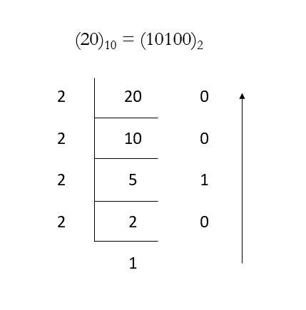

# Bitwise

## Position Notation

`Position notation` usually denotes the extension to any base of the Huindu-Arabic number system (or decimal system). More generally, a positional system is a numeral system in which the contribution of a digit to the value of a number is the value of the digit muktiplied by a factor determined by the position of the digit.

For a x position notation number, the value is determined by the position of position of the digit and the radix. The 10 position number system(decimal) number 123.45 can be written as:

$$
123.45 = 1 \times 10^2 + 2 \times 10^1 + 3 \times 10^0 + 4 \times 10^{-1} + 5 \times 10^{-2}
$$

8 position number system(Octal) number 720.5 can be written:

$$
720.5_{(8)} = 7 * 8^2 + 2 * 8^1 + 0 * 8^0 + 5 * 8^{-1}
$$

### Other Position System Number to Decimal System Number

Add all position digit weigted with the radix. For example:

$$
720.5_{(8)} = 7 * 8^2 + 2 * 8^1 + 0 * 8^0 + 5 * 8^{-1} = 464.625
$$

### Decimal to Other Position System

1. The remainder is stored in a variable when it is divided by 2;
2. Divide the number by 2;
3. Repeat these steps till the number is greater than zero;
4. Combine all reminders in reversing order.

## Bit and Operators

Computer stores all numbers with binary system, and all calculations are implemented by bitwise operatons.

### AND
`AND`($\&$) takes two equal-length binary representations and performs the logical AND operation on each pair of the corresponding bits. If both bits in the compared position are 1, the bit in the resulting binary representation is $1$, other wise the result is $0$.

| x | y | result |
| - | - | ------ |
| 0 | 0 | 0 |
| 0 | 1 | 0 |
| 1 | 0 | 0 |
| 1 | 1 | 1 |

### OR

A bitwise `OR` ($|$) is a binary operation that takes two bit patterns of equal length and performs the logical inclusive OR operation on each pair of corresponding bits. The result in each position is 0 if both bits are 0, while otherwise the result is 1.

| x | y | result |
| - | - | ------ |
| 0 | 0 | 0 |
| 0 | 1 | 1 |
| 1 | 0 | 1 |
| 1 | 1 | 1 |

### XOR

A bitwise `XOR` ($\oplus$)is a binary operation that takes two bit patterns of equal length and performs the logical exclusive OR operation on each pair of corresponding bits. The result in each position is 1 if only one of the bits is 1, but will be 0 if both are 0 or both are 1. In this we perform the comparison of two bits, being 1 if the two bits are different, and 0 if they are the same. 

| x | y | result |
| - | - | ------ |
| 0 | 0 | 0 |
| 0 | 1 | 1 |
| 1 | 0 | 1 |
| 1 | 1 | 0 |

### NOT

The bitwise `NOT`($\sim$), or complement, is a unary operation that performs logical negation on each bit, forming the ones' complement of the given binary value. Bits that are 0 become 1, and those that are 1 become 0.

| x | result |
| - | ------ |
| 0 | 1 |
| 0 | 0 |

### Left Shift

When shifting left($<<$), the most-significant bit is lost, and a 0 bit is inserted on the other end.

$$
0010 << 1 \to 0100
$$

$$
0010 << 2 \to 1000
$$

### Right shift

When shifting right($>>$), the most-significant bit is lost, and a 0 bit is inserted on the other end.

$$
0010 >> 1 \to 0001
$$

$$
0010 >> 2 \to 0000
$$

## Bitwise Operation Properties

- Idempotent Law: $a \& a = a, a | a = a$
- Exchange Law: $a \& b = b \&a, a | b = b | a, a \oplus b = b \oplus a$
- Union Law: $(a \& b) \& c = a \& (b \& c), (a | b) | c = a | (b | c), (a \oplus b) \oplus c = a \oplus (b \oplus c)$
- Distribution Law: $(a \& b) | c = (a | c) \& (b | c), (a | b) \& c = (a \& c) | (b \& c), (a \oplus b) \& c = (a \& c) \oplus (b \& c)$
- De Morgan Law: $\sim(a \& b) = (\sim a) | (\sim b), \sim(a | b) = (\sim a) \& (\sim b)$
- Not Operation Property: $-1 = \sim 0, -a = \sim(a - 1)$
- And Operation Property: $a \& 0 = 0, a \& (-1) = a, a \& (\sim a) = 0$
- Or Operation Property: $a | 0 = a, a | (\sim a) = -1$
- Xor Operation Property: $a \oplus 0 = a, a \oplus a = 0$

Other useful properties:

- Set the last $1$ of the binary representation of $n$ to $0$: $n \& (n - 1)$
- Keep the last $1$ of the binary representation of $n$, and the rest of the $1$s become $0$: $n \& (\sim n)$
