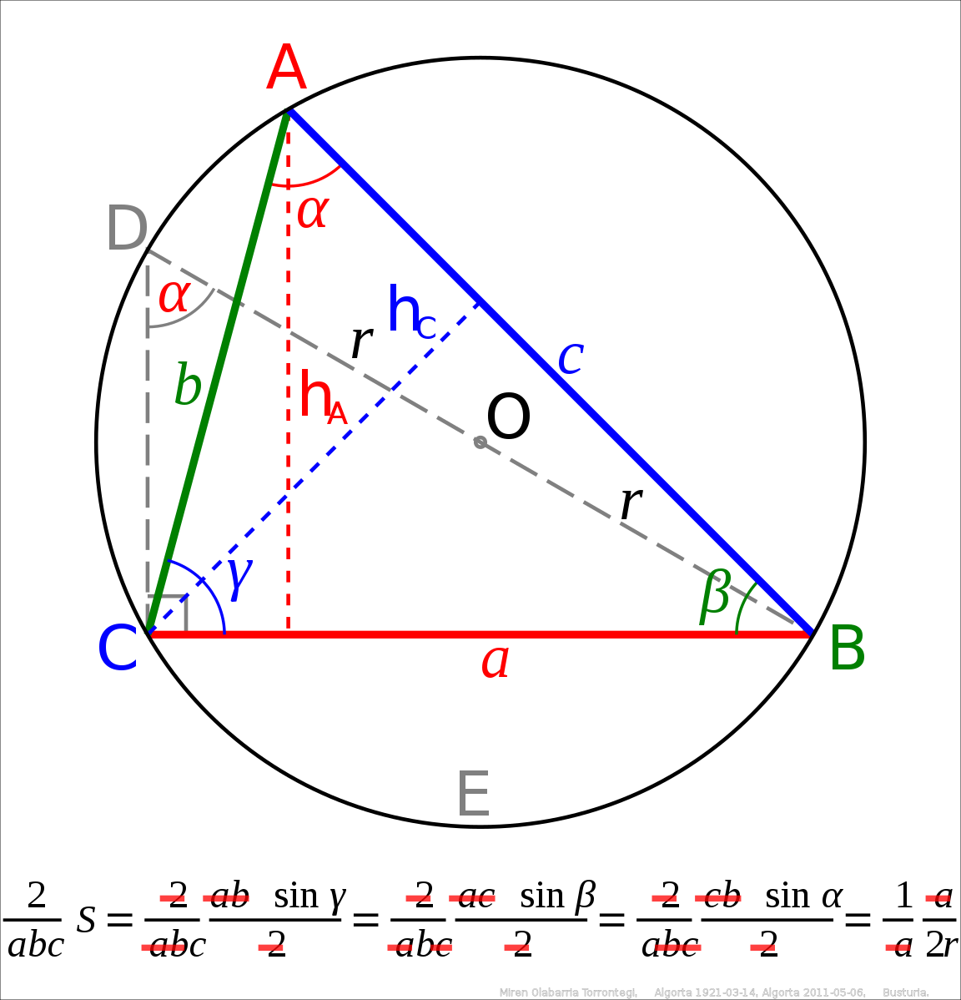
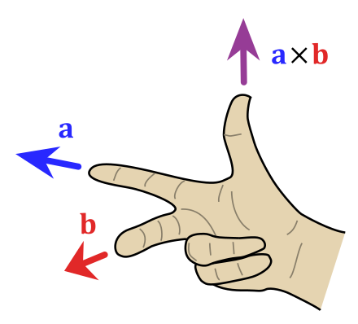

# Geometry(2D)

To solve geometry problems in 2D with computers, we need some basic knowledge about geometry relationships and equations.

## Notion

### Point

In Cartesian Coordinate System, we use coordinates $(x, y)$ to represent a point, for example, $(2, 3)$, $(-7, 0)$.

```C++
struct Point {
  double x{0.};
  double y{0.};
};
```

### Vector

The representation of vector is like point, we use $(x, y)$ to represent a vector.

```C++
using Vector = Point;
```

### Line
There are many variant ways to write the equation of a line:

- Normal form: $ax + by + c = 0$;
- Slope-intercept form: $y = kx + b$;
- Intercept form: $\frac{x}{a} + \frac{y}{b} = 1$;

Consider that we just want to know where the line locates and how the line slopes, we can use the form of:

- a point on line and the unit vector of the line.

```C++
struct Line {
  Point point{0., 0.};
  Vector unit{0., 1.};
};
```

### Line Segment

We use two end points $(x_1, y_1), (x_2, y_2)$ of the line segment to represent it.

```C++
struct LineSegment {
  Point start{0., 0.};
  Point end{0., 0.};
};
```

### Polygon

We record all vertices of the polygon to represent it.

```C++
struct Polygon {
  vector<Vector> points{};
};
```

### Curve

Some special curves like Bezier curve and Bell curve, we use its analytical expressions to represent them. For simple curve like circle, we can use the central point and radius of the circle to represent it.

```C++
struct Circle {
  Point center{0., 0.};
  double radius{0.};
};
```

## Basic Equations
### Triangle
#### Law of sines



$$
\frac{a}{\sin{A}} = \frac{b}{\sin{B}} = \frac{c}{\sin{C}} = 2R
$$

where:

- $a, b, c$ are the lengths of the sides of a triangle;
- $A, B, C$ are the opposite angle of $a, b, c$;
- $R$ is the radius of the triangle's circumcircle.

#### Law of cosines


$$
a^2 = b^2 + c^2 - 2bc\cos{A}
$$

$$
b^2 = a^2 + c^2 - 2ac\cos{B}
$$

$$
c^2 = a^2 + b^2 - 2ab\cos{C}
$$

### Vector
#### Addition and Subtraction

The sum of two vectors is a third vector, represented as the diagonal of the parallelogram constructed with the two original vectors as sides. As for subtraction, set the second vector coordinates with its opposite number and use the same equation.


$$
A(x_1, y_1) + B(x_2, y_2) = C(x_1 + x_2, y_1 + y_2)
$$

```C++
Vector operator+(const Vector& A, const Vector& B) {
  return Vector{A.x + B.x, A.y + B.y};
}

Vector operator-(const Vector& A, const Vector& B) {
  return Vector{A.x - B.x, A.y - B.y};
}

Vector operator*(const Vector& A, const double k) {
  return Vector{A.x * k, A.y * k};
}

Vector operator/(const Vector& A, const double k) {
  return Vector{A.x / k, A.y / k};
}
```

#### Dot Production
The dot product, also called the scalar product, is a scalar real number equal to the product of the lengths of vector $|\vec{a}|$ and $|\vec{b}|$ and the cosine of the angle $\theta$ between them:

$$
\vec{a} \cdot \vec{b} = |\vec{a}||\vec{b}|\cos{\theta} 
$$

We use dot product to:

- check if the two vectors are perpendicular: 

$$a \cdot b = 0$$

- calculate the angle between two vectors:

$$\cos{\theta} = \frac{\vec{a} \cdot \vec{b}}{|\vec{a}||\vec{b}|}$$

The result of dot product is calculated as:

```C++
double operator*(const Vector& A, const Vector& B) {
  return A.x * B.x + A.y * B.y;
}

double Length(const Vector& A) {
  return sqrt(A * A);
}

double Angle(const Vector& A, const Vector& B) {
  return acos(A * B / Length(A) / Length(B));
}
```

#### Cross Production

The cross product, also called the vector product, is a third vector $\vec{c}$, perpendicular to the plane of the original vectors. The magnitude of $\vec{c}$ is equal to the product of the lengths of vectorss $\vec{a}$ and $\vec{b}$ and the sine of the angle $\theta$ between them:

$$
|\vec{c}| = |\vec{a}||\vec{b}|\sin{\theta}
$$

We can find the direction of cross product with right-hand rule:


The cross product $\vec{c} = \vec{a} \times \vec{b}$ (vertical, in purple) changes as the angle between the vector $\vec{a}$(blue) and $\vec{b}$(red) changes. 
The cross product is:

- always orthogonal to both vectors;
- has magnitude $0$ when the vectors are parallel;
- has maximum magnitude $|\vec{a}||\vec{b}|$ when they are orthogonal.


The result of dot product is calculated as:
```C++
double Cross(const Vector& A, const Vector& B) {
  return A.x * B.y - A.y * B.x;
}
```

#### Rotation of Vector


Let's say that we have a point $(x_1, y_1)$, which also defines the vector $\vec{a_1}$. The angle of $\vec{a_1}$ is $\beta$. The vector $\vec{a_1}$ has length $L$. We rotate this vector anticlockwise around the origin by $\alpha$ degrees, the new vector $\vec{a_2}$ has coordinates $(x_2, y_x)$. The length $L$ is not changed, so we have:

$$
x_1 = L \cos{\beta}
$$

$$
y_1 = L \sin{\beta}
$$
As we rotate $(x_1, y_1)$ by angle $\beta$ to get $(x_2, y_2)$, the new vector $\vec{a_2}$ has:

$$
x_2 = L \cos{(\alpha + \beta)}
$$

$$
y_2 = L \sin{(\alpha + \beta)}
$$

Combine all these equations above we have:

$$
\begin{align}
x_2 
& = L cos(\alpha + \beta) \\\\
& = L (\cos{\alpha}\cos{\beta} - \sin{\alpha}\sin{\beta}) \\\\
& = L \cos{\beta}\cos{\alpha} - L \sin{\beta}\sin{\alpha} \\\\
& = x_1 \cos{\alpha} - y_1 \sin{\alpha} \\\\
\end{align}
$$

$$
\begin{align}
y_2 
& = L sin(\alpha + \beta) \\\\
& = L (\sin{\alpha}\cos{\beta} + \cos{\alpha}\sin{\beta}) \\\\
& = L \cos{\beta}\sin{\alpha} + L \sin{\beta}\cos{\alpha} \\\\
& = x_1 \sin{\alpha} + y_1 \cos{\alpha} \\\\
\end{align}
$$

So the result of rotation of vector is:
```C++
Vector Rotate(Vector A, double alpha) {
  return Vector{A.x * cos(alpha) - A.y * sin(alpha),
                A.x * sin(alpha) + A.y * cos(alpha)};
}
```

## Basic Problems
### Area of Triangle


When we know the base and height, the area of triangle is:`

$$
S = \frac{1}{2} |AB| \cdot h
$$

as we have:

$$
|\vec{AB} \times \vec{AC}| = |\vec{AB}||\vec{AC}|sin\theta
$$

and

$$
h = |\vec{AC}|sin\theta
$$

The area of triangle can be calculated:

$$
S = \frac{1}{2} |\vec{AB} \times \vec{AC}| 
$$

```C++
double TriangleArea(const Point& A, const Point& B, const Point& C) {
  return Cross(B - A, C - A) / 2;
}
```

### Area of Polygon


We can divide a polygon to multiple triagnles and calculate the sum of their areas.

```C++
double PolygonArea(const Polygon& poly) {
  double res{0};
  int m = poly.points.size();
  for (int i = 1; i < m - 1; ++i) {
    res += Cross(poly.points[i] - poly.points[0], 
                 poly.points[i + 1], poly.points[0]);
  }
  return res / 2.;
}
```

### Point on Line Side


We can use the cross product to check a point on wihch side of the line:
if the cross product is 

- $> 0$, point is on line left;
- $< 0$, point is on line right.

```C++
bool IsPointOnLineLeft(const Line& L, const Point& P) {
  return Cross((P - L.point), L.unit) > 0.;
}
```

### Point and Line Distance

The result of cross product is the area of parallelogram, we divide this by parallelogram's base to get height, which is the distance from point to line.

```C++
double DistanceFromPointToLine(const Point& P, const Line& L) {
  Vector v1{L.unit - L.point};
  Vector v2{P - L.point};
  return fabs(Cross(v1, v2) / Length(v1));
}
```

### Point and Line Segment Distance

If the point is not in the rectangle of line segment, we should calculate the distance from point to nearest line segment point; otherwise we can use the line distance to get the result.

```C++
double DistanceFromPointToLineSegment(const Point& P, const LineSegment& L) {
  Vector v1{L.end - L.start};
  Vector v2{P - L.start};
  Vector v3{P - L.end};
  if (sign(v1 * v2) < 0) return Length(v2);
  if (sign(v1 * v3) > 0) return Length(v3);
  return fabs(Cross(v1, v2) / Length(v1));
}
```

### Point on Line Segment
If a point is on line segment, it should meet:

- the point is on the line;
- the point is between two end points of line segment.

```C++
int Sign(double x) {
  return x < -1e-4 ? -1 : x > 1e-4 ? 1 : 0;
}

bool IsPointOnSegment(const LineSegment& L, const Point A) {
  return Sign(Cross(L.start - A, L.end - A)) == 0 &&
         Sign((L.start - A) * (L.end - A)) <= 0;
}
```

### Point in Polygon(PIP)

In computational geometry, the `point in polygon` problem asks whether a given point in the plane lies inside of a polygon. There are two methods to check if the point is in polygon:

- Ray casting
- Winding number

#### Ray casting algorithm


One simple way of finding whether the point is inside a simple polygon is to test how many times a ray, starting from the point in any fixed direction, intersects the edges of the polygon. If the ray intersects the polygon's edge:

- `even number` times, the point is outside the polygon;
- `odd number` times, the point is inside the polygon.

There are some special cases we need to deal with:

1. ray intersects the conves vertex(case 1), which should count once;
2. ray intersects the concave vertex(case 2), which should not be counted;
3. ray intersects the edge of polygon, which should not be counted.

To simplify the logic, we think that a point is in a polygon if:

1. the point is on the edge;
2. the ray from point to long long right has intersetion with the edge.

While calculating the intersection with the edge, we check:

1. the point is between the edge in y direction: `p0.y - p.y != p1.y - p.y`
2. the intersection size: `p0.y < p1.y ? cross_product > 0 : cross_product < 0`

```C++
// Ray casting
bool IsPointInPolygon(const Point& p, cosnt Polygon& poly) {
  bool f{false};
  auto p0 = poly.points.back();
  for (auto p1 : poly.points) {
    if (IsPointOnSegment(p, {p0, p1})) return true;
    if ((p0.y > p.y) != (p1.y > p.y)) {
      auto side = (p1 - p0).Cross(p - p0);
      f ^= p0.y < p1.y ? side > 0 : side < 0;
    }
    p0 = p1;
  }
  return f;
}
```

#### Winding Number Algorithm

Winding number algorithm links the point to all points of the polygon and calculate the sum of all the angles, if the angle is: 

- $\ne 0$, the point is not in polygon;
- $= 0$, the point is in polygon.

 ```C++
 // Winding number
 bool IsPointInPolygon(const Point& p, const Polygon& poly) {
   double accumulate_angle{0};
   int m = poly.points.size();
   for (int i = 0; i < m; ++i) {
     auto& p1 = poly.points[i];
     auto& p2 = poly.points[(i + 1) % m];
     if (IsPointOnSegment(p, {p1, p2})) return true;
     accumulate_angle += acos((p1 - P) * (p2 - P) / Length(p1 - p) / Length(p2 - p));
   }
   return sign(accumulate_angle) == 0;
 }
 ```

### Line Segment Intersection


There are three relationships between two line segments:

- no intersection;
- intersection;
- overlaps.

And as for the intersection case, we can use following methods to calculate its intersection point:


We assume that the intersection point is $O$, the area of the $\triangle ABC$ and $\triangle ABD$ can be calculated by:

$$
S_{ABC} = \frac{\vec{AB} \times \vec{AC}} {2}
$$

$$
S_{ABD} = \frac{\vec{AB} \times \vec{AD}} {2}
$$

As we have known that $\triangle ABC$ and $\triangle ABD$ have the same base $AB$:

$$
\frac{S_{ABC}} {S_{ABD}} = \frac{\frac{|AB| * |CN|}{2}}{\frac{|AB| * |DM|}{2}} =  \frac{|CN|} {|DM|}
$$

And according to triangle rules:

$$
\frac{|DM|}{|CN|} = \frac{|DO|}{|CO|}
$$

Finally:

$$
\frac{|DO|}{|CO|} = \frac{S_{ABD}}{S_{ABC}}
$$

$$
\frac{|DO|}{|DC|} = \frac{S_{ABD}}{S_{ABC} + S_{ABD}} = k
$$

$$
\vec{DO} = k * \vec{DC}
$$

```C++
bool IsLineSegmentIntersection(const LineSegment& L1, const LineSegment& L2) {
  return sign(Cross(L1.end - L1.start, L2.start - L1.start)) *
             sign(Cross(L1.end - L1.start, L2.end - L1.start)) < 0 &&
         sign(Cross(L2.end - L2.start, L1.start - L2.start)) *
             sign(Cross(L2.end - L2.start, L1.end - L2.start)) < 0;
}
```

### Convex Hull


The convex hull of a set of points is defined as the smallest convex polygon, that encloses all of the points in the set. Convex means that the polygon has no coner that is bent inwards.

A usefull way to think about the convex hull is the rubber band analogy. Suppose the points in the set were nails, sticking out of a flat surface. Imaging now, what would happen if you took a rubber band and stretched it around the nails. Trying to contract back to its origin length, the rubber band would enclose the nails, touching the ones that stick out the furthest from the centre.

#### Andrew's monotone chain convex hull algorithm


Andrew's algorithm constructs the convex hull of a set of 2D points in $O(NlogN)$ time.

It does so by first sorting the points lexicographically (first by x-coordinate, and in case of a tie, by y-coordinate), and then constructing upper and lower hulls of the points in $O(n)$ time.


The process is mainly:

1. Sort the points by its x-coordinate, if the x-coordinate is equal, by y-coordinate;
2. Start from the leftmost point, if the new point is higher(use `cross product`) than last point in stack, we pop the last; if not, we push the new point to stack. After this, we can get the upper hull.
3. We remove all points used in upper hull, and do the same thing as step 2 in reverse order to get the lower hull.
4. Return all points in upper and lower hull.

```C++
vector<vector<int>> andrew(const vector<vector<int>>& pts) {
    sort(pts.begin(), pts.end(), [](auto& a , auto& b) {
      return a[0] == b[0] ? a[1] < b[1] : a[0] < b[0];
    });
    auto cross = [](auto& p1, auto& p2, auto& p0) -> int {
      return (p1[0] - p0[0]) * (p2[1] - p0[1]) -
             (p1[1] - p0[1]) * (p2[0] - p0[0]);
    };

    int m = pts.size();
    vector<int> hull{};
    vector<bool> v(m, true);
    for (int i = 0; i < m; ++i) {
      while (hull.size() >= 2 && cross(pts[*hull.rbegin()], pts[i],
                                       pts[*(hull.rbegin() + 1)]) > 0) {
        v[hull.back()] = false;
        hull.pop_back();
      }
      hull.push_back(i);
    }
    
    int n = hull.size();
    v[0] = false;
    for (int i = m - 1; i >= 0; --i) {
      if (v[i]) continue;
      while (hull.size() >= 2 && cross(pts[*hull.rbegin()], pts[i],
                                       pts[*(hull.rbegin() + 1)]) > 0) {
        hull.pop_back();
      }
      hull.push_back(i);
    }
    hull.pop_back();

    vector<vector<int>> ans{};
    for (auto i : hull) ans.push_back(std::move(pts[i]));
    return ans;
  }
```

## Reference

- [Geometry](https://oi-wiki.org/geometry/2d/)
- [Computer Geometry Tutorial](https://oi-wiki.org/geometry/2d/)
