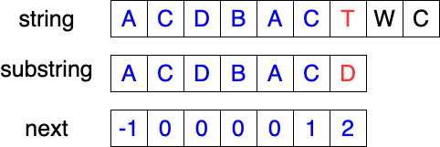

# String

A `string` is traditionally a sequence of charactors, either as a literal constant or as some kind of variable. The storage of string can be:

- an array of `char` with the end of `\0`, which is the `C`-style string;
- the stl `string` container, whose length is changable;
- literal constant(some charactors enclosed by `""`).

Some definiations:

- Prefix: a string `s` is said to be a prefix of `t` if there exists a string `u` such that `t = su`;
- Proper prefix: if `u` is nonempty, `s` is said to be a `proper prefix` of `t`;
- Suffix: a string `s` is said to be a prefix of `t` if there exists a string `u` such that `t = us`;
- Proper suffix: if `u` is nonempty, `s` is said to be a `proper prefix` of `t`;

## Pattern Matching

This probelm is defined as:
> Given strings `s` and `t`, find the position that `t` appears in `s` for the first time. `t` is called the `pattern`.

### Brute Force

The basic method is to enumerate the start position of substring in pattern, and check if it's true;

```C++
for (int i = 0; i < m; ++i) {
  bool is_sub{true};
  for (int j = 0; j < n; ++j) {
    if (pattern[i + j] == substr[j]) continue;
    is_sum = false;
    break;
  }
  if (is_sub) return i;
}

return -1;
```

The time complexity is $O(mn)$, which costs a lot;

### Knuth-Morris-Pratt(KMP)

The disadvantage of BF is that every time comparing the `s` and `t` we have to return to the start of substring if failed, which wastes much time.

If the repeated string appears in substring, we can jump over the same prefix of the string and check the first different charactor when mismatching occurs. Where comes the `next` array:

#### `next` Array

Generally speaking, `next` is an array that `next[i]` represents the length of the longest common proper prefix of two string:

1. prefix of string `s[0:i - 1]`;
2. suffix of string `s[0:i - 1]`;

where `s` is the given substring.



We let `next[0] = -1` because `s[0:-1]` has no proper prefix. And at the position `i` we fill the result of `next[i + 1]`, so the terminate condition is `i < n - 1`.

```C++
int i = 0;  // for main loop
int j = next[0] = -1;  // for common part of prefix and suffix
while (i < n - 1) {  // n is the length of s, i < n - 1 to ensure index safety
  if (j < 0 || s[i] == s[j]) {  // matching
    next[++i] = ++j;
  } else {
    j = next[j];  // not matching, go to first different position
  }
}
```

#### Main Process

The main process is the same with how we get the `next` array:

```C++
int i = 0, j = 0;
while (i < m) {
  if (j < 0 || t[i] == s[j]) {
    ++i; ++j;
  } else {
    j = next[j];
  }
  if (j == n) return i - n;
}

return -1;
```

The time complexity of KMP is $O(m + n)$.

Problems:

- [implement-strstr](https://leetcode-cn.com/problems/implement-strstr/)
- [longest-happy-prefix](https://leetcode-cn.com/problems/longest-happy-prefix/)

## Substring

## Prefixes and Suffixes


