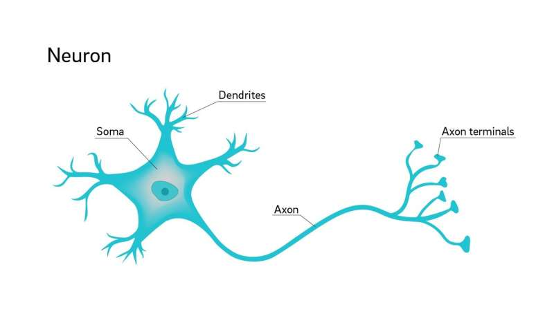
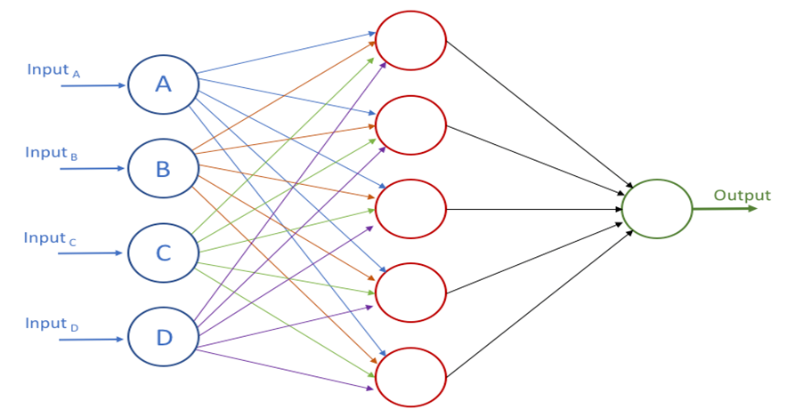
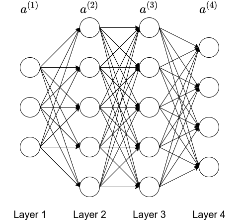

# Mechine Learning
## Instruction

### Defination
A Computer program is said to learn from experience `E` with respect to some task `T` and some performance measure `P`, if its performance on `T`, as measured by `P`, improves with experience `E`.

There are two common types of Machine Learning: Supervised Learning and Unsupervised Learning.

### Supervised Learning
The term Supervised Learning refers to the fact that we gave the algorithm a data set which we call "right answer", and the task of the algorithm was to produce more of these right answers.

The problem is called a

- regression problem, if the algorithm should predict a **continuous** valued output;
- classification problem, if the algirhtm should predict a **discrete** valued output.

For example, you have a large inventory of identical items and want to predict how many of these items will sell over the next 3 months, this is a regression problem. 

If you would like to examine individual customer accounts, and for each account decide if it has been hacked/compromised, this is a classification problem.

### Unsupervised Learning
Unsupervised Learning allows us to approach problems whith little or no idea what our results should look like. We can derive structure from data where we don't necessarily know the effect of the variables.

We can derive this structure by clustering the data based on relationships among the variables in the data.

With unsupervised learning there is no feedback based on the prediction results.

For example,

- Clustering: Take a collection of 1000000 different genes, and find a way to automatically group these genes into groups that are somehow similar or related by different variables, such as lifespan, location, roles and so on.
- Non-Clustering: The "Cocktail Party Problem", allows you to find structure in a chaotic environment.

## Linear Regression with One Variable

### Model Representation
To establish notation for future use, we use:

- $x_i$ to denote the "input" variables(also called input features);
- $y_i$ to denote the "output" variables we are trying to predict.

A pair $(x_i, y_i)$ is called a training example and a list of training example is called a training set.

We also use:

- $X$ to denote the space of input values;
- $Y$ to denote the space of output values;

To describe the supervised learning problem more formally, our goal is, given a training set, to learn a function $h: X \to Y$ so that $h(x)$ is a "good" predictor for the corresponding value of $y$. For history reason, the function $h$ is called a hypothesis. The process is like this:
```C++
  +----------------+
  |                |
  |  Training set  |
  |                |
  +-------+--------+
          |
          |
          |
  +-------v--------+
  |                |
  |  Learning      |
  |  algorithm     |
  +-------+--------+
          |
          |
          |
       +--v--+
       |     |
x +---->  h  +-----> y
       |     |
       +-----+
```

### Cost Function
we can measure the accuracy of our hypothesis function by using a **cost function**. The most common cost function is "Squared error function" or called "Mean squared error":
$$
J(\theta_0, \theta_1) = \frac{1}{2m} \sum_{i = 1}^{m}(\hat{y_i} - y_i)^2 = \frac{1}{2m} \sum_{i = 1}^{m}(h_{\theta}(x_i) - y_i)^2
$$
The mean is halved $(\frac{1}{2})$ as a convenience for the computation of the gradient descent, as the derivative term of the square function will cancel out the $\frac{1}{2}$ term.

We should try to minimize the cost function to find the best $h$ to predict the output data.

### Gradient Descent
So we have our hypothesis function and we have a way of measuring how well it fits into the data. Now we need to estimate the parameters in the hypothesis function. That's where gradient descent comes in.

We put $\theta_0$ on the $x$ axis and $\theta_1$ on the $y$ axis, with the cost function on the vertical $z$ axis. The points on our graph will be the result of the cost function using our hypothesis with those specific $\theta$ parameters. The goal is to find the very bottom point of the graph.

The gradient descent algorithm is:

$$
\theta_j = \theta_j - \alpha \frac{\partial}{\partial\theta_j}J(\theta_0, \theta_0)
$$

where:

- $j = 0, 1$ represents the feature index number.
- $\alpha$ is called "learning rate" to ensure that the gradient descent algorithm converges in a reasonable time.

### Gradient Descent For Cost Function
We can substitute our cost function and our actual hypothesis function and modify the equation to:

$$
\theta_{0} := \theta_{0} - \alpha\frac{1}{m}\sum_{i = 1}^{m}(h_{\theta}(x_{i}) - y_{i})
$$

$$
\theta_{1} := \theta_{1} - \alpha\frac{1}{m}\sum_{i = 1}^{m}((h_{\theta}(x_{i}) - y_{i})x_{i})
$$

where:

- $m$ is the size of the training set;
- $\theta_{0}$ is a constant that will be changing simultaneously with $\theta_{1}$
- $x_{i}, y_{i}$ are values of the given training set.

With the equation, we can repeat calculating $\theta_{0}$ and $\theta_{1}$ until convergence.

This method looks at every example in the entire training set on every step, and is called `batch gradient descent`.

## Linear Regression with Multiple Variables

## Multiple Features
Linear regression with multiple variables is also known as `multivariate linear regression`.

The notation for equations where we can have any number of input variables is as below:

- $x_{j}^i$ is the value of feature $j$ in the $ith$ training example;
- $x^{i}$ is the input (features) of the $ith$ training exmaple;
- $m$ is the number of training examples;
- $n$ is the number of features.

The multivariable form of the hepothesis function with multiple features is as follows:

$$
h_{\theta}(x) = \theta_{0} + \theta_{1}x_{1} + \theta_{2}x_{2} + \theta_{3}x_{3} + ... + \theta_{n}x_{n}
$$

Using the definition of matrix multiplication, our multivariable hypothesis function can be concisely represented as:

$$
h_{\theta}(x) = \begin{bmatrix} \theta_0 \theta_1 \cdots \theta_n \end{bmatrix} \begin{bmatrix} x_0 \\\\ x_1 \\\\ \vdots \\\\ x_n \end{bmatrix} = \theta^Tx
$$

## Gradient Descent for Multiple Variables
The gradient descent equation is the same form, we just have to repeat it for our $n$ feature:

$$
\begin{cases}
\theta_{0} := \theta_0 - \alpha\frac{1}{m}\sum_{i=1}^m(h_{\theta_0}(x^i) - y^i) \cdot x_0^i \\\\
\theta_1 := \theta_1 - \alpha\frac{1}{m}\sum_{i=1}^m(h_{\theta_1}(x^i) - y^i) \cdot x_1^i \\\\
\theta_2 := \theta_2 - \alpha\frac{2}{m}\sum_{i=2}^m(h_{\theta_2}(x^i) - y^i) \cdot x_2^i \\\\
...
\end{cases}
$$

In other words:

$$
\theta_j := \theta_j - \alpha\frac{1}{m}\sum_{i=1}^m(h_{\theta}(x^i) - y^i) \cdot x_j^i
$$

where:

- $j = 0, 1, ..., n$

### Feature Scaling to Speed up Gradient Descent
We can speed up gradient descent by having each of our input values in roughly the same range. This is because $\theta$ will descend quickly on small ranges and slowly on large ranges, and so will oscillate inefficiently down to the optimum when the variables are very uneven.

The way to prevent this is to modify the ranges of our input variables so that they are all roughly the same. Ideally:

$$
-1 <= x_i <= 1
$$

or

$$
-0.5 <= x_i <= 0.5
$$

These are not exact requirements, we are only trying to speed things up. The goal is to get all input variables into roughly one of these ranges, give or take a few.

Two techiques to help with this are:

- feature scaling: involves diving the input values by the range of the input variable, resulting in a new range of just $1$;
- mean normalization: involves subtracing the average value for an input variable from the values for that input variable, resulting in a new average value for the input variable of just zero.

To impliment both of these techniques, adjust your input values as shown in this formula:

$$
x_i := \frac{x_i - \mu_i}{s_i}
$$

where:

- $\mu_i$ is the average of all the values for feature;
- $s_i$ is the range of values($max - min$).  

### Choosing Correct Learning Rate
To debug gradient descent, we can make a plot with number of iterations on the x-axis. Now plot the cost function $J(\theta)$ over the number of iterations of gradient descent. If $J(\theta)$ increases, then you probably need to decrease $\alpha$.

The learning rate effects the convergence of the $J(\theta)$:

- $\alpha$ is too small: slow convegence;
- $\alpha$ is too large: may not decrease on every iteration and shus may not converge.

### Improve features and hypothesis
We can improve our features and the form of our hypothesis function in a couple different ways.

#### Feature
We can combine multiple features into one. For example, we can combine $x_1$ and $x_2$ into a new feature $x_3$ by taking $x_3 = x_1 * x_2$.

#### Hypothesis Function
Our hypothesis function need not to be linear (a straight line) if that does not fit the data well.
We can change the behavior or curve of our hypothesis function by making it a:

- quadratic;
- cubic;
- square root

function.

One important thing to keep in mind is, if you choose your features this way, the feature scaling becomes very important.

## Normal Equation for Multiple Variables
Gradient descent gives one way to solve the minimizing $J$, the `normal equation` method is another way of doing so. In this way, we will minimizing $J$ by explicitly taking its derivatives with respect to the $\theta_j$ and set them to $0$. This allows us to find the optimum theta without iteration. The normal equation is given below:

$$
\theta = (X^TX)^{-1}X^Ty
$$

Following is a comparison of gradient descent and the normal equation:

| Gradient Descent | Normal Equation |
| ---------------- | --------------- |
| Need to choose $\alpha$ | No need to choose $\alpha$ |
| Need many iterations | No need to iterate |
| Time complexity $O(kn^2)$ | Time complexity $O(n^3)$, need to calculate inverse of $X^TX$ |
| Works well when $n$ is large | Slow if $n$ is very large |

With the normal equation, computing the inversion has comlexity $O(n^3)$. So if we have a very large number of features, the normal equation will be slow. In practice, when $n$ exceeds $10000$ it might be a good time to go from normal solution to an iterative process.

### Noninvertibility
The normal equation used $X^TX$ to calculate variables, but $X^TX$ might be "noninvertible", the common causes may be:

- Redundant features, where two features are very closely related;
- Too many features(e.g. $m <= n$), in this case, delete some featues or use "regularization".

## Logistic Regression

Logistic regression is a method for classifying data into discrete outcomes. For example, we might use logistic regression to classify an email as spam or not spam. In this module, we introduce the notion of classification, the cost function for logistic regression, and the application of logistic regression to multi-class classification.

The classification problem is just like the regression problem, except that the values we now want to predict take on only a small number of discrete values. To attempt classification, one method is to use linear regression and map all predictions greater than $0.5$ as $1$ and all less than $0.5$ as $0$. However, this method doesn't work well because classification is not really a linear function.

## Hypothesis Representation
We could approach the classification problem ignoring the fact that y is discrete value and use our old linear function to predict y with given x. However, it doesn't make sense for $h_{\theta}(x)$ to take value larger than $1$ or smaller than $0$ when we know that $y \in {0, 1}$. To fix this, we plug $\theta^Tx$ into the `Logistic Function`.

`Logistic Function`(or `Sigmoid Function`) is defined as:

$$
h_{\theta}(x) = g(\theta^Tx)
$$

$$
z = \theta^Tx
$$

$$
g(z) = \frac{1}{1 + e^{-z}}
$$

more details can be found [here](https://en.wikipedia.org/wiki/Logistic_function).
The function $g(z)$ maps any real number to the $(0, 1)$ interval, making it useful for transforming an arbitrary-valued function into a function better suited for classification.

$h_{\theta}(x)$ will give us the probability that our output is $1$. For example, $h_{\theta}(x) = 0.7$ gives us the probability of $0.7$ that our output is $1$.

$$
h_{\theta}(x) = P(y = 1 |x; \theta) = 1 - P(y = 1 | x ; \theta)
$$

$$
P(y = 1 |x; \theta) + 1 - P(y = 1 | x ; \theta) = 1
$$

## Decision Boundary
In order to get our discrete $0 or 1$, we can translate the output of the hypothesis function as follows:

$$
h_{\theta}(x) \ge 0.5 \to y = 1
$$

$$
h_{\theta}(x) \le 0.5 \to y = 0.5
$$

The way our logistic function $g$ behaves when its input is greater than or equal to zero, its output is greater than or equal to $0.5$:

$$
\begin{array}{lcl}
g(z) \ge 0.5 \\\\
\mbox{if } z \ge 0
\end{array}
$$

So if the input to $g$ is $\theta^TX$, then that means:

$$
h_{\theta}(x) = g(\theta^Tx) \ge 0.5
$$

when

$$
\theta^Tx \ge 0
$$

From these statements we can now say:

$$
\theta^Tx \ge 0 \to y = 1
$$

$$
\theta^Tx \le 0 \to y = 0
$$

The `decision boundary` is the line that separates the area where $y = 0$ and where $y = 1$. It is created by our hypothesis function.

## Cost Function
We cannot use the same cost function that we use in linear regression because the Logistic Function will cause the output to be wavy, causing many local optima. In other words, it isn't a convex function.

Instead, our cost function for logistic regression looks like:

$$
\begin{align}
J(\theta) & = \frac{1}{m}\sum_{i=1}^{m}Cost(h_{\theta}(x^i), y^i) \\\\
Cost(h_{\theta}(x^i), y^i) & = -log(h_{\theta}(x)) & \mbox{ if } y = 1 \\\\
Cost(h_{\theta}(x^i), y^i) & = -log(1 - h_{\theta}(x)) & \mbox{ if } y = 0
\end{align}
$$

When $y = 1$, we get the following plot for $J(\theta)$ vs $h_{\theta}(x)$:

```C++

^      X        y = 1
|      XX
|       X
|       XX
|        XX
|         XX
|          XX
|           XXX
|             XX
|               XX
|                XXX
|                  XXX
|                    XXX
|                      XX
|                        XXX
|                          XXX
|                             XXX 
+-------------------------------XX+----------->
0            h(x)                 1
```

Similarly, when $y = 0$, we get the following plot for $J(\theta)$ vs $h_{\theta}(x)$:

```C++
^               y = 0
|
|
|
|                             XX
|                             XX
|                            XX
|                           XX
|                          XX
|                       XXX
|                    XXXX
|                  XXX
|               XXX
|             XXX
|          XXX
|      XXXX
| XXXXX
XX--------------------------------+----------->
0            h(x)                 1
```

$$
\begin{align}
Cost(h_{\theta}(x), y) & = 0 & \mbox{if } h_{\theta}(x) = y & \\\\
Cost(h_{\theta}(x), y) & \to \infty & \mbox{if }  y = 0 \mbox{ and } h_{\theta}(x) = 1 \\\\
Cost(h_{\theta}(x), y) & \to \infty & \mbox{if }  y = 1 \mbox{ and } h_{\theta}(x) = 0
\end{align}
$$

### Simplified Cost Function 
We can compress our cost function's two conditianal cases into one case:

$$
Cost(h_{\theta}(x), y) = -ylog(h_{\theta}(x)) - (1 - y) log(1 - h_{\theta}(x))
$$

Then the entire const function is as follows:

$$
J(\theta) = -\frac{1}{m} \sum_{i = 1}^m[y^ilog(h_{\theta}(x^i)) + (1 + y^i)log(1 - h_{\theta}(x^i))]
$$

A vectorized implementation is:

$$
\begin{align}
h & = g(X\theta) \\\\
J(\theta) & = \frac{1}{m} \cdot (-y^Tlog(h) - (1 - y)^Tlog(1 - h))
\end{align}
$$

### Gradient Descent
The general form of gradient descent is:

$$
\theta_j := \theta_j - \alpha \frac{\partial}{\partial \theta_j}J(\theta)
$$

We can work out the derivative part using calculus to get:

$$
\theta_j := \theta_j - \frac{\alpha}{m} \sum_{i=1}{m}(h_{\theta}(x^i) - y^i)x_j^i
$$

A vectorized implementation is:

$$
\theta := \theta - \frac{\alpha}{m} X^T(g(X\theta) - \overrightarrow{y})
$$

### Advanced Optimization
Instead of gradient descent,

- "Conjugate gradient",
- "BFGS",
- "L-BFGS"

are more sophisticated, faster ways to optimize $\theta$.
You can use a existed libaray to apply these mathods.

## Multiclass Classification: One-vs-all
Now we will approach the classification of data when we have more than two . Instead of $y = {0, 1}$, we will expand our definition so that $y = {0, 1, ..., n}$.

Since $y = {0, 1, ..., n}$, we divide our problem into $n+1$ ($+1$ because the index start at 0) binary classification problems. In each one, we predict the probability that $y$ is a member of one of our classes.

$$
\begin{align}
y & \in {0, 1, ..., n} \\\\
h_{\theta}^{(0)}(x) & = P(y = 0 | x; \theta) \\\\
h_{\theta}^{(1)}(x) & = P(y = 1 | x; \theta) \\\\
h_{\theta}^{(2)}(x) & = P(y = 2 | x; \theta) \\\\
\cdots \\\\
h_{\theta}^{(n)}(x) & = P(y = n | x; \theta) \\\\
prediction & = \max_i(h_{\theta}^{(i)}(x))
\end{align}
$$

We are basically choosing one class and then lumping all the others into a single second class. We do this repeatedly, applying binary logistic regression to each case, and then use the hypothesis that returned the highest value as prediction.

To sumerize:

- Train a logistic regression classifier $h_{\theta}(x)$ for each class to predict the probability that $y = i$;
- To make a prediction on a new $x$, pick the class that maximized $h_{\theta}(x)$.

## Neural Networks

### Model Representation


In this chapter, we will represent a hypothesis function using neural networks. At a very simple level, neurons are basically computational units that take inputs(dendrites) as electrical inputs(called "spikes") that are channeled to outputs(axons). In our model, our dendrites are like the input features $x_{1} \cdots x_{n}$ and the output is the result of our hypothesis function. In this model our $x_{0}$ input node is sometimes called the "bias unit". It is always euqal to $1$. In neural networks, we use the same logistic function as in classification, $\frac{1}{1+e^{-\theta^Tx}}$, yet we sometimes call it a sigmoid(logistic) activation function. In this situation, our "theta" parameters are sometimes called "weights".



Visually, a simplistic representation looks like:

$$
\begin{bmatrix}
x_{0} \\\\
x_{1} \\\\
x_{2}
\end{bmatrix}
\to \mbox{[ ]} \to h_{\theta}(x)
$$

Our input nodes(layer 1), also known as the "input layer", go into another node(layer 2), which finally outputs the hypothesis function, known as "output layer".

We can have intermediate layers of nodes between "input layers" and "output layers" called the "hidden layers".

In this example, we label these intermediate or "hidden" layer nodes $a_{0}^2 \cdots an_{n}^2$ and call them "activation units".

$$
a_{i}^{(j)} = \mbox{"activation" of unit i in layer j}
$$

$$
\Theta^{(j)} = \mbox{matrix of weights controlling function mapping from layer j to layer j + 1}
$$

If we have hidden layer, it would like:

$$
\begin{bmatrix} x_{0} \\\\ x_{1} \\\\ x_{2} \\\\ x_{3} \end{bmatrix} \to 
\begin{bmatrix} a_{0}^{(2)} \\\\ a_{1}^{(2)} \\\\ a_{2}^{(2)} \\\\ a_{3}^{(2)} \end{bmatrix} \to
h_{\theta}(x)
$$

The values for each of the "activation" nodes is obtained as follows:

$$
\begin{bmatrix}
\Theta_{10}^{(1)} & \Theta_{11}^{(1)} & \Theta_{12}^{(1)} & \Theta_{13}^{(1)} \\\\
\Theta_{20}^{(1)} & \Theta_{21}^{(1)} & \Theta_{22}^{(1)} & \Theta_{33}^{(1)} \\\\
\Theta_{30}^{(1)} & \Theta_{31}^{(1)} & \Theta_{32}^{(1)} & \Theta_{33}^{(1)} 
\end{bmatrix}
\begin{bmatrix}
x_{0} \\\\
x_{1} \\\\
x_{2} \\\\
x_{3}
\end{bmatrix}
=
\begin{bmatrix}
a_{1}^{(2)} \\\\
a_{2}^{(2)} \\\\
a_{3}^{(2)}
\end{bmatrix}
$$

$$
h_{\Theta}^{(x)} = a_{1}^{(3)} = g(
\begin{bmatrix}
\Theta_{10}^{(2)} & \Theta_{11}^{(2)} & \Theta_{12}^{(2)} & \Theta_{13}^{(2)} 
\end{bmatrix}
\begin{bmatrix}
a_{0}^{(2)} \\\\
a_{1}^{(2)} \\\\
a_{2}^{(2)} \\\\
a_{3}^{(2)}
\end{bmatrix}
)
$$

This is saying that we compute our activation nodes by using a $3 \times 4$ matrix of parameters. We apply each row of the parameters to our inputs to obtain the value for one activation node.
Our hypothesis output is the logistic function applied to the sum of the values of our activation nodes, which have been multiplied by yet another another parameter matrix $\Theta^{(2)}$ containing the weights for our second layer of nodes.
Each layer gets its own matrix of weights, $\Theta^{(j)}$.
The dimension of these marices of weights is determined as follows:

> If network has $s_{j}$ units in layer $j$ and $s_{j + 1}$ in layer $j + 1$, then $\Theta_{0}^{j}$ will be of dimension $s_{j + 1} \times (s_{j} + 1)$.

The $+1$ comes from the addition in $\Theta^{(j)}$ of the "bias node" $x_{0}$ and $\Theta_{0}^{(j)}$. In other words, the output nodes will not include the bias node while the input nodes will.

### Application

#### Implement A Logical Operator
A simple example of applying neural networks is by predicting $x_{1} \mbox{ AND } x_{2}$ which is the logical `and` operator and is only true if both $x_{1}$ and $x_{2}$ are $1$.

The graph of our functions will look like:

$$
\begin{bmatrix}
x_{0} \\\\
x_{1} \\\\
x_{2}
\end{bmatrix}
\to 
\begin{bmatrix}
g(z^{(2)})
\end{bmatrix}
\to
h_{\Theta}^{(x)}
$$

Remember that $x_{0}$ is our bias variable and is always $1$.

Let's set our first $\Theta$ matrix as:

$$
\Theta^{(1)} = \begin{bmatrix} -30 & 20 & 20 \end{bmatrix}
$$

This will case the output of our hypothesis to only be positive if both $x_{1}$ and $x_{2}$ are $1$. In other words:

$$
h_{\Theta}(x) = g(-30 + 20x_{1} + 20x_{2})
$$

And $g(z)$ is the sigmoid fucntion, it's $1$ if $z > 0$, and $0$ if $z < 0$.
So the result is:

| $x_{1}$ | $x_{2}$ | g(z) | $h_{\Theta}(x)$ |
| ----- | ----- | ---- | --------------- |
| 0     | 0     | g(-30) | 0             |
| 0     | 1     | g(-10) | 0             |
| 1     | 0     | g(-10) | 0             |
| 1     | 0     | g(10) | 1              |

So we have constructed one of the fundamental operation in computers by using a small neural network rather than an actual `AND` gate. Neural network can also be used to simulate all the other logical gates.

#### Implement A Complex Logical Operator
The $\Theta^{(1)}$ matrices for `AND`, `NOR` and `OR` are:

- AND:

$$
\Theta^{(1)} = \begin{bmatrix} -30 & 20 & 20 \end{bmatrix}
$$

- NOR:

$$
\Theta^{(1)} = \begin{bmatrix} 10 & -20 & -20 \end{bmatrix}
$$

- OR:

$$
\Theta^{(1)} = \begin{bmatrix} -10 & 20 & 20 \end{bmatrix}
$$

We can combine these to get the `XNOR` logical operator(which gives 1 if $x_{1}$ and $x_{2}$ are both 0 or both 1).

$$
\begin{bmatrix}
x_{0} \\\\
x_{1} \\\\
x_{2}
\end{bmatrix}
\to
\begin{bmatrix}
a_{1}^{(2)} \\\\
a_{2}^{(2)}
\end{bmatrix}
\to
\begin{bmatrix}
a^{(3)}
\end{bmatrix}
\to
h_{\Theta}(x)
$$

For the transition between the second and third layer, we'll use a $\Theta^{(2)}$ matrix that combines the values for AND and NOR:

$$
\Theta^{(1)} = 
\begin{bmatrix}
-30 & 20 & 20 \\\\
10 & -20 & -20
\end{bmatrix}
$$

For the transition between the second and third layer, we'll use a $\Theta^{(2)}$ matrix that uses the value for OR:

$$
\Theta^{(2)} = \begin{bmatrix} -10 & 20 & 20 \end{bmatrix}
$$

Let's write out the values for all our nodes:

$$
a^{(2)} = g(\Theta^{(1)} \cdot x)
$$

$$
a^{(3)} = g(\Theta^{(2)} \cdot a^{(2)})
$$

$$
h_{\Theta}(x) = a^{(3)}
$$

The neural networks is like this:


#### Multiclass Classification
To classify data into multiple classes, we let our hypothesis function return a vector of values. We still use the `One-vs-all` method.

For example, if we want to classify our data into one of four , we can define our set of resulting classes as:

$$
y^{(i)} = 
\begin{bmatrix} 1 \\\\ 0 \\\\ 0 \\\\ 0 \end{bmatrix}, 
\begin{bmatrix} 0 \\\\ 1 \\\\ 0 \\\\ 0 \end{bmatrix}, 
\begin{bmatrix} 0 \\\\ 0 \\\\ 1 \\\\ 0 \end{bmatrix}, 
\begin{bmatrix} 0 \\\\ 0 \\\\ 1 \\\\ 1 \end{bmatrix}
$$

Each $y^{(i)}$ represents a different image conrresponding to either class 1, class 2, class 3 or class 4. The inner layers, each provide us with some new information which leads to our final hypothesis function. The step looks like:

$$
\begin{bmatrix} x_{0} \\\\ x_{1} \\\\ x_{2} \\\\ \cdots \\\\ x_{n} \end{bmatrix} \to
\begin{bmatrix} a_{0}^{(2)} \\\\ a_{1}^{(2)} \\\\ a_{2}^{(2)} \\\\ \cdots \\\\ x_{n}^{(2)} \end{bmatrix} \to
\begin{bmatrix} a_{0}^{(3)} \\\\ a_{1}^{(3)} \\\\ a_{2}^{(3)} \\\\ \cdots \\\\ x_{n}^{(3)} \end{bmatrix} \to
\cdots \to
\begin{bmatrix} h_{\Theta1}(x) \\\\ h_{\Theta2}(x) \\\\ h_{\Theta3}(x) \\\\ h_{\Theta4}(x) \end{bmatrix}
$$

Our resulting hypothesis for one set of inputs may look like:

$$
h_{\Theta}(x) = 
\begin{bmatrix}
0 \\\\
1 \\\\
0 \\\\
0
\end{bmatrix}
$$

## Cost Function
Let's define a few variables that we will need to use:

- $L$: total number of layers int the network;
- $s_{l}$: number of units(not counting bias unit) in layer $l$;
- $K$: number of output units/classes.

In neural networks, we may have many output nodes, we donate $h_{\Theta}(x)\_{k}$ as being a hypothesis that results in the $k^{th}$ output.

Our cost function for neural networks is going to be a generalization of the one we used for logistic function. Recall that the cost function for regularized logistic regression was:

$$
J(\Theta) = -\frac{1}{m}\sum_{i=1}^{m}[y^{(i)}log(h_{\theta}(x^{(i)})) + (1 - y^{(i)})log(1 - h_{\theta}(x^{(i)}))] + \frac{\lambda}{2m} \sum_{j=1}^{n}\theta_{j}^{2}
$$

For neural networks, it is going to be slightly more complicated:

$$
J(\Theta) = -\frac{1}{m}\sum_{i=1}^{m}\sum_{k=1}^{K}[y_{k}^{(i)}log(h_{\Theta}(x^{(i)})\_k) + (1-y_{k}^{(i)})log(1 - (h_{\Theta}(x^{(i)})\_k)] + \frac{\lambda}{2m}\sum_{l=1}^{L-1}\sum_{i=1}^{s_{l}}\sum_{j=1}^{s_{l+1}}(\Theta_{j,i}^{(l)})^{2}
$$

We have added a few nested summations to account for our multiple output nodes. In the first part of the equation, before the square brackets, we have an additional nested summation that loops through the number of output nodes.

In the regularization part, after the square brackets, we must account for multiple theta matrices. The number of colums in our current theta matrix is equal to the number of nodes in our current layer(including the bias unit). The number of rows in our current theta matrix is equal to the nubmer of node in the next layer(excluding the bias unit). As before with logistic regression, we suqare every term.

#### Backpropagation Algorithm
"BackPropagation" is neural-network terminology for minimizing our cost function, just like what we were doing with gradient descent in logistic and linear regression. Our goal is to compute:

$$
\min_{\Theta}J(\Theta)
$$

That is, we want to minimize our cost function $J$ using an optimal set of parameters in $\Theta$. In this section we'll look at the equations we used to compute the partial derivative of $J(\Theta)$:

$$
\frac{\partial}{\partial\Theta_{i,j}^{(l)}}J(\Theta)
$$

To do so:

1. Given training set ${(x^{(1), y^{(1)}}) \cdots (x^{(m)}, y^{(m)})}$,
    1. Set $\Delta_{i, j}^{(l)} := 0$ for all $(l, i, j)$(hence you end up having a matrix full of zeros)
2. For training example $t = 1 \to m$:
    1. Set $a^{(1)} := x^{(t)}$
    2. Perform `forward propagation` to compute $a^{(l)}$ for $l=2,3,\cdots,L$ 

    3. Using $y^{(t)}$ to compute $\delta^{(L)} = a^{(L)} - y^{(t)}$.
    4. Where $L$ is our total number of layers and $a^{(L)}$ is the vector of outputs of the activation units for the last layer. So our "error values" for the last layer are simply the differences of our actual results in the last layer and the correct outputs in $y$. To get the $\delta$ values of the layers before the last layer, we can use an equation that steps us back from right to left.
    5. Computing $\delta^{(L-1)},\delta^{(L-2)},\cdots,\delta^{(2)}$ using

$$
\delta^{(l)}=((\Theta^{(l)})^{T}\delta^{(l+1)}).*a^{(l)}.*(1-a^{(l)})
$$

The equation for b.:

$$
\begin{array}{lcl}
a^{(1)} & = & x \\
z^{(2)} & = & \Theta^{(1)}a^{(1)} \\
a^{(2)} & = & g(z^{(2)}) \quad (add \quad a_{0}^{(2)}) \\
z^{(3)} & = & \Theta^{(2)}a^{(2)} \\
a^{(3)} & = & g(z^{(3)}) \quad (add \quad a_{0}^{(3)}) \\
z^{(4)} & = & \Theta^{(3)}a^{(3)} \\
a^{(4)} & = & h_{\Theta}(x) = g(z^{(4)}) \\
\end{array}
$$

We then element-wise multiple that with a function called $g'$ which is the derivative of the activation function $g$ evaluated with the input values given by $z^{(l)}$:

$$
g'(z^{(l)}) = a^{(l)}.*(1-a^{(l)})
$$

$\Delta_{i,j}^{(l)} := \Delta_{i,j}^{(l)} + a_{j}^{(l)}\delta_{i}^{(l+1)}$ or with vectorization:

$$
\Delta^{(1)} := \Delta^{(l)} + \delta^{(l)} + \delta^{(l+1)}(a^{(l)})^T
$$

Hence we update our new $\Delta$ matrix:

$$
D_{i,j}^{(l)} =
\begin{cases}
\frac{1}{m}(\Delta_{i,j}^{(l)} + \lambda\Theta_{i,j}^{(l)}), & if \quad j \ne 0 \\\\
\frac{1}{m}\Delta_{i,j}^{(l)} & if \quad j \ne 0
\end{cases}
$$

The $\Delta$ matrix $D$ is used as an "accumulator" to add up our values as we go along and eventually compute our partial derivative. Thus we get:

$$
\frac{\partial}{\partial\Theta_{i,j}^{(l)}}J(\Theta) = D_{i,j}^{(l)}
$$

