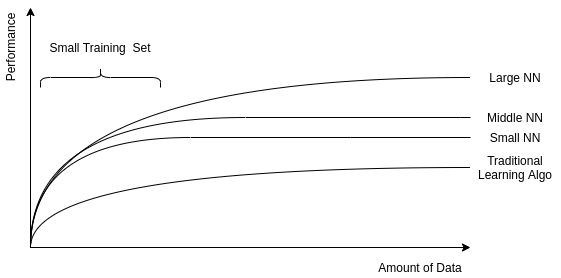
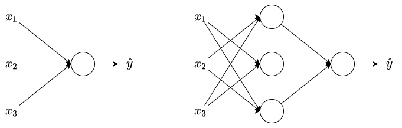

# Neural Network and Deep Learning

## Introduce to deep learning

### What is a Neural Network

At a very simple level, neurons are basically computational units that take inputs(dendrites) as electrical inputs(called "spikes") that are channeled to outputs(axons). A single neuron will calculate weighted sum of input($W.T \cdot X$) and we can set a threshold to predict output in a perceptron. If weighted sum of input across the threshold, perceptron fires and if not then perceptron doesn't predict.

The disadvantage of perceptron is that it only outputs binary values. To make output of perceptron flips we add a bias, here comes: $W.T \cdot X + b$. We need some system which can modify the output slightly accordding to small change in weight and bias, here comes activation functions($g(W.T \cdot X + b)$).

`Sigmoid` is a kind of activation functions, we can make slight change in output with sigmoid function, and the single neuron with sigmoid activation function will act as `Logistic Regression`.

`ReLU` which stands for rectified linear unit, is the most popular activation function right now that makes deep neural network trains faster.

### Supervised learning with neural networks
There are different types of neural networks for supervised learning:

- `CNN`(Convolutional Neural Network) is useful in computer vision;
- `RNN`(Recurrent Neural Network) is useful in speech recognition or NLP(Nature Language Process);
- `Standard NN` is useful for structured data;
- Hybrid/custom NN or a Collection of NNs types

### Why is deep learning taking off

Deep learning is taking off for 3 reasons:

1. Data scale:
    - For small data NN can performs as traditional algorithms like Linear regression or SVM(Support vector mechine);
    - For bigger data a small NN performs better than traditional algos;
    - For really big data, a large NN is better than middle NN that is better than small NN;
    - Hopefully we have a lot of data because the world is using the computer a little bit more.
2. Computation:
    - GPUs;
    - Powerful CPUs;
    - Distributed computing;
    - ASICs.
3. Algorithm:
    - Creative algorithms have appeared that changed the way NN works: For example, using `ReLU` is so much better than using `Sigmoid` function in training a NN because it helps with the vanishing gradient problem.

## Neural Network Basics
This part we learn to set up a machine learning problem with a neural network mindset. Learn to use vectorization to speed up your models.

### Logistic regression
Algorithm is used for classification of 2 classes. We use the equation:

$$
y = wx + b
$$

to calculate the output. 
If $x$ is a vector, the equation becomes:

$$
y = w^Tx + b
$$

If we need $y$ to be in $[0, 1]$(probability):

$$
y = sigmoid(w^Tx + b)
$$

### Logistic regression cost function
The cost function can be the one half a square error:

$$
L(\hat{y}, y) = \frac{1}{2} \cdot (\hat{y} - y)^2
$$

but we won't use this notation because it leads to optimization problem which is non convex, means it contains local optimum points.

Alternately, we use the function:

$$
L(\hat{y}, y) = - (y \cdot \log(\hat{y}) + (1 - y) \cdot \log(1 - \hat{y}))
$$

this leads to two cases:

- if $y = 1$, $L(\hat{y}, 1) = -log(\hat{y})$, we want $\hat{y}$ to be the largest, and the largest value of $\hat{y}$ is $1$;
- if $y = 0$, $L(\hat{y}, 1) = -log(1 - \hat{y})$, we want $1 - \hat{y}$ to be the largest, and the smallest value of $\hat{y}$ is $0$;

Then the cost function will be:

$$
J(w, b) = \frac{1}{m} \sum_{i=1}^{m} {(L(\hat{y}^{[i]}, y^{[i]}))}
$$

The difference between loss function and cost function:

- the loss function calculates the error for a single training example;
- the cost function calculates the average of the loss function of the entire training set.

### Gradient Descent
Our target is to predict $w$ and $b$ that minimize the cost function while the cost function itself is convex.

The gradient descent repeats:

$$
w = w - \alpha \cdot dw
$$

$$
b = b - \alpha \cdot db
$$

to reach the minimum of cost function, while the $\alpha$ is the `learning rate` and $dw$ is the derivative of $w$, $db$ is the derivative of $b$.

### Vectorization
Deep learning shines when the dataset is big. However, `for loop` will make you wait a lot for a result. That's why we need vectorization to get rid of  some of our `for loop`s.

### General steps
The main steps for building a Neural Network are:

- Define the model structure(such as number of input features and outputs);
- Initialize the model's parameters;
- Loop:
    - Calculate current loss(forward propagation);
    - Calculate current gradient(backward propagation)
    - Update parameters(gradient descent)

Tunning the learning rate(which is an example of a "hyperparameter") can make a big difference to the algorithm.

## Shallow neural network
This part we learn to build a neural network with one hidden layer, using forward propagation and backward propagation.

### Neural network overview

In the left logistic regression we had:

$$
z = W^TX + B \Rightarrow a = sigmoid(z) \Rightarrow L(a, Y)
$$

where $W$, $X$ and $B$ are matirx.

In neural networks with one layer we will have:

$$
Z_1 = W_1^TX + B \Rightarrow A1 = sigmoid(Z_1) \Rightarrow Z_2 = W_2^TA_1 + B_2 \Rightarrow A_2 = sigmoid(Z_2) \Rightarrow L(A2,Y)
$$

Neural Network is a stack of logistic regression objects.

### Neural network notations

#### General comments
- Superscript $(i)$ will denote the $i^{th}$ training example while the superscript $[l]$ will denote the $l^{th}$ layer.

#### Sizes
- $m$: number of examples in the dataset;
- $n_x$: input size;
- $n_y$: output size(or number of classes);
- $n_h^{[l]}$: number of hidden units of the $l^{th}$ layer;
- $L$: number of layers in the network.

#### Objects
- $X$: the input matrix
- $x^{(i)}$: the $i^{th}$ example represented as a column vector;
- $Y$: the label matrix;
- $y^{(i)}$: the output label for the $i^{th}$ example;
- $W^{[l]}$: the $l^{th}$ lyaer weight matrix;
- $b^{[l]}$: the bias vector of $l^{th}$ layer;
- $\hat{y}$: the predicted output vector. It can also be denoted $a^{[L]}$ where $L$ is the number of layers in the network.

#### Forward propagation
- $a = g^{[l]}(W_xx^{(i)} + b_1) = g^{[l]}(z_1)$, where $g^{[l]}$ denotes the $l^{th}$ layer activation function;
- $J(x, W, b, y)$ or $J(\hat{y}, y)$ denotes the cost function.

### Activation functions

#### sigmoid
So far we are using sigmoid, but it works not so well:

- sigmoid can lead us to gradient decent problem where the updates are so slow;
- the range of function is $[0, 1]$.

#### tanh
`tanh` is a shifted version of sigmoid with the range $[-1, 1]$. It usually works better than sigmoid activation for hidden units because the mean of its outputs is closer to $0$, and so it centers the data better for the next layer.

#### ReLU
`sigmoid` or `tanh` function disadvantage is that if the input is too small or too high, the slope will be near zero which will cause the gradient decent problem.

One of the popular activation functions that solved the slow gradient decent is the ReLU function.

#### Leaky ReLU
The difference between Leaky ReLU and ReLU is that if the input is negtive the slope will be so small. It works as ReLU but most people use ReLU.

### Why we need non-linear activation functions
Linear activation will output linear activations, that means whatever hidden layers you add, the activation will be always linear like logistic regression, so it's useless in a lot of complex problems.

You might use linear activation function in one place, the output layer, if the output is real number(regression problem). But even in this case if the output value is non-negtive you could still use ReLU instead.

### Derivative of activation functions

- Derivation of sigmoid activation function:

$$
g(z) = \frac{1}{1 + e^{-z}}
$$

$$
g'(z) = \frac{1}{1 + e^{-z}} \cdot (1 - \frac{1}{1 + e^{-z}}) = g(z) \cdot (1 - g(z))
$$

- Derivation of tanh activation function:

$$
g(z) = \frac{e^z - e^{-z}}{e^z + e^{-z}}
$$

$$
g'(z) = 1 - tanh^2(z) = 1 - g^2(z)
$$

- Derivation of ReLU activation function:

$$
g(z) = max(0, z)
$$

$$
g'(z) = 
\begin{cases}
0, \quad \mbox{if} \quad z < 0 \\\\
1, \quad \mbox{if} \quad z >= 0
\end{cases}
$$

- Derivation of leaky ReLU activation function:

$$
g(z) = max(0.01 \cdot z, z)
$$

$$
g'(z) = 
\begin{cases}
0.01, \quad \mbox{if} \quad z < 0 \\\\
1, \quad \mbox{if} \quad z >=0
\end{cases}
$$

### Random initialization
In logistic regression it wasn't important to initialize the weights randomly, while in neural network we have to initialize them randomly.

While initializing bias with $0$ is OK, neural network won't work if we initialize all weights with zeros:

- all hidden units will be completely identical(symmetric) and compute exactly the same function;
- on each gradient descent iteration all the hidden units will always update the same.

We need small values because in sigmoid(or tanh) activation function, for example, if the weights is too large you are more likely to end up with very large values of $Z$. Which causes your tanh or sigmoid activation function to be saturated, thus slowing down learning. If you don't have any sigmoid or tanh activation function throughout your neural network, this is less of an issue.

## Deep neural network
Shallow Neural Network is a Neural Network with $1$ or $2$ layers. Deep Neural Network is a Neural Network with $3$ or more layers.

### Getting your matrix dimensions right
With the equation:

$$
Z = W^TX + B
$$

where $X$ has the shape of $(x, n^{[l-1]})$.

- Dimension of $W$ is $(n^{[l]}, n^{[l-1]})$;
- Dimension of $B$ is $(n^{[l]}, 1)$;
- $dw$ has the same shape as $W$;
- $db$ has the same shape as $B$;
- Dimension of $Z^{[l]}$, $A^{[l]}$, $dZ^{[l]}$, $dA^{[l]}$ is $(n^{[l]}, m)$.

### Hyperparameters
The main parameters of Neural Network is:

- $w$;
- $b$.

Hyperparameters are the parameters that control the algorithm:

- learning rate;
- Number of iteration;
- Number of hidden layers;
- Number of hidden units;
- Choice of activations.
