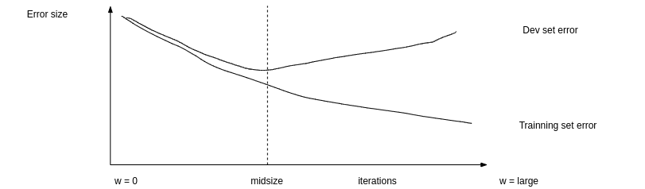
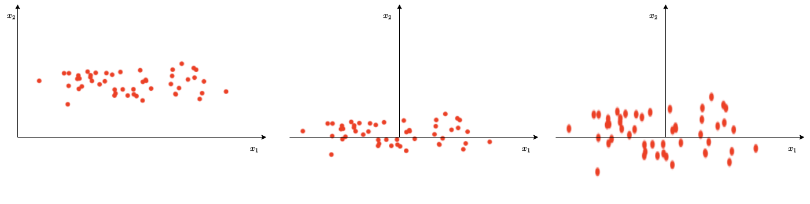
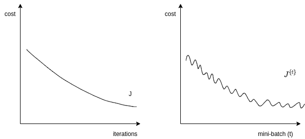
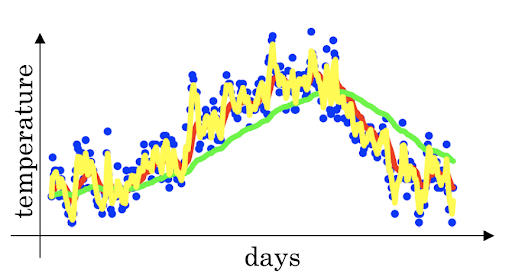
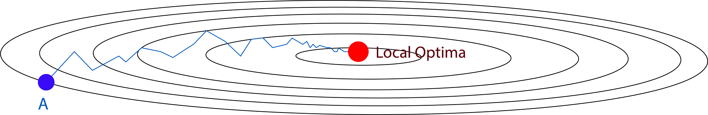

# Improving Deep Neural Networks: Hyperparameter Tuning, Regularition and Optimization

### Practical aspects of deep learning

#### Train/dev/test Sets
It's impossible to get all your hyperparameters right on a new application from the first time, so, the idea is to go through the loop:
```C++
   Idea --> Code --> Experiment
    ^                     |
    |                     |
    -----------------------
```
You can go through the loop many times to figure out your hyperparameters.

Generally, we divid the data into three parts:

- Train set, which used to train the neural network and is usually the largest set;
- Develop(dev) set, which is used to validate the traing result;
- Test set, which is used to test the trained neural network.

You will try to build a model upon `train set` then try to optimize hyperparamters on `dev set` as much as possible. After your model is ready, you can evaluate the model with `test set`.

The ratio of splitting the models is:

- `6:2:2`, if the size of the dataset is $100$ to $1000000$;
- `98:1:1` or `99.5:0.25:0.25`, if the size of the dataset is $> 1000000$.

You should make sure the `dev set` and `test set` comes from the same distribution.

#### Bias/variance
Bias and variance techiques are easy to learn but difficult to master.
Generally, your model is:

- `underfitting`, if it has a `high bias`;
- `overfitting`, if it has a `high variance`.


You can plot the result as the figure above, but if this is not possible, another idea to get bias/ variance is to check the error:

- High variance(overfitting):
    - Training error: 1%;
    - Dev error: 11%.
- High bias(underfitting):
    - Training error: 15%;
    - Dev error: 14%.
- High bias (underfitting) && High variance(overfitting):
    - Training error: 15%;
    - Test error: 30%.
- Best:
    - Training error: 0.5%;
    - Test error: 1%.

These conclusions come from the assumption that human has $0%$ error. If the problem isn't meeting this assumption, you will need to use human error as baseline.

#### Basic recipe for high bias and variance
If your algorithm has a high bias, you can:

- Try to make your neural network bigger(more hidden units or more layers);
- Try a different model that fits your data well;
- Try more batches;
- Try difference(advanced) optimization algorithms.

If your algorithm has a high variance, you can:

- Use more data;
- Try regularization;
- Try a different model that is suitable for your data.

No matter what the problem is, training a bigger neural network never hurts, although this may lead to longer runing time.

### Regularizing your neural network
For variance(overfitting) problems, we can try a bigger training data to fix it. But some times you can't just get more training data, or it would be quite expensive to get more data. In this case regularization will often help to prevent overfitting, or reduce the errors in your network.

#### Regularization

##### Regularization for logistic regression
- $L_1$ regularization

$$
J(w,b) = \frac{1}{m} \sum_{i = 1}^mL(\hat{y^{(i)}}, y^{(i)}) + \frac{\lambda}{2m} \lVert w \rVert_2^2
$$

$$
\lVert w \rVert_2^2 = \sum_{j = i}^{n_x}|w_j|
$$

where $\lambda$ is called regularization parameter(hyperparameter), you can try different value and choose the one with best performance.

- $L_1$ regularization(for arcane technical math, this is called `Frobenius norm`)

$$
J(w,b) = \frac{1}{m} \sum_{i = 1}^mL(\hat{y^{(i)}}, y^{(i)}) + \frac{\lambda}{2m} \lVert w \rVert_1
$$

$$
\lVert w \rVert_1 = \sum_{j = i}^{n_x}w_j^2 = w^Tw
$$

##### Regularization for neural network
The normal cost function that we want to minimize is:

$$
J(w^{[1]}, b^{[1]}, ..., w^{[L]}, b^{[L]}) = \frac{1}{m} \sum_{i = 1}^{m}L(\hat{y^{(i)}}, y^{(i)})
$$

Then the $L_2$ regularization is:

$$
J(w^{[1]}, b^{[1]}, ..., w^{[L]}, b^{[L]}) = \frac{1}{m} \sum_{i = 1}^{m}L(\hat{y^{(i)}}, y^{(i)}) + \frac{1}{2m} \sum_{l = 1}^{L} \lVert w^{[l]} \rVert^2
$$

The old way we do back propagation is:

$$
dw^{[l]} = (back propagation)
$$

$$
w^{[l]} = w^{[l]} - \alpha \cdot dw^{[l]}
$$

Then we change to:

$$
dw^{[l]} = (back propagation) + \frac{\lambda}{m} \cdot w^{[l]}
$$

So:

$$
\begin{align}
w^{[l]} 
& = w^{[l]} - \alpha \cdot dw^{[l]} \\\\
& = w^{[l]} - \alpha * ((back propagation) + \frac{\lambda}{m} \cdot w^{[l]}) \\\\
& = w^{[l]} - \alpha * (back propagation) - \alpha * (\frac{\lambda}{m} \cdot w^{[l]}) \\\\
& = (1 - \frac{\alpha\lambda}{m}) \cdot w^{[l]} - \alpha * (back propagation)
\end{align}
$$

In practice this will penalize large weights and effectively limits the freedom in your model, because the them $(1 - \frac{\alpha\lambda}{m}) \cdot w^{[l]}$ causes the `weight to decay` in propartion to its size.

##### Why regularization reduces overfitting
Here are some intuitions:

- If $\lambda$ is too large: a lot of $w$ part will be close to $0$, which makes the neural network more simple;
- If $\lambda$ is good enough: it will reduce some weights that makes the neural network overfitting.

And for $tanh$ activation function:

- If $\lambda$ is too large, $w$ part will be small(close to $0$), which will use the linear part of the $tanh$ activation function, so we will go from non-linear activation to roughly linear which would make the neural network a roughly linear classifier.
- If $\lambda$ is good enough, it will just make some of $tanh$ activations roughly linear which will prevent overfitting.

#### Dropout regularization
In most case, we use $L_2$ regularization. The dropout regularization eliminates some neurons/weights on each iteration based on a probability. A most common techinque to implement dropout is called `Inverted dropout`:
```Python
keep_prob = 0.8   # 0 <= keep_prob <= 1
l = 3  # this code is only for layer 3
## the generated number that are less than 0.8 will be dropped. 80% stay, 20% dropped
d3 = np.random.rand(a[l].shape[0], a[l].shape[1]) < keep_prob

a3 = np.multiply(a3,d3)   # keep only the values in d3

## increase a3 to not reduce the expected value of output
## (ensures that the expected value of a3 remains the same) - to solve the scaling problem
a3 = a3 / keep_prob
```

##### Understanding dropout

- Dropout knocks out units in neural network randomly, so it works like on every iteration you're working with a smaller neural network which has a regulizing effect.
- Neural network can not rely on any one feature because it may be knocked out, so it has to spread out weights.
- Dropout can have different `keep_prob` per layer.
- The input layer dropout has to be near $1$(or just $1$) because you don't want to eliminate a lot of featrues.
- A lot of researchers are using dropout with Computer Vision(CV), bacause they have a very big input size and almost nerver have enough data, so overfitting is the usual problem. And dropout is a regularization technique to prevent overfitting.

#### Other regularization methods

##### Data augmentation
- In a computer vision data, you can:
    - flip all your pictures horizontally which will give you more data instances;
    - apply a random position and rotation to an image to get more data.
- In OCR you can impose random ratation and distortions to digits/letters.
- New data obtained using this technique isn't as good as the real independent data, but still can be used as a regularization techniques.

##### Early stopping
We plot the `training set cost` and the `dev set cost` together for each iteration. At some iteration the `dev set cost` will stop decreasing and will start `increasing`. We will pick the point at wich the training set error and dev set error are best(lowest training cost with lowest dev cost).


We prefer to use $L_2$ regularization instead of early stop because this technique simultaneously tries to mimimize the cost function and not to overfit which contradicts the orthogonalization approch. But its advantage is that you don't need to search a hyperparameter.

##### Model ensembles
You can train multiple independent models and average their results, this can get you extra 2% performance and reduces the generalization error.

### Setting up your optimization problem

#### Normallizing inputs
Normalizing inputs will speed up the training process a lot.


Normalization are going on these steps:

1. Get the mean of the training set: $mean = \frac{1}{m} * \sum_{i=1}^mx^{(i)}$
2. Subtract the mean from each input: $X = X - mean$, this will make your inputs centered around $0$.
3. Get the variance of the training set: $variance = \frac{1}{m} * \sum_{i = 1}^m(x^{(i)})^2$
4. Normalize the variance: $X = X / variance$

So why we normalize our inputs?

- If we don't normalize the inputs our cost function will be deep and its shape will be inconsistent(elongated), then optimizing it will take a long time.
- If we normalized the inputs, the shape of the cost function will be consistent(look more symmetric like circle in 2D exmaple) and we can use a larger learning rate $\alpha$, the optimization will be faster.

#### Vanishing/exploding gradients
The vanishing/exploding gradients occurs when your derivates becomes very small or very big. To understand the problem, suppose that we have a deep neural network with number of layer $L$, and all the activation functions are `linear` and each $b = 0$, then:

$$
\hat{y} = w^{[L]}w^{[L - 1]}w^{[L - 2]} \cdots w^{[2]} w^{[1]} x
$$

and if we have 2 hidden units per layer and $x_1 = x_2 = 1$, we will result in:

$$
\hat{y} = w^{[L]} \begin{bmatrix}x & 0 \\\\ 0 & x \end{bmatrix}^{L-1} = x^L \\\\
$$

as:

$$
w^{[L]} = \begin{bmatrix}x & 0 \\\\ 0 & x \end{bmatrix}^{L-1}
$$

If $x < 1$, $\hat{y}$ will be very small; if $x > 1$, $\hat{y}$ will be really big.
This example explains that the activations (and similarly derivatives) will be decreased/increased exponentially as a function of number of layers.

#### Weight initialization for deep networks
A partial solution to the vanishing/exploding gradients in neural network is better or more careful choice of the random initialization of weights.
In a simgle neuron: $Z = w_1x_1 + w_2x_2 + \cdots + w_nx_n$, if the number of node $n_x$ is large, we want $w$ to be smaller to not explode the cost, which turns out that we need the variance(equal to $\frac{1}{n_x}$) to be the range of $W$.
So we initialize $W$ like this(better to use with `tanh` activation):
```Python
np.random.rand(shape) * np.sqrt(1/n[l-1])
```
or variation of this:
```Python
np.random.rand(shape) * np.sqrt(2/(n[l-1] + n[l]))
```
Setting initialization part inside sqrt to `2/n[l-1]` for `ReLU` is better:
```Python
np.random.rand(shape) * np.sqrt(2/n[l-1])
```
This is one of the best way of partially solution to Vanishing / Exploding gradients (ReLU + Weight Initialization with variance) which will help gradients not to vanish/explode too quickly.

## Optimization algorithms
Training neural network with a large data is slow, so it's necessary to optimize the algorithm to run faster.

### Mini-batch gradient descent
Suppose we have a data set with the size of `50m`, training it will take a huge processing time for one step because 50 million won't fit in the memory at once. To deal with this we can use `mini-batch` to process some of our items even before finishing the 50 million items. The process is:

- Split $X$(with the size `m`) into `mini-batch` of size `b`:
    - $X^{ \\{ 1 \\} } = 0,  \cdots, b$
    - $X^{ \\{ 2 \\} } = b + 1, \cdots, 2b$
    - $\cdots$
    - $X^{ \\{ \frac{m}{b} \\} } = (\frac{m}{b} - 1) * b, \cdots, \frac{m}{b} * b\cdots 2b$
- Split $Y$ into `mini-batch` of size `b`, so we get the definition of `mini-batch`: $t: X^{\\{ t \\}}, Y^{\\{ t \\}}$
- Like old `batch gradient descent`, with `mini-batch gradient descent` we run the gradient descent on the mini datasets:

```python
for t = 1 : Sum_of_mini-batches  # this is called an epoch
	AL, caches = forward_prop(X{t}, Y{t})
	cost = compute_cost(AL, Y{t})
	grads = backward_prop(AL, caches)
	update_parameters(grads)
```

#### Understanding mini-batch gradient descent
Unlike batch gradient descent where cost function decreases each iteration, mini-batch's cost function won't go down with each step, it may contain ups and downs but generally it goes down.



The gradient descent type depends on mini-batch size:

- mini-batch-size = m: batch gradient descent, which is too long per iteration(epoch);
- mini-batch-size = 1: stochastic gradient descent(SGD), which:
    - is too noisy regarding cost minimization(can be reduced by using smaller learning rate);
    - won't ever converge(reach the minimum cost);
    - loses speedup from vectorization.
- mini-batch-size = (1, m): mini-batch gradient descent, which:
    - has faster learning speed:
        - it can take the advantage of vectorization;
        - it makes progress without waiting to process the entire training set.
    - doesn't always exactly converge(oscelates in a very small region)

How to choose the `mini-batch` size? Here are the suggestions:

- m < 2000: Batch gradient descent;
- It has to be the power of $2$(64, 128, ..., 1024, ...), because of the way computer memory is layed and accessed your code might run faster;
- Make sure that the `mini-batch` fits in CPU/GPU memory.

### Exponentially weighted average
If you have data like the temparature of day throughout the year:

$$
\begin{array}{l}
\theta_1 = 40 \\\\
\theta_2 = 49 \\\\
\theta_3 = 45 \\\\
\cdots \\\\
\theta_{180} = 60
\end{array}
$$

This data is samll in winter but big in summer. It's noisy if we plot it out.
Now we use the `exponentially weighted averages` equation

$$
v_t = \beta * v_{t - 1} + (1 - \beta) * \theta_t
$$

The result is:

$$
\begin{array}{l}
v_0 = 0 \\\\
v_1 = \beta * v_0 + (1 - \beta) * \theta_1 \\\\
v_2 = \beta * v_0 + (1 - \beta) * \theta_2 \\\\
v_3 = \beta * v_0 + (1 - \beta) * \theta_3 \\\\
\cdots
\end{array}
$$

If we plot this it will represent averages about $\frac{1}{1 - \beta}$ entries:

- $\beta = 0.9$ will average last 10 entries;
- $\beta = 0.98$ will average last 50 entries;
- $\beta = 0.5$ will average last 2 entries.

The reason why `exponentially weighted averages` is useful for further optimizing gradient descent is that, it can give different weights to recent data points($\beta$) based on value of $\beta$. If $\beta$ is high(around 0.9),  it smoothens out the averages of skewed data points, which will reduce oscillations in gradient descent and hence make faster and smoother path towards minima.


The advantage of this algorithm is that its implementation is efficient and fast because it has only one param: $\beta$.

#### Bias correction in exponentially weighted averages
Because $v_0 = 0$, the bias of the weighted averages is shifted and the accuracy suffers at the start. We use following equation to solve the bias issue:

$$
v_t = \frac{\beta * v_{t - 1} + (1 - \beta) * \theta_t}{1 - \beta^t}
$$

As $t$ becomes larger the $1 - \beta^t$ term will become close to $1$.

### Gradient descent with momentum
The momentum algorithm almost always works faster than standard gradient descent. The simple idea is to calculate the exponentially weighted averages for your gradients and then update your weights with the new values:

$$
\begin{array}{l}
v_{dW} = \beta \cdot v_{dW} + (1 - \beta) \cdot dW \\\\
v_{db} = \beta \cdot v_{db} + (1 - \beta) \cdot db \\\\
W = W - \alpha \cdot v_{dW} \\\\
b = b - \alpha \cdot v_{db}
\end{array}
$$

where $\alpha$ is learning rate, $\beta$ is another `hyperparameter`, $\beta = 0.9$ is very common and works very well in most cases.

> In practice we don't bother implementating `bias correction`

### RMSprop
`RMSprop` stands for `Root Mean Square prop`. It speeds up the gradient descent:

$$
\begin{array}{l}
s_{dW} = \beta \cdot s_{dW} + (1 - \beta) \cdot dW^2 \\\\
s_{db} = \beta \cdot s_{db} + (1 - \beta) \cdot db^2 \\\\
W = W - \alpha \cdot \frac{dW}{\sqrt{s_{dW}}} \\\\
b = b - \alpha \cdot \frac{dW}{\sqrt{s_{db}}}
\end{array}
$$

RMSprop will make the cost function move slower on the vertical direction and faster on the horizontal direction:



To ensure $s_{dw}$ is not zero, we add $\epsilon$ (e.g. $\epsilon = 10^{-8}$)to the demoninator: 

$$
W = W - \alpha \cdot \frac{dW}{\sqrt{s_{dW}} + \epsilon}
$$

### Adam optimization algorithm
`Adam` stands for `Adaptive Moment Estimation`. Adam and RMSprop are among the optimization algorithms that works very well with a lot of neural network architecture. Adam simply puts RMSprop and momentum together:

$$
\begin{align}
v_{dW} &= \beta_1 \cdot v_{dW} + (1 - \beta_1) \cdot dW \\\\
v_{db} &= \beta_1 \cdot v_{db} + (1 - \beta_1) \cdot db \\\\
s_{dW} &= \beta_2 \cdot s_{dW} + (1 - \beta_2) \cdot dW^2 \\\\
s_{db} &= \beta_2 \cdot s_{db} + (1 - \beta_2) \cdot db^2 \\\\
v_{dW} &= \frac{v_{dW}}{1 - \beta_1^t} \\\\
v_{db} &= \frac{v_{db}}{1 - \beta_1^t} \\\\
s_{dW} &= \frac{s_{dW}}{1 - \beta_1^t} \\\\
s_{db} &= \frac{s_{db}}{1 - \beta_1^t} \\\\
W &= W - \alpha \cdot \frac{v_{dW}}{\sqrt{s_{dW}} + \epsilon} \\\\
b &= b - \alpha \cdot \frac{v_{db}}{\sqrt{s_{db}} + \epsilon}
\end{align}
$$

In equation:

- (5) and (6) are momentum;
- (7) and (8) are RMSprop;
- (9) - (12) are bias correction;
- $\alpha$ is learning rate and needs to be tuned;
- $\beta_1$ is the parameter of momentum, $0.9$ is recommanded by default;
- $\beta_2$ is the parameter of RMSprop, $0.999$ is recommanded by default;
- $\epsilon = 10^{-8}$ recommanded by default.

### Learning rate decay
Learning rate decay is to reduce the learning rate slowly. As mentioned before, mini-batch gradient descent won't reach the optimum point(converge). But by making the learning rate decay with iterations it will be much closer to it because the steps near the optimum are smaller.

One technique equations is:

$$
\alpha = \frac{1}{1 + k_{decay} \cdot t} \cdot \alpha_0
$$

where $k_{decay}$ is decay rate, $t$ is the epoch number.
Other learning rate decay can be:

$$
\alpha = 0.95^{t} \cdot \alpha_0
$$

or

$$
\alpha = \frac{k}{\sqrt{t}} \cdot \alpha_0
$$

Learning rate decay has less priority than other optimization methods.

## Hyperparameter tuning and batch nomalization

### Tuning process
When we train a neural network, we usually need to tune our hyperparameters to get the best out of them. The importance rank of these hyperparameters is:

1. Learning rate, $\alpha$;
2. Momentum, $\beta$;
3. Mini-batch size, $b$;
4. Number of hidden units;
5. Number of layers;
6. Learning rate decay;
7. Ragularization $\lambda$;
8. Activation functions;
9. Adam $\beta_1$, $\beta_2$ and $\epsilon$.

One of the ways to tune is to sample a grid with $N$ hyperparameter settings and then try all setting combinations on your problem. You should try random values, not the grid.
You can use `Coarse to fine sampling scheme`:
> When you find some hyperparameters values that give you a better performance, zoom into a smaller region around these values and sample more densely within this space.

### Using an appropriate scale to pick hyperparameters
Assume that you have a specific range for a hyperparameter from `a` to `b`, it's better to search for the right ones using logarithmic scale rather than in linear scale:

- $a_{log} = log(a)$: if $a = 0.001$ then $a_{log} = -4$
- $b_{log} = log(b)$: if $b = 1$ then $a_{log} = 0$

Then: $r = (a_{log} - b_{log}) * rand + b_{log}$, the range will be [-4, 0] and result $r = 10^r$.

For example, we have known that the best range for `Momentum` $\beta$ is $[0.9, 0.999]$, you should search for $1 - \beta$ in the range $[0.001, 0.1]$, and use $a = 0.001$ and $b = 0.1$. Then:

- $a_{log} = -3$
- $b_{log} = -1$
- $r = (a_{log} - b_{log}) * rand + b_{log}$
- $\beta = 1 - 10^r$

#### Hyperparameters tuning in practice: Pandas vs. Caviar
Intuitions about hyperparameter settings from one application area may or may not trasfer to a different one.

If you don't have much computational resources you can use `Panda` approach:

- Day 0 you might initialize your parameter as random and then start training;
- Then you watch your learning curve gradually decrease over the day;
- And each day you nudge your parameters a little during training.

If you have enough computational resources, you can use `Caviar` approach: 

- Run some models in parallel and at the end of the day you check the result.

#### Normalizing activations in a network
Normalizing input by subtracting the mean and dividing by variance helps a lot for the shape of the cost function and for reaching the minimum point faster.  The question is:
> for any hidden layer can we normalize $A^{[l]}$ to train $W^{[l+1]}$ and $b^{[l+1]}$ faster?
This is what batch normalization is about.

There are some debates about whether you should normalize values before the activation function $Z^{[l]}$ or after applying the activation function $A^{[l]}$. In practice, nomalizing $Z^{[l]}$ is much more often.
The algorithm porcess is:

- Given $Z^{[l]} = [z^{(1)}, \cdots, z^{(m)}]$;
- Compute $mean = \frac{1}{m} * \sum^m\_{i=1}{z^{[i]}}$
- Compute $variance = \frac{1}{m} * \sum_{i=1}^m(z^{[i]}-mean)^2$
- Then $Z_{norm}^{[i]} = \frac{z^{[i]}}{\sqrt{variance + epsilon}}$
     - forcing the inputs to distribution with 0 mean and variance of 1
- Then $\tilde{z}^{[i]} = \gamma * z_{norm}^{[i]} + \beta$
     - Make inputs belong to other distribution(with other mean and variance);
     - $\gamma$ and $\beta$ are learnable parameters of the model;
     - Make the neural network learn the distribution of the outputs;
     - Note: if $\gamma = \sqrt{variance + epsilon}$ and $\beta = mean$, then $\tilde{z}^{[i]} = z^{[i]}$

#### Fitting Batch normalization into a neural network
Batch normalization is usually applied with mini-batches.
If we use batch normalization parameters $b^{[1]}, \cdots, b^{[l]}$ doesn't count because they will be eliminated after mean subtraction step. So the parameters will be:

- $W^{[l]}$;
- $\beta^{[l]}$;
- $\alpha^{[l]}$.

#### Why does batch normalization work?

- The first reason is the same reason as why we normalize $X$;
- The second reason is that batch normalization reduces the problem of input values changing(shifting);
- Batch normalization does some regularization:
     - Each mini-batch is scaled by the mean/variance computed of that mini-batch;
     - This adds some noise to the value $Z^{[l]}$ within that mini-batch, so similar to dropout it adds some noise to each hidden layer's activation;
     - This has a slight regularization effect;
     - Using bigger size of the mini-batch you are reducing noise and therefore regularization effect;
     - Don't rely on batch normalization as a regularization, it's intended for normalization of hidden units, activations and therefore speeding up learning. For regularization use other regularization techniques.

#### Batch normalization at test time
When we train a neural network with batch normalization, we compute the mean and the variance of the mini-batch. But in testing we might need to process examples one each time, whose mean and variance won't make sense. So we have to compute the average across the mini-batch, this is called `Running average`.

#### Softmax Regression
The neural networks we trained so far are binary classifications, but there are a generalization of logistic regression called `Softmax regression` that is used for multiclass classification/regression. In the last layer of the neural network we use the `Softmax regression` activation instead of `sigmoid` to classify the classes.

$$
t = e^{Z^{[L]}}
$$

$$
A_{[L]} = \frac{e^{Z^{[L]}}}{\sum{t}}
$$

#### Trainning a Softmax classifier
There is an activation called `hard max` which get $1$ for the maximum value and $0$ for others. The `softmax` named because it's not so `hard`, it can be values in $[0, 1]$.

Softmax is a generalization of logistic activation function to `C` classes. If `C = 2` then `softmax` reduces to logistic regression.

The loss function used which `softmax`:

$$
L(y, \hat{y}) = - \sum_{j=0}^{C-1}(y^{[j]} * log(\hat{y}^{[j]}))
$$

The cost function used with `softmax`:

$$
J(w^{[1]}, b^{[1]}, \cdots) = -\frac{1}{m} * \sum_{i=0}^{m}(L(y^{[i]}, \hat{y}^{[i]}))
$$

Back propagation with `softmax`:

$$
dZ^{[L]} = \hat{Y} - Y
$$

The derivative of softmax is:

$$
\hat{Y} * (1 - \hat{Y})
$$


