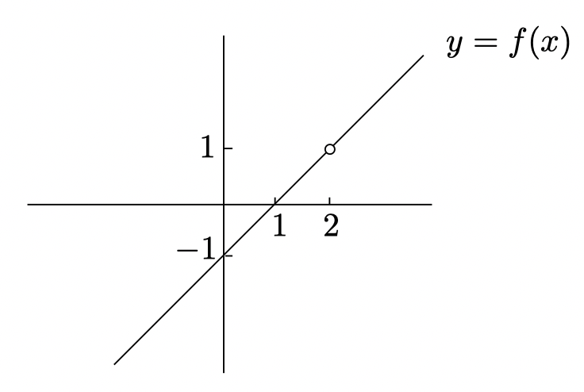

# Limits

Calculus wouldn't exist without the concept of limits. It turns out that it's pretty tricky to define a limit properly, but you can get an intuitive understanding of limits even without going into the glory details

## The basic idea

We start with some function $f$ and a point on the $x$-axis which we call $a$. Here is what we'd like to understand:
> What does $f(x)$ look like when $x$ is really close to $a$, **but not equal to $a$** ? 

Suppose that we have a a function $f$ with domain $\mathbb{R}\backslash\{2\}$, and set $f(x) = x - 1$ on this domain. Formally we wright:

$$
f(x) = x - 1 \quad when \quad x \ne 2
$$

The graph of the function is like:

You can get as close as you want to $1$, without actually getting to $1$ by letting $x$ be close enough to $2$. Without getting bogged down, we just write:

$$
\lim_{x \to 2}f(x) = 1
$$

which read as:
> the limit, as $x$ goes to $2$, of $f(x)$ is equal to $1$.
As $x$ journeys along the number line from the left or the right toward the number $2$, the value of $f(x)$ gets very very close to $1$(and stays close!).

And what if the function has special value at limit point? For example, we have:

$$
g(x) = 
\begin{cases}
x - 1 & if \quad x \ne 2, \\
3 & if \quad x = 2.
\end{cases}
$$

What is $\lim_{x \to 2}g(x)$? The tricky here is that the value of $g(x)$ is irrenlevent with $\lim_{x \to 2}g(x)$, it's only the values of $g(x)$ where  $x$ is close to $2$, not actually **at** 2, which matter.

So, $\lim_{x \to 2}g(x) = 1$ as before, even though $g(x) = 3$.

## Left-hand and right-hand limits
If we have a function graph like this:

Of course $h(x) = 2$ is irrelevant as far as the limiting behavior is concerned.  

Imagine that you're the hiker in the picture, climbing up and down the hill. The value of $h(x)$ tells you how high up you are when your horizontal position is at $x$. So if you walk right ward from the left of the picture, you get the `left-hand limit` of $h(x)$ at $x = 3$ is equal to $1$. On the other hand, if you are walking leftward from the right-hand side of the picutre, your height becomes close to $-2$ as your horizontal position gets close to $x =3$. This means that the `right-hand limit` is equal to $-2$.

We can summarize our findings from above by writing:
$$
\lim_{x \to 3^-} h(x) = 1
$$

and

$$
\lim_{x \to 3^+} h(x) = -2
$$

The minus sign after $3$ means the limit is a `left-hand limit`, and the plus sign means the limit is a `right-hand limit`.

The regular two-sided limit at $x = a$ exists **exactly when** both left-hand and right-hand limits at $x = a$ exist and **are equal to each other**.
If the left-hand limit and right-hand limit are not equal, the two-sided limit *does not exist*, written as:

$$
\lim_{x \to 3} h(x) = DNE
$$

## Limits at $\infty$ and $-\infty$
In above parts we've concentrated on the behavior of a function near a point $x = a$, however sometimes it's important to understand how a function behaves when $x$ gets really huge. We defines the `large` and `small` number as this:

A number is

- `large`, if its absolute value is really big number;
- `small`, if it is really close to $0$(but not actually equal to $0$).

We can say the limit at infinity as:

- "f has a right-hand horizontal asymptote at y = L", means:

$$
\lim_{x \to \infty} f(x) = L
$$

- "f has a left-hand horizontal asymptote at y = M", means:

$$
\lim_{x \to -\infty} f(x) = M
$$

## Two common misconceptions about asymptotes

### A function doesn't have to have the same horizontal asymptote on the left as on the right. 
For example, the graph of $y = tan^{-1}(x)$ looks like:

it has the limit of:

- $\lim_{x \to \infty} tan^{-1}(x) = \frac{\pi} {2}$
- $\lim_{x \to -\infty} tan^{-1}(x) = -\frac{\pi} {2}$

### A function can cross its asymptote.

The graph of $y = \frac{\sin(x)}{x}$ is like:

and it crosses its aymptote many times.

## The sandwich principle

The `sandwich principle`, also known as `squeeze principle`, says that:
> If a function $f$ is sandwiched between two functions $g$ and $h$ that converge to the same limit $L$ as $x \to a$, then $f$ **also** converges to $L$ as $x \to a$.

There is a similar version of the sandwich principle for one-sided limits, except this time the inequality $g(x) < f(x) < h(x)$ only has to hold for $x$ on the side of $a$ that you care about. 

For example, the function $f(x) = x sin(\frac{1}{x})$ is sandwiched by $h(x) = x$ and $g(x) = -x$:

we can say that:

$$
\lim_{x \to +0} x \sin(\frac{1}{x}) = 0.
$$

In summary if:

$$
g(x) \le f(x) \le h(x)
$$

for all $x$ near $a$, and

$$
\lim_{x \to a} g(x) = \lim_{x \to a} h(x) = L
$$

then:

$$
\lim_{x \to a} f(x) = L.
$$

