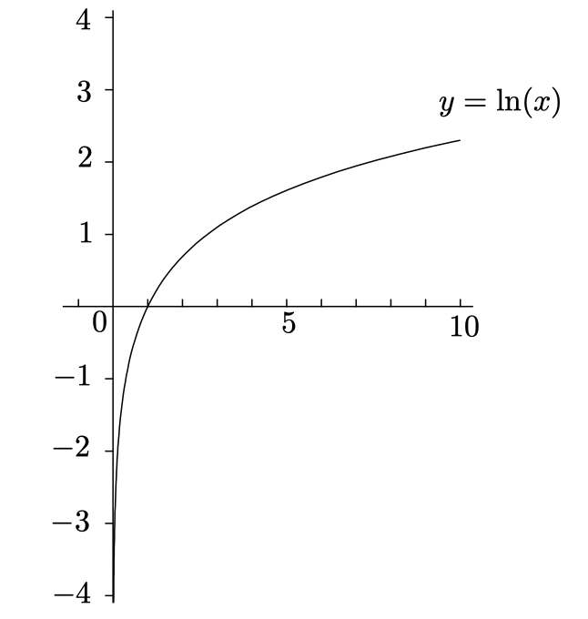

# Exponentials and Logarithms
It turns out that there's a special base, the number $e$, that works out particularly nicely, doing calculus with $e^x$ and $log_e(x)$ is much easier than dealing with $2^x$ or $log_3(x)$. Let's spend some time looking at $e$ and its calculus.

## The Basics
Before you start doing calculus with exponentials, you really need to understand their properties.

### Exponentials
The rough idea is that we'll take a positive number, called the `base`, and raise it to a power called the `exponent`:

$$
base^{exponent}
$$

For any base $b > 0$ and real numbers $x$ and $y$:

- $b^0 = 1$
- $b^1 = b$
- $b^xb^y = b^{x + y}$
- $\frac{b^x}{b^y} = b^{x - y}$
- $(b^x)^y = b^{xy}$

### Logarithms
$\log_b{y}$ is the power you have to raise the base $b$ to in order to get $y$, which means that $x = \log_by$ is the solution of the equation $b^x = y$ for given $b$ and $y$:

$$
b^{\log_b(y)} = y
$$

Here are the rules valid for any base $b > 1$ and positive real numbers $x$ and $y$:

- $\log_b(1) = 0$
- $\log_b(b) = 1$
- $\log_b(xy) = \log_b(x) + \log_b(y)$
- $\log_b(x/y) = \log_b(x) - \log_b(y)$
- $\log_b(x^y) = y\log_b(x)$
- $\log_b(x) = \frac{\log_c(x)} {\log_c(b)}$

## Definition of $e$

The $e$ is a special constant number like $\pi$. One way of seeing where $e$ comes from involves a bit of a finance lesson.

### A question about compound interest
A long time ago, a dude named Bernoulli answers a question about compound interest. Here is the setup for his question. Let's suppose you have a bank account that pays interest at a generous rate of $12%$ annually, compounded once a year. You put in an initial deposit; every year, your fortune increase by $12%$. This means that after $n$ years, your fortune has increased by a factor of $(1 + 0.12)^n$. In particular, after one year, your fortune is just $(1 + 0.12) = 1.12$ times the original amount. If you started with $100, you'd finish the year with $112.

Now suppose you find another bank that also offers an annual interest rate of $12%$, but now it compounds twice a year. Of course you aren't going to get $12%$ for half a year; you have to divide that by $2$. Basically this means that you are getting $6%$ interest for every 6 months. So if you put money into this bank account, then after one year it has compounded twice at $6%$; the result is that your fortune has expanded by a factor of $(1 + 0.06)^2 = 1.1236$. So if you started with $100, you'd finish with $112.36.

The second account is a little better than the first. It makes sense when you think about it--compounding is beneficial, so compounding more often at the same annual rate should be better. Let's try 3 times a year at the annual rate of $12%$. We take $12%$ and divide by $3$ to get $4%$, then compound three times; our fortune has increased by $(1 + 0.04)^3$, which works out to be $1.124864$. This is a little higher still. How about 4 times a year? That'd be $(1 + 0.03)^4$, which is approximately $1.1255$. That's even higher. Now, the question is, where does it stop? If you compound more and more often at the same annual rate, do you get wads and wads of cash after a year, or is there some limitation on all this?

### The answer to our question

Let's turn to some symbols. First, let's suppose that we are compounding n times a year at an annual rate of $r$, this means that each time we compound, the amount of compounding is $r / n$. After this happens n times in one year, our original fortune has grown by a factor of:

$$
(1 + \frac{r}{n})^n
$$

We would like to know what happens in the limit as $n \to \infty$:

$$
L = \lim_{n \to \infty} (1 + \frac{r}{n})^n
$$

If this limit turns out to be finite, then by compounding more and more often, you could get more and more money in a single year. On the other hand, if it turns out to be finite, we'll have to conclude that there is a limitation on how much we can increase our fortune with an annual interest rate of $r$, no matter how often we compound.

First, lets' set $h = \frac{r}{n}$, so that $n = \frac{r}{h}$. Then as $n \to \infty$, we seet that $h \to 0^+$(since $r$ is constant), so:

$$
L = \lim_{h \to 0^+}(1 + h)^{\frac{r}{h}}
$$

Use the exponential rule:

$$
L = \lim_{h \to 0^+}((1 + h)^{\frac{1}{h}})^r
$$

Let's pull a huge rabbit out of the hat and set:

$$
e = \lim_{h \to 0^+}(1 + h)^{\frac{1}{h}}
$$

and we have:

$$
L = \lim_{h \to 0^+}((1 + h)^{\frac{1}{h}})^r = e^r
$$

The number $e$ turns out to be an irrational number whose decimal expansion begins like this:

$$
e = 2.71828182845904523...
$$

The base $e$ logarithm is called the `natural logarithm`. Since we have a new base $e$, and a new way of writing logarithms in that base, the basic rules of logarithm can be rewritten as:

- $e^{\ln(x)} = x$
- $\ln(e^x) = x$
- $\ln(1) = 0$
- $\ln(e) = 1$
- $\ln(xy) = \ln(x) + \ln(y)$
- $\ln(\frac{x}{y}) = \ln(x) - \ln(y)$
- $\ln(x^y) = y\ln(x)$

## Differentiation of Logs and Exponentials

With the definition of limit, we can find the derivatives of logs and exponentials:

- $(\ln(x))' = \frac{1}{x}$
- $(\log_b(x))' = \frac{1}{x\ln(b)}$
- $(e^x)' = e^x$
- $(b^x)' = b^xln(b)$

### Behavior of exponentials near 0
In fact, we know that:

$$
\lim_{x \to 0} e^{x^2} = e^0 = 1
$$

But what about the limit:

$$
\lim_{h \to 0} \frac{e^h - 1} {h}
$$

Well, try setting $f(x) = e^x$, we have:

$$
f'(x) = \lim_{h \to 0} \frac{f(x + h) - f(x)} {h} = \lim_{h \to 0} \frac{e^{x + h} - e^x} {h} = e^x
$$

Simplify the equation, we have:

$$
\lim_{h \to 0} \frac{e^h - 1} {h} = 1
$$

### Behavior of logarithms near 1

It turns out that the situation is pretty simillar to the case of exponentials near 0:

$$
\lim_{h \to 0} \frac{\ln(1 + h)} {h} = 1
$$

### Behavior of exponentials near $\infty$ or $-\infty$

Let's take a look at the graph of $y = e^x$:

and get the conclusion:

$$
\lim_{x \to \infty} e^x = \infty
$$

and

$$
\lim_{x \to -\infty} e^x = 0
$$

What if we the base $e$ is replaced by some other base?

$$
\lim_{x \to \infty} r^x = 
\begin{cases}
\infty, & if \quad r > 1, \\
1, & if \quad r = 1, \\
0, & if \quad r < 1.
\end{cases}
$$

In addtion to all equations above, as `Exponentials grow quickly`:

$$
\lim_{x \to \infty} \frac{x^n}{e^x} = 0
$$

no matter how large $n$ is.

### Behavior of logs near $\infty$

The sage continues. Here is the graph of $y = \ln(x)$:

$$
\lim_{x \to \infty} \ln(x) = \infty
$$

And as the logs grow slowly, if $a > 0$:

$$
\lim_{x \to \infty} \frac{\ln(x)} {x^a} = 0
$$

no matter how small $a$ is.

### Behavior of logs near 0
Logs grow slowly at $0$, so if $a > 0$:

$$
\lim_{x \to 0^+} x^a\ln(x) = 0
$$

no matter how small $a$ is.
