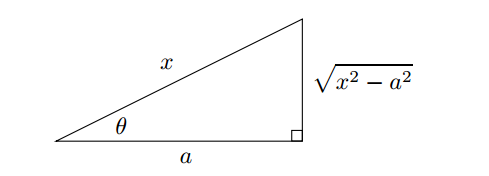

# Techniques to Solve Integration Problems

## Substitution

Substitution, also known as "change of variables", comes from the chain rule.
What saves us in the case of $\int 2x e^{x^2} dx$ is the presence of the 2x factor, which is exactly what popped out when we used the chain rule to differentiate $e^{x^2}$. Now imagine starting with an indefinite integral like this:

$$
\int x^2 cos(x^3) dx
$$

The derivative of the quantity $x^3$ is $3x^2$. This almost matches the factor $x^2$ in the integrand, it's only the constant 3 that makes things a little more difficult. Still, constants can move in or out of integrals, so that should not be a problem.

Start off by setting $t = x^3$, we can get:

$$
\int x^2 cos(x^3) dx = \int cost(x^3) (x^2 dx) = \int cos(t) (\frac{1}{3} dt)
$$

The middle step isn't really necessary, but it helps to see $x^2$ $dx$ next to each other so that you can justify replacing theme by $\frac{1}{3} dt$. Anyway, now we can drag the factor of $\frac{1}{3}$ outside the integral, then integrate:

$$
\int x^2 cos(x^3) dx = \int cos(t) \frac{1}{3} dt = \frac{1}{3} \int cos(t) dt = \frac{1}{3} + C
$$

It's pretty lazy to leave the answer as $\frac{1}{3} sin(t) + C$. We started in x-land, then migrated over to t-land; now we have to come back to x-land. This isn't hard to do: just replace t by $x^3$ once agin:

$$
\int x^2 cos(x^3) dx = \frac{1}{3} sin(x^3) + C
$$

In general, if $f$ is a differentiable function, then:

$$
\int \frac{f'(x)}{f(x)} dx = \ln |f(x)| + C
$$

And for the type of $\sqrt[n]{ax + b}$, we can set $t = \sqrt[n]{ax + b}$ and differentiate both sides of $t^n = ax + b$

To summarize the method of substitution:

- for **indefinite** integrals, change everytyhing to do with $x$ and $dx$ to stuff involving $t$ and $dt$, do the new integral, then change back to $x$ stuff;
- for **definite** integrals, change everything to do with $x$ and $dx$ to stuff involving $t$ and $dt$, **and** change the limits of integration to the corresponding $t$ values as well, then do the new integral(no need to go back to x-land here).

## Integration by Parts
We saw how to reverse the chain rule by using the method of substitution. There is also a way to reverse the product rule, which is called integration by parts.

The product rule is:

$$
\frac{d}{dx} (uv) = v \frac{du}{dx} + u \frac{dv}{dx}
$$

Let's rearrange this equation and then integrate both sides with respect to $x$:

$$
\int u \frac{dv}{dx} dx = \int \frac{d}{x} (uv) dx - \int v \frac{du}{dx}
$$

The first term on the right-hand side is the antiderivative of the derivative of $uv$, so it's just equal to $uv + C$. The $+C$ is unnecessary, though, because the second term ont the right-hand side is already an indefinite integral, so we have:

$$
\int u \frac{dv}{dx} dx = uv - \int v \frac{du}{dx}
$$

If we replace $\frac{dv}{dx} dx$ by $dv$, and replace $\frac{du}{dx}$ by $du$, we get the formula:

$$
\int u dv = uv - \int v du
$$

## Partial Fractions
Let's focus our attention on how to integrate a rational function. So we want to find an integral like:

$$
\int \frac{p(x)}{q(x)} dx
$$

where $p$ and $q$ are polynomials.

Here is the complete method for finding the integral of a rational functions:

- **Step1, check degrees, divide if necessary**: check to see if the degree of the numerator is less than the degree of the denominator. If it is, then you're golden, go to step 2. If not do a long division, then to step 2.

- **Step2, factor the denominator**: use the quadratic formula, or guess roots and divide, to factor the denominator of your integrand.
- **Step3, the form**: write down the "form", with undetermined constants, 

    - $\frac{A}{x + a}$
    - $\frac{A}{(x + a)^2} + \frac{B}{x + a}$
    - $\frac{Ax + B}{x^2 + ax + b}$
    - $\frac{A}{(x + a)^3} + \frac{B}{(x + a)^2} + \frac{C}{x + a}$

- **Step4, evaluate constants**: multiply both sides of this equation by the denominator, then find the constants by:
    
    - substituting clever values of x;
    - equating coefficients;
    - some combination of aboves.

- **Step5, integrate terms with linear powers on the bottom**: solve any integrals whose denominators are powers of linear functions; the answers will involve logs or negative powers of the linear term.

- **Step6, integrate terms with quadratics on the bottom**: for each integral with nonfactorable quadratic term in the denominator, complete the square, make a change of variable, then possibly split up into two integrals. This formula is very useful most of the time:

$$
\int \frac{1}{t^2 + a^2} dt = \frac{1}{a} tan^{-1}(\frac{t}{a}) + C
$$

## Integrals Involving Trig Identities
There are three families of trig identities which are particularly useful in evaluating integrals.

The first family arises from the double-angle formular for $cos(2x)$. We have known that $cos(2x) = 2cos^2(x) - 1$ and $cos(2x) = 1 - 2sin^2(x)$. So we have:

$$
cos^2(x) = \frac{1}{2}(1 + cos(2x))
$$

$$
sin^2(x) = \frac{1}{2}(1 - cos(2x))
$$

The second family of trig identities involving Pythagorean identities:

$$
sin^2(x) + cos^2(x) = 1
$$

$$
tan^2(x) + 1 = sec^2(x)
$$

$$
1 + cot^2(x) = csc^2(x)
$$

Let's look at the third family of identities, the so-called products-to-sums identities:

$$
cos(A) cos(B) = \frac{1}{2}(cos(A - B) + cos(A + B))
$$

$$
sin(A) sin(B) = \frac{1}{2}(cos(A - B) - cos(A + B))
$$

$$
sin(A) cos(B) = \frac{1}{2}(sin(A - B) + sin(A + B))
$$

## Integrals Involving Powers of Trig Functions

### Powers of $sin$ and/or $cos$
If one of the powers of $sin(x)$ or $cos(x)$ is odd, then grab it. If you've grabbed your odd power, then you need to pull out one power to go with the $dx$; then deal with what's left by using one of the identities:

$$
cos^2(x) = 1 - sin^2(x)
$$

$$
sin^2(x) = 1 - cos^2(x)
$$

### Powers of $tan$
### Powers of $sec$
### Powers of $cot$
### Powers of $csc$
### Reduction formula

## Integrals Involving Trig Substitutions

### Type 1: $\sqrt{a^2 - x^2}$
If you have an integral involving an odd power of $\sqrt{a^2 - x^2}$, the correct substitution to use is $x = a sin(\theta)$. The reason that this substituation is effective is that:

$$
a^x - x^2 = a^2 - a^2 sin^2(\theta) = a^2 (1 - sin^2(\theta)) = a^2 cos^2 (\theta)
$$

and we can get $dx = a cos(\theta)d\theta$. Now you can easily take a square root.

### Type 2: $\sqrt{a^2 + x^2}$
If an integral involves an odd power of $\sqrt{x^2 + a^2}$, the correct substitution is $x = a tan(\theta)$, this works because:

$$
x^2 + a^2 = a^2 tan^2(\theta) + a^2 = a^2 (tan^2(\theta) + 1) = a^2 sec^2 (\theta)
$$

Also, we'll need to know that $dx = a sec^2(\theta) d\theta$.

### Type 3: $\sqrt{x^2 - a^2}$

Finally, as for $\sqrt{x^2 - a^2}$, the correct substitution is $x = a sec(\theta)$

$$
x^2 - a^2 = a^2 sec^2(\theta) - a^2 = a^2 (sec^2(\theta) - 1) = a^2 tan^2(\theta)
$$

To take the substitution, we'll also need the fact that $dx = a sec(\theta)tan(\theta)d\theta$

