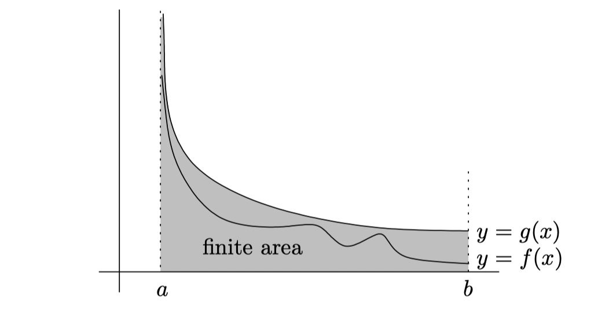

# Improper Integrals

The integral $\int_{a}^{b} f(x) dx$ is **improper** if any of the following conditions apply:

1. $f$ isn't bounded in the closed interval $[a, b]$;
2. $b = \infty$;
3. $a = -\infty$.

If $f(x)$ is unbounded for $x$ near some number $c$, we'll say that $f$ has a *blow-up point* at $x = c$.

We can define the integral of improper integral if we have a blow-up point at $x = a$:

$$
\int_{a}^{b} f(x) dx = \lim_{\epsilon \to 0^+} \int_{a + \epsilon}^{b} f(x) dx
$$

If the limit is $L$ as $\epsilon \to 0^+$, we say that $\int_{a}^{b} f(x) dx$ **converge to L**. If there's no limit, we say that the above integral **diverges**.

Now we still have to look at what happens when one or both of the limits of integration are infinite, this means that the region of integration is *unbounded*:

$$
\int_{a}^{\infty} f(x) dx
$$

In symbols, we are define:

$$
\int_{a}^{\infty} f(x) dx = \lim_{N \to \infty} \int_{a}^{N} f(x) dx
$$

## The Comparison Test(Theory)
Suppose we have two functions which are never negative, at least in some region of interest. If the first function is bigger than the second function, and the integral of the second function diverges, then the first function also diverges.

Mathematically, it looks like this: if $f(x) \ge g(x) \ge 0$ for $x$ in the interval $(a, b)$, and we know that $\int_{a}^{b} g(x) dx$ diverges, then so does $\int_{a}^{b} f(x) dx$.

$$
\int_{a}^{b} f(x) dx \ge \int_{a}^{b} g(x) dx = \infty
$$

On the other hand, for convergence, if $0 \le f(x) \le g(x)$ on $(a, b)$ and $\inf_{a}^{b} g(x) dx$ converges, then so does $\int_{a}^{b} f(x) dx$:

$$
\int_{a}^{b} f(x) dx \le \int_{a}^{b} g(x) dx < \infty
$$

## The Limit Comparison Test(Theory)

Suppose we have two function $f$ and $g$ such that:

$$
\lim_{x \to a} \frac{f(x)} {g(x)} = 1
$$

We'll say that $f(x) \sim g(x)$ as $x \to a$ if the limit of the ratio is 1.

## The p-Test(Theory)

Now that we have the comparison test and limit comparison test, we need to know how to use them. The question is, what are some functions we could choose as g? Well, the most useful are the functions $\frac{1}{x^p}$ for some $p > 0$. Since these functions are so easy to integrate, we can use the limit formula to get the p-test:

- p-test, $\int^{\infty}$ version: For any finite $a > 0$, the integral below converges if $p > 1$ and diverges if $p < 1$

$$
\int_{a}^{\infty} \frac{1}{x^p} dx
$$

- p-test, $\int_{0}$ version: For any finite $a > 0$, the integral below converges if $p < 1$ and diverges if $p > 1$

$$
\int_{0}^{a} \frac{1}{x^p} dx
$$
