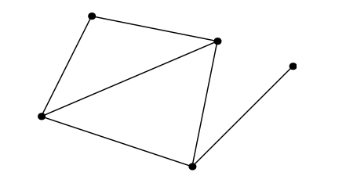

# Matrix spaces, Rand 1 and Small World Graphs

We've talked a lot about $\mathbb{R}^n$, but we can think about vector spaces made up of any sort of `vectors` that allow addition and scalar multiplication.

## New vector spaces

### 3 by 3 matrices

We were looking at the space $M$ of all 3 by 3 matrices. We identified some subspaces:

- the symmetric 3 by 3 matrices $S$,
- the upper triangular 3 by 3 matrices $U$
- and the intersection $D$ of these two spaces - the space of diagonal 3 by 3 matrices.

The dimension of $M$ is 9; we must choose 9 numbers to specify an element of $M$. The space $M$ is very similar to $\mathbb{R}^9$. A good choice of basis is:

$$
\begin{bmatrix}
1 & 0 & 0 \\
0 & 0 & 0 \\
0 & 0 & 0 \\
\end{bmatrix}
,
\begin{bmatrix}
0 & 1 & 0 \\
0 & 0 & 0 \\
0 & 0 & 0 \\
\end{bmatrix}
,
\begin{bmatrix}
0 & 0 & 1 \\
0 & 0 & 0 \\
0 & 0 & 0 \\
\end{bmatrix}
, \cdots
\begin{bmatrix}
0 & 0 & 0 \\
0 & 0 & 0 \\
0 & 1 & 0 \\
\end{bmatrix}
,
\begin{bmatrix}
0 & 0 & 0 \\
0 & 0 & 0 \\
0 & 0 & 1 \\
\end{bmatrix}
$$

The subspace of symmetric matrices $S$ has dimension 6. When choosing an element of $S$ we pick three numbers on the diagonal and three in the upper right, which tell us what must appear in the lower left of the matrix. One basis for $S$ is the collection:

$$
\begin{bmatrix}
1 & 0 & 0 \\
0 & 0 & 0 \\
0 & 0 & 0 \\
\end{bmatrix}
,
\begin{bmatrix}
0 & 1 & 0 \\
1 & 0 & 0 \\
0 & 0 & 0 \\
\end{bmatrix}
,
\begin{bmatrix}
0 & 0 & 1 \\
0 & 0 & 0 \\
1 & 0 & 0 \\
\end{bmatrix}
,
\begin{bmatrix}
0 & 0 & 0 \\
0 & 1 & 0 \\
0 & 0 & 0 \\
\end{bmatrix}
,
\begin{bmatrix}
0 & 0 & 0 \\
0 & 0 & 1 \\
0 & 1 & 0 \\
\end{bmatrix}
,
\begin{bmatrix}
0 & 0 & 0 \\
0 & 0 & 0 \\
0 & 0 & 1 \\
\end{bmatrix}
$$

The dimension of $U$ is again 6; we have the same amount of freedom in selecting the entries of an upper triangular matrix as we did in choosing a symmetric matrix. A basis for $U$ is:

$$
\begin{bmatrix}
1 & 0 & 0 \\
0 & 0 & 0 \\
0 & 0 & 0 \\
\end{bmatrix}
,
\begin{bmatrix}
0 & 1 & 0 \\
0 & 0 & 0 \\
0 & 0 & 0 \\
\end{bmatrix}
,
\begin{bmatrix}
0 & 0 & 1 \\
0 & 0 & 0 \\
0 & 0 & 0 \\
\end{bmatrix}
,
\begin{bmatrix}
0 & 0 & 0 \\
0 & 1 & 0 \\
0 & 0 & 0 \\
\end{bmatrix}
,
\begin{bmatrix}
0 & 0 & 0 \\
0 & 0 & 1 \\
0 & 0 & 0 \\
\end{bmatrix}
,
\begin{bmatrix}
0 & 0 & 0 \\
0 & 0 & 0 \\
0 & 0 & 1 \\
\end{bmatrix}
$$

This happens to be a subset of the basis we chose for $M$, but there is no basis for $S$ that is subset of the basis we chose for M.

The subspace $D = S \cap U$ of diagonal 3 by 3 matrices has dimension 3. Because of the way we chose bases for $U$ and $S$, a good basis for $D$ is the intersection of those bases.

Is $S \cup U$, the set of 3 by 3 matrices which are either symmetric or upper triangular, a subspace of $M$? No. This is like taking two liness in $\mathbb{R}^2$ and asking if together they form a subspace; we have to fill in between them. If we take all possible sums of elements of $S$ and elements of $U$ we get what we call the sum $S + U$. This is a subspace of $M$. In fact, $S + U = M$. For unions and sums, dimensions follow this rule:

$$
\text{dim } S + \text{dim } U = \text{dim } S \cup U + \text{dim } S \cap U
$$

### Differential equations

Another example of a vector space that's not $\mathbb{R}^n$ appears in differential equations.

We can think of the solution $y$ to $\frac{d^2y}{dx^2} + y = 0$ as the elements of a nullspace. Some solutions are:

$$
y = cos(x), y = sin(x), y = e^{ix}
$$

The complete solution is:

$$
y = c_1 cos(x) + c_2 sin(x)
$$

where $c_1$ and $c_2$ can be any complex numbers. This solution space is a two dimension vector space with basis vectors $cos(x)$ and $sin(x)$. Even though these don't `look like` vectors, we can build a vector space from them because they can be added and multiplied by a constant.

### Rank 4 matrices

Now let $M$ be the space of $5 \times 17$ matrices. The subset of $M$ containing all rank 4 matrices is not a subspace, even if we include the zero matrix, because the sum of two rank 4 matrices may not have rank 4.

In $\mathbb{R}^4$, the set of all vectors $\mathbf{v} = \begin{bmatrix} v_1 \\ v_2 \\ v_3 \\ v_4 \end{bmatrix}$ for which $v_1 + v_2 + v_3 + v_4 = 0$ is a subspace. It contains the zero vector and is closed under addition and scalar multiplication. It is the nullspace of the matrix $A = \begin{bmatrix} 1 & 1 & 1 & 1 \end{bmatrix}$. Because A has rank 1, the dimension of this nullspace is $n - r = 3$. The subspace has the basis of special solutions:

$$
\begin{bmatrix}
-1 \\
1 \\
0 \\
0 \\
\end{bmatrix}
,
\begin{bmatrix}
-1 \\
0 \\
1 \\
0 \\
\end{bmatrix}
,
\begin{bmatrix}
-1 \\
0 \\
0 \\
1 \\
\end{bmatrix}
$$

The column space of $A$ is $\mathbb{R}^1$. The left nullspace contains only the zero vector, has dimension zero, and its basis is the empty set. The row space of $A$ has dimension 1.

## Rank one matrices

The rank of a matrix is the dimension of its column(or row) space. The matrix

$$
A =
\begin{bmatrix}
1 & 4 & 5 \\
2 & 8 & 10 \\
\end{bmatrix}
$$

has rank 1 because of its columns is a multiple of the first column.

$$
A =
\begin{bmatrix}
1 \\
2 \\
\end{bmatrix}
\begin{bmatrix}
1 & 4 & 5
\end{bmatrix}
$$

Every rank 1 matrix A can be written $A = \mathbf{U}\mathbf{V}^T$, where $\mathbf{U}$ and $\mathbf{V}$ are column vectors. We'll use rank 1 matrices as building blocks for more complex matrices.

## Small world graphs

In this class, a `graph` G is a collection of nodes joined by edges:

$$
G = \{nodes, edges\}
$$

A typical graph appears in figure below.

Another example of a graph is one in which each node is a person. Two nodes are connected by an edge if the people are friends. We can ask how close two people are to each other in the graph, what's the smallest number of friend to friend connections joining them? The question "what's the farthest distance between two people in the graph?" lies behind phrases like "six degrees of separation" and "it's a small world".

Another graph is the world wide web: its nodes are websites and its edges are linkes.

We'll describe graphs in terms of matrices, which will make it easy to answer questions about distance between nodes.
