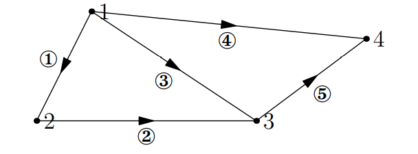

# Graphs, Networks and Incidence Matrices

When we use linear algebra to understand physical systems, we often find more structure in the matrices and vectors than appears in the examples we make up in class. There are many applications of linear algebra; for example, chemists might use row reduction to get a clearer picture of what elements go into a complicated reaction. In this lecture we explore the linear algebra associated with electrical networks.

## Graphs and networks

A `graph` is a collection of nodes joined by edges; figure below shows one small graph with 4 nodes and 5 edges:

We put an arrow on each edge to indicate that the positive direction for currents running through the graph.

## Incidence matrices

The `incidence matrix` of this directed graph has one column for each node of the graph and one row for each edge of the graph:

$$
A =
\begin{bmatrix}
-1 & 1 & 0 & 0 \\
0 & -1 & 0 & 0 \\
-1 & 0 & 1 & 0 \\
0 & 0 & -1 & 1 \\
\end{bmatrix}
$$

If an edge runs from node $a$ to node $b$, the row corresponding to that edge has $-1$ in column $a$ and $1$ in column $b$; all other entries in that row are $0$. If we were studying a larger graph we would get a larger matrix but it would be `sparse`; most of the entries in that matrix would be 0. This is one of the ways matrices arising from the applications might have extra structure.

Note that nodes $1, 2$ and $3$ and edge $(1), (2)$ and $(3)$ form a loop. The matrix describing just those nodes and edges looks like:

$$
\begin{bmatrix}
-1 & 1 & 0 & 0 \\
0 & -1 & 1 & 0 \\
-1 & 0 & 1 & 0 \\
\end{bmatrix}
$$

Note that the third row is the sum of the first two rows; loops in the graph corresponds to linearly dependent rows of the matrix.

To find the nullspace of A, we solve $A\mathbf{x}= \mathbf{0}$:

$$
A\mathbf{x}=
\begin{bmatrix}
x_2 - x_1 \\
x_3 - x_2 \\
x_3 - x_1 \\
x_4 - x_1 \\
x_4 - x_3 \\
\end{bmatrix}
=
\begin{bmatrix}
0 \\
0 \\
0 \\
0 \\
0 \\
\end{bmatrix}
$$
