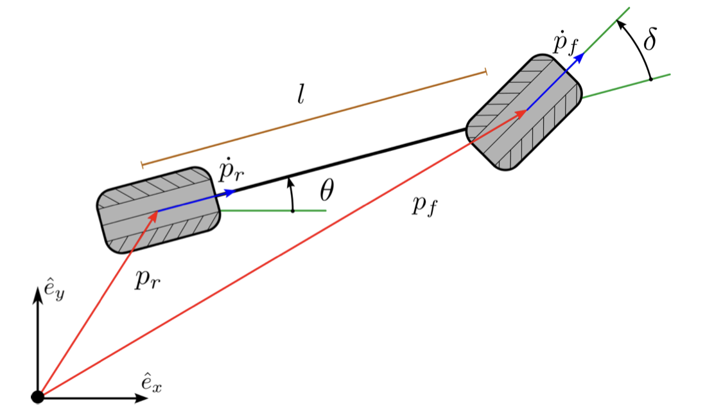
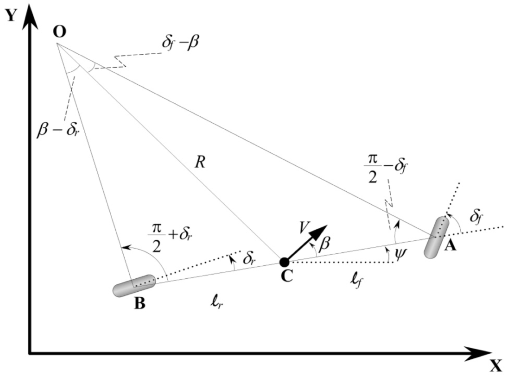
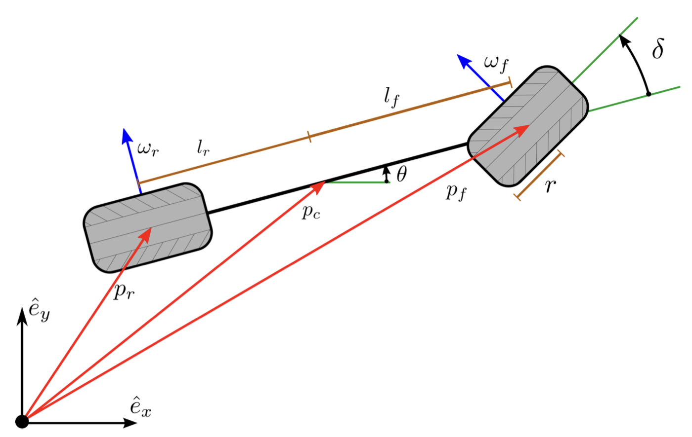
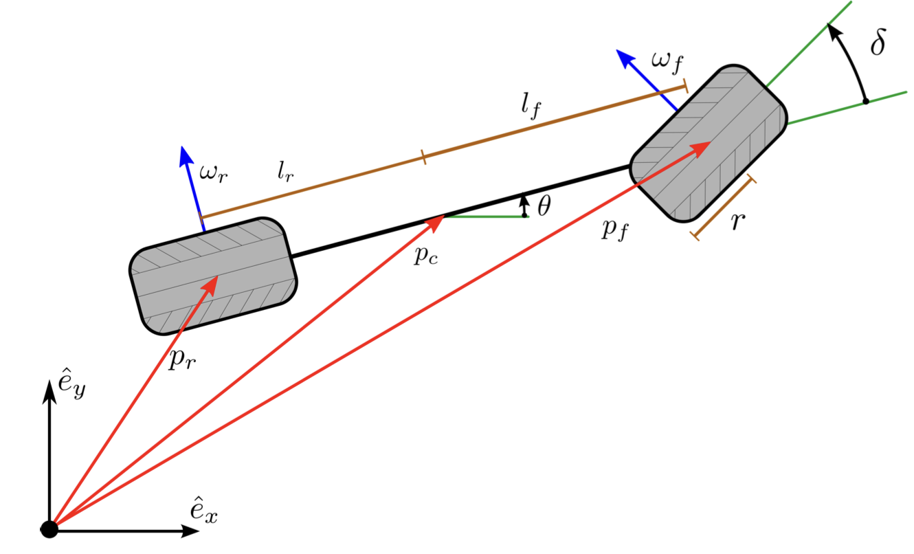
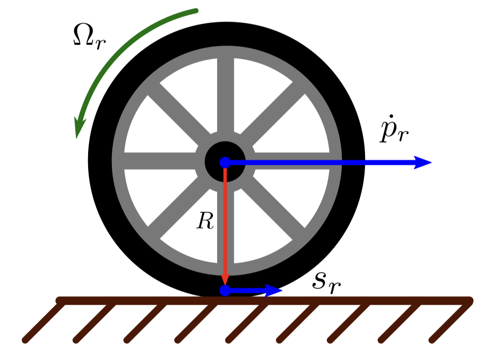
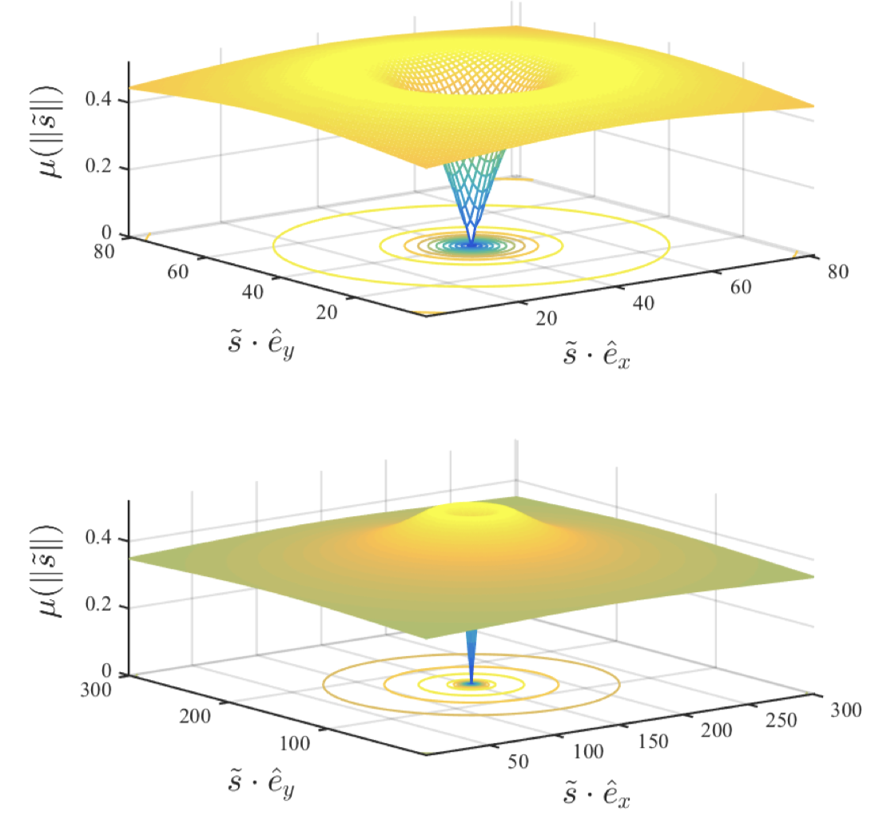

Here we focus on the most commonly used models of mobility of car-like vehicles. Such models are widely used in control and motiong planning algorithms to approximate a vehicle's behavior in response to control actions in relevant operating conditions.

## The Kinematic Single-Track Model

In most basic model of practical use, the car consists of two wheels connected by a rigid link and is restricted to move in a plane. It is assumed that 

> wheel do not slip at their contact point with the ground, but rotate freely about their axes of rotation.

The front wheel has an added degree of freedom where it is allowed to rotate about an axis normal to the plane of motion. This is to model steering.

- $p_r$ and $p_f$ denote the location of `rear wheel` and `front wheel` with basis vectors($\hat{e}_x, \hat{e}_y, \hat{e}_z$)
- $\theta$ is the angle discribing the direction that the vehicle is facing
- $\delta$ is the steering angle
- $l$ is the length front rear wheel to front wheel
- Time derivatives of $p_r$ and $p_f$ are restricted by the noholonomic constraint to the direction indicated by the blue arrows.

Differential constraints will be derived from the coordinate systems consisting of the angle $\theta$ , together with the motion of one of the points $p_r$ and $p_f$.

As the vehicle is rotating at rear wheel, we have:

$$
tan \delta = \frac{l}{R}
$$

where:

- $R$ is the radius of turn

The constraints at rear wheel is:

$$
\begin{align}
\dot x_r &= v_r \cdot \cos{\theta} \\
\dot y_r &= v_r \cdot \sin{\theta} \\
\dot \theta &= \frac{v_r}{l} \cdot \tan{\delta}
\end{align}
$$

The constraints at front wheel is:

$$
\begin{align}
\dot x_f &= v_f \cdot \cos{(\theta + \delta)} \\
\dot y_f &= v_f \cdot \sin{(\theta + \delta)} \\
\dot \theta &= \frac{v_f}{l} \cdot \sin{\delta}
\end{align}
$$

The ralationship between $v_f$ and $v_r$ is:

$$
\frac{v_r}{v_f} = cos \delta
$$

## Kinematic Unicycle Model

A simplification of above is to select the heading rate $\omega$ instead of steering angle $\delta$：

$$
\delta = arctan \frac{l \cdot w} {v_r}
$$

simplifying the heading dynamics to:

$$
\dot \theta = \omega
$$

where:

$$
\omega \in [\frac{v_r}{l} tan(\delta_{min}), \frac{v_r}{l} tan(\delta_{max})]
$$
An important variant of this model is the case when $v_r$ is fixed. This is sometimes referred to as the `Dubins` car. Another notable variantion is the `Reeds-Shepp` car for which minimum length paths are known when $v_r$ takes a single forward and reverse speed.

## Kinematic Single-Track Improved

The kinematic models are suitable for planning paths at low speeds where inertial effects are small in comparison to the limitations on mobility imposed by the no-slip assumption. A major drawback of this model is that it permits instaneous steering angle changes which can be problematic if the motion planning module generates solutions with such instantaneous changes.

Continuity of the steering angle can be imposed by augmenting, where the steering angle integrates a commanded rate:

$$
\begin{align}
\dot x_f &= v_f \cdot \cos{(\theta + \delta)} \\
\dot y_f &= v_f \cdot \sin{(\theta + \delta)} \\
\dot \theta &= \frac{v_f}{l} \cdot \sin{\delta} \\
\dot \delta &= v_{\delta}
\end{align}
$$

In addition to the limit on the steering angle, the steering rate can now be limited: $v_{\delta} \in [\dot \delta_{min}, \dot \delta_{max}]$. The same problem can arise with the car's speed $v_r$ and can be resolved in the same way. The drawback to this technique is the increased dimension of the model which can complicate motion planning and control problems.

## Kinematic Single-Track at Center of Mass with Slide Angle

where:

- $A$: position of front wheel
- $B$: position of rear wheel
- $C$: position of the center of mass
- $O$: position of the center of turn
- $R$: radius of the turn
- $\delta_f$: steering angle of front wheel
- $\delta_r$: steering angle of rear wheel
- $(X, Y)$: position of C
- $\Psi$: heading of the vehicle
- $\beta$: sliding angle
- $V$ : velocity of C

Applying the sine rule to triangle OCA:

$$
\frac{sin(\delta_f - \beta)}{l_f} = \frac{\frac{\pi}{2} - \delta_f}{R} \tag{1}
$$

Applying the sine rule to triangle OCB:

$$
\frac{sin(\beta - \delta_r)}{l_r} = \frac{sin(\frac{\pi}{2} + \delta_r)}{R} \tag{2}
$$

from (1) we have:

$$
\frac{sin(\delta_f)cos(\beta) - sin(\beta)cos(\delta_f)}{l_f} = \frac{cos(\delta_f)}{R} \tag{3}
$$

from (2) we have:

$$
\frac{cos(\delta_r)sin(\beta) - cos(\beta)sin(\delta_r)}{l_r} = \frac{cos(\delta_r)}{R} \tag{4}
$$

Multiply both sides of (3) by $\frac{l_f}{cos(\delta_f)}$:

$$
tan(\delta_f) cos(\beta) - sin(\beta) = \frac{l_f}{R} \tag{5}
$$

Multiply both sides of (44) by $\frac{l_r}{cos(\delta_r)}$:

$$
sin(\beta) - tan(\delta_r) cos(\beta) = \frac{l_r}{R} \tag{6}
$$

Add (5) and (6):

$$
\{tan(\delta_f) - tan(\delta_r)\} cos(\beta) = \frac{l_f + l_r}{R} \tag{7}
$$

If we assume that the radius of the vehicle path changes slowly due to low vehicle speed, then the rate of change of orientation of the vehicle ($\dot \Psi$) must be equal to the angular velocity of the vehicle. Since the angular velocity of the vehicle is $\frac{V}{R}$, it follows that:

$$
\dot \Psi = \frac{V}{R} \tag{8}
$$

Using (8), (7) can be re-written as:

$$
\dot \Psi = \frac{V cos(\beta)} {l_f + l_r} (tan(\delta_f) - tan(\delta_r))
$$

The final equations of motion are therefore given by:

$$
\begin{cases}
\dot X &= V cos(\Psi + \beta) \\
\dot Y &= V sin(\Psi + \beta) \\
\dot \Psi &= \frac{V cos(\beta)} {l_f + l_r} (tan(\delta_f) - tan(\delta_r))
\end{cases}
$$

In this model there are three inputs:

- $\delta_f$
- $\delta_r$
- $V$

The velocity $V$ is an external variable and can be asssumed to be a time varying function or can be obtained from a longitudinal vehicle model.

The slip angle $\beta$ can be obtained by multiplying (5) by $l_r$ and subtracting it from (6) multiplied by $l_f$:

$$
\beta = tan^{-1}(\frac{l_f tan(\delta_r) + l_r tan(\delta_f)}{l_f + l_r})
$$

## Dynamic Model

When the acceleration of the vehicle is sufficiently large, the no-slip assumption between the tire and ground becomes invalid. In this case a more accurate model for the vehicle is as a rigid body satisfying basic momentum principles. That is, the acceleration is proportional to the force generated by the ground on the tires. Taking $p_c$ to the vehicles center of mass, and a coordinate of the configuration the motion of the vehicle is governed by:

$$
\begin{align}
m \ddot p_c &= F_f + F_r \\
I_{zz} \ddot \theta &= (p_c - p_f) \cdot F_f + (p_c - p_r) \cdot F_r
\end{align}
$$

where:

- $F_r$ and $F_f$ are the forces applied to the vehicle by the ground through the ground-tire interaction
- $m$ is the vehicles total mass
- $I_{zz}$ is the polar moment of inertia in the $\hat e_z$ direction about the center of mass

The force between the ground and tires is modeled as being dependent on the rate that tire slips on the ground. Although the center of mass serves as a coordinate for the configuration, the velocity of each wheel relative to the ground is needed to determine this relative speed. The kinematic relations between these three points are:

$$
\begin{align}
p_r &= p_c + \begin{pmatrix} -l_r cos(\theta) \\ -l_r sin(\theta) \\ 0 \end{pmatrix} \\
\dot p_r &= \dot p_c + \begin{pmatrix} 0 \\ 0 \\ \dot \theta \end{pmatrix} \times \begin{pmatrix} -l_r cos(\theta) \\ -l_r sin(\theta) \\ 0 \end{pmatrix} \\
p_f &= p_c + \begin{pmatrix} l_f cos(\theta) \\ l_f sin(\theta) \\ 0 \end{pmatrix} \\
\dot p_f &= \dot p_c + \begin{pmatrix} 0 \\ 0 \\ \dot \theta  \end{pmatrix} \times \begin{pmatrix} l_f cos(\theta) \\ l_f sin(\theta) \\ 0 \end{pmatrix} \\
\end{align}
$$

These kinematic relations are used to determine the velocities of the point on each tire in contact with the ground, $s_r$ and $s_f$. The velocity of these points are reffered to as the tire slip velocity. In general, $s_r$ and $s_f$ differ from  $\dot p_r$ and $\dot p_f$ through the angular velocity of the wheel. The kinematic raltion is:

$$
\begin{align}
s_r &= \dot p_r + \omega_r \times R \\
s_f &= \dot p_f + \omega_f \times R \\
\end{align}
$$

The angular velocities of the wheels are given by:

$$
\begin{align}
\omega_r &= \begin{pmatrix} \Omega_r sin(\theta) \\ -\Omega_r cos(\theta) \\ 0 \end{pmatrix} \\
\omega_f &= \begin{pmatrix} \Omega_f sin(\theta + \delta) \\ -\Omega_f cos(\theta + \delta) \\ 0 \end{pmatrix} \\
\end{align}
$$

And $R = (0, 0, -r)^T$. The wheel radius is the scalar quantity $r$, and $\Omega_{r, f}$ are the angular speeds of each wheel relative to the car.

Under static conditions, or when the height of the center of mass can be approximated as $p_c \cdot \hat e_z \approx 0$, the compnent of the force normal to the ground, $F_{r, f} \cdot \hat e_z$ can be computed from a static force-torque balance as:

$$
F_f \cdot \hat e_z = \frac{l_r m g}{l_f + l_r}, 
F_r \cdot \hat e_z = \frac{l_f m g}{l_f + l_r}
$$

The normal force is then used to compute the traction force on each tire together with the slip and a friction coefficient model, $\mu$, for the tire behavior. The traction force on the rear tire is given component-wise by:

$$
\begin{align}
F_r \cdot \hat e_x &= -\frac{F_r \cdot \hat e_z \mu \frac{|| s_r ||}{\Omega_r r} s_r}{||s_r||} \cdot \hat e_x \\
F_r \cdot \hat e_y &= -\frac{F_r \cdot \hat e_z \mu \frac{|| s_r ||}{\Omega_r r} s_r}{||s_r||} \cdot \hat e_y \\
\end{align} \tag{14}
$$

The same expression descripes the front  tire with the r-subscript replaced by an f-subscript. The formula above models the traction force as being anti-parelled to the slip with magnitude proportional to the normal force with a nonlinear dependence on the slip ratio (the magnitude of the slip normalized by $\Omega_r r$ for the rear and $\Omega_f r$ for the front). Expressions for the net force on each wheel of the car in terms of the control variables, generalized coordinates, and their velocities. Equation above, together with following model for $\mu$

$$
\mu (\frac{||s_r||}{\Omega_r r}) = D sin(C arctan(B \frac{||s_r||}{\Omega_r r})) \tag{15}
$$

are a frequently used model for tire interaction with the ground. This equation is a simplified version of the well known model.

The rotational symmetry of (14) together with the peak in (15) lead to a maximum norm force that the tire can exert in any direction. This peak is referred to as the friction circle depicted below.

