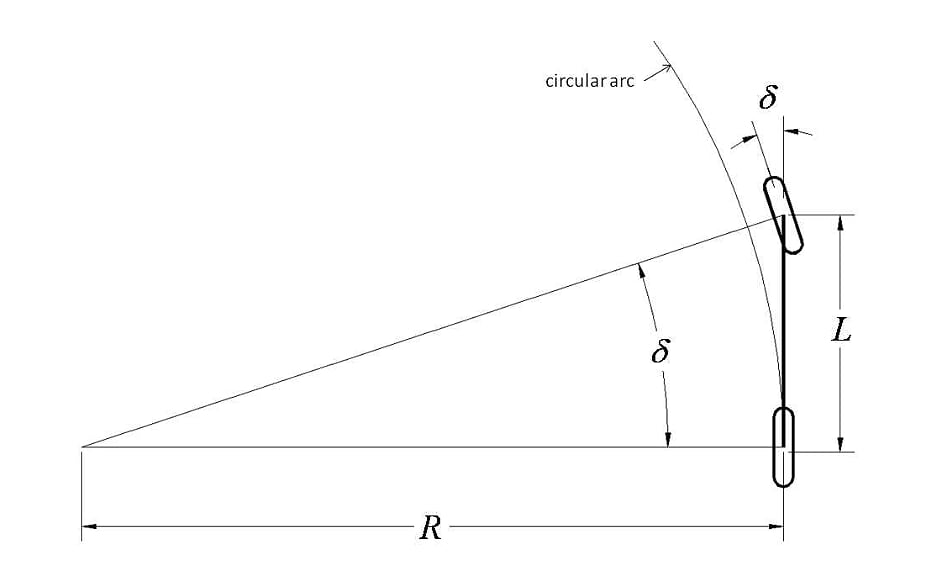

One of the most popular classes of path tracking methods is geometric tracking. Geometric tracking methods exploit geometric relationships between the vehicle and the path resulting in control law solutions to the path tracking problem. Two of the most commonly used geometric methods are `Pure-Pursuit` and `Stanley Method`.

## Pure-Pursuit

Geometric-based pure-pursuit is one of the most basic and simple methods to compute steering wheel angle for lateral controller.

### Bicycle Model
The simplest vehicle model for path tracking is the bicycle model, which following the Ackerman steering geometry. The bicycle model simplifies the four wheel car by:

- combining the two front wheels together and the two rear wheels together to form a two wheeled model, like a bicycle;
- the vehicle can only move on a plane.

These simplifications result in a simple geometric relationship between the front wheel steering angle and the curvature that the rear axle will follow.

Following is the geometri bicycle model:

This simple relationship between front wheel angle and curvature is:

$$
\tan(\delta) = \frac{L}{R} \tag1
$$

where $\delta$ is the front wheel steering angle, $L$ is the distance between the front axle to rear axle(wheelbase) and $R$ is the radius of the circle that the rear axle will travel along at the given steering angle.
The bicycle model approximates the motion of a car reasonably well at:

- low speed;
- moderate steering angle.

### Control Law

The pure pursuit method consists of geometrically calculating the curvature of a circular arc that connects the rear axle location to a goal point on the path ahead of the vehicle. The goal point is determined from a look-ahead distance $l_d$ from the current rear axle position to the desired path. The goal point $(g_x, g_y)$ is illustrated in the figure. The vehicle's steering angle $\delta$ can be determined using only the goal point location and the angle $\alpha$ between the vehicle's heading vector and the look-ahead vector.

According to the law of sines:

$$
\frac{l_d}{\sin(2\alpha)} = \frac{R}{\sin(\frac{\pi}{2} - \alpha)}
$$

$$
\frac{l_d}{2\sin(\alpha)\cos(\alpha)} = \frac{R}{\cos(\alpha)}
$$

$$
\frac{l_d}{\sin(\alpha)} = 2R \tag2
$$

Using $(1)$ and $(2)$, the pure-pursuit control law is given as:

$$
\delta = arctan(\frac{2L\sin(\alpha)}{l_d}) \tag3
$$

### Tuning
From the equation $(3)$ we can see that, the angle $\alpha$ and the distance $l_d$ determine the scale of front wheel steer angle $\delta$, and both of them are related to goal point's distance on path. A general goal point selected method is:

$$
l_d = l_{min} + v \cdot t_{ahead}
$$

where $l_d$ is the goal point distance, $l_min$ is the minimum look ahead distance, $t$ is the look ahead time time, their value can be determined by tuning.

### Feature

A short look-ahead distance provides more accurate tracking while a longer distance provides smoother tracking.

Advantage:

- high level robustness;
- needs little calculation.

Disadvantage:

- look-ahead distance is too small will cause instability and too large will cause bigger cross tracking error, the trade off between stability and tracking performance is difficult to balance;
- a sufficient look-ahead distance will result in `cutting corners` while executting turns on the path;
- a constant look-ahead distance will only fit a certain curvature and speed.

## Stanley Method
The Stanley steering controller was deveoped by the Stanford Racing Team and implimented int their autonoumous vehicle for the DARPA Grand Challenge. The controller is based on a non-linear feedback function based on lateral errors measured from the front wheel axle.

### Kinematic Model
Following is the kinematic model which assumes the vehicle has negligible inertia. This assumption is effective for low speed driving.

$v$ is the automobile's speed; $e$ is the cross-track error between desire path and the guiding wheels; $\psi$ is the heading with respect to the closet trajectory segment; $\delta$ is the front wheel steering angle.
For forward driving, the guiding wheels are front wheels, and the derivative of the cross-track error is:

$$
\dot e = v \cdot \sin(\psi - \delta) \tag4
$$

while the steering is mechanically limited to $|\delta| < \delta_{max}$
The derivative of the yaw angle, the yaw rate, is 

$$
\dot \psi = - \frac{v \cdot \sin(\delta)} {a + b} \tag5
$$

where $a$ and $b$ are the distance from the center of gravity(CG) to the front and rear axle.

### Partial Control Law
By inspecting Equation (1) and (2), a controller is selected such that the resulting differential equation has a global asymptotically stable equilibrium at zero cross-track error:

$$
\delta = 
\begin{cases}
\psi + arctan(\frac{k \cdot e}{v}) &  when & |\psi + \arctan(\frac{k \cdot e}{e})| < \delta_{max} \\\\
\delta_{max} &  when & \psi + \arctan(\frac{k \cdot e}{e}) \geqslant \delta_{max} \\\\
-\delta_{max} &  when & \psi + \arctan(\frac{k \cdot e}{e}) < -\delta_{max} 
\end{cases}
\tag6
$$

### Proof of the Global Asymptotically Stable Equilibrium
Using the steering control law, there are three regions in the phase space of $e$ and $\psi$: input saturated high, input saturated low and norminal control. When steering command ($\psi + \arctan(\frac{k \cdot e}{v})$) is at the steering limit, the equation of this boundary is as a function of $e$:

$$
\psi_b = -\arctan(\frac{k \cdot e}{v}) \pm \delta_{max}
$$

#### For the Saturated Low Region
At this condition, the steering wheel angle is $-\delta_{max}$, considering Equation (4) and (5):
 
$$
\dot e = v \cdot \sin(\psi + \delta_{max}) 
$$

$$
\dot \psi = \frac{v \cdot \sin(\delta_{max})} {a + b} 
$$

Because $\delta_{max} > 0$, $\dot\psi > 0$ in this region, and is constant, $\psi = -\arctan(\frac{ke}{v}) - \delta_{max} < 0$, so $\psi$ increase linearly with time. Any state in this region will flow into the nominal region with finite time.

#### For the Saturated High Region
At this condition, the steering wheel angle is $\delta_{max}$, considering Equation (4) and (5):
 
$$
\dot e = v \cdot \sin(\psi - \delta_{max}) 
$$

$$
\dot \psi = -\frac{v \cdot \sin(\delta_{max})} {a + b} 
$$

Because $\delta_{max} > 0$, $\dot\psi < 0$ in this region, and is constant, $\psi = -\arctan(\frac{ke}{v}) + \delta_{max} > 0$, so $\psi$ decrease linearly with time. Any state in this region will flow into the nominal region with finite time.

#### For the Nominal Region
Substituting Equation (5) into Equation (1) we get:

$$
\dot e = - v \cdot \sin(\arctan(\frac{ke}{v})) = \frac{-ke}{\sqrt{1 + {\frac{ke}{v}}^2}} \tag7
$$

Inside the nominal region, the sign of $\dot e$ is always opposite to $e$, and for any $e$, $\dot e \in [ke, v]$. Thus the value of $e$ will always converge to 0. For $\psi$, the sign of $\dot\psi$ is opposite to $(\psi + \arctan(\frac{ke}{v}))$, therefore, the origin is the only stable equilibrium in phase space.

### Optimization

#### Yaw Damping
Using the controller as Equation (6), the tires act as dampers, providing reaction forces to sideways velocities. At low speeds, this stabilities the yaw dynamics, however the magnitude of this reaction is inversely proportional to speed. As speed increase, the damping effect diminishes, creating a need for active damping.
Thus 

$$k_{d,yaw}(r_{meas} - r_{traj})$$ 

is added to the steering command, where the $k_{d,yaw}$ is a tuned gain, $r_{traj}$ is the yaw rate for the trajectory, and $r_{meas}$ is the measured yaw rate.

#### Actuator
The controller commands a steering servo, but time delay and overshot in the servo can cause instablility. One way to prevent this is to add 

$$
k_{d,steer}(\delta_{meas}(i) - \delta_{meas}(i + 1))
$$

to the steering command, where $\delta_{meas}$ is the discrete time measurement of the steering angle, and i is the index of the measurement one control period earlier. This provides lead control on the software side. The value of $k_{d,steer}$ is tuned to be large enough to damp the steering wheel response, but small enough to have minimal effect on performance.

#### Curvy Road
Automobiles point inward on curves, to generate lateral acceleration with the front and rear tires. The controller yaw setpoint should be non-zero. The steady state yaw, $\psi_{ss}$, relative to a constant curvature path, can be found using sums of forces and moments, yielding

$$
\psi_{ss} = \frac{mvr_{traj}}{C_y(1 + \frac{a}{b})} = k_{ag}vr_{traj} /tag8
$$

#### Low Speed
One final modification for driving at low speed prevents the gain term $\frac{k}{v}$ from becoming so large that it is oversensitive to noise on $e$. A tuned gain, $k_{soft}$, is added to the denominator, permitting control to be arbitrarily soft at low speeds. In experiments, $k_{soft} = 1$ was found appropriate.

### Final Control Law
So, the complete steering law is

$$
\delta = (\psi - \psi_{ss}) + \arctan(\frac{ke}{k_{soft} + v}) + k_{d,yaw}(r_{meas} - r_{traj}) + k_{d,steer}(\delta_{meas}(i) - \delta_{meas}(i + 1))
$$

with saturation at $\pm\delta_{max}$.

## Reference
1. [Automatic Steering Methods for Autonomous Automobile Path Tracking](https://www.ri.cmu.edu/pub_files/2009/2/Automatic_Steering_Methods_for_Autonomous_Automobile_Path_Tracking.pdf)
2. [Autonomous Automobile Trajectory Tracking for Off-Road Driving: Controller Design, Experimental Validation and Racing](http://ai.stanford.edu/~gabeh/papers/hoffmann_stanley_control07.pdf)
3. [Dynamic Speed Adaptation for Path Tracking Based on Curvature Information and Speed Limits](https://pdfs.semanticscholar.org/ef41/50cd77e086d9ad5e64d3827a9ac18d25757b.pdf#page=21&zoom=100,0,268)
