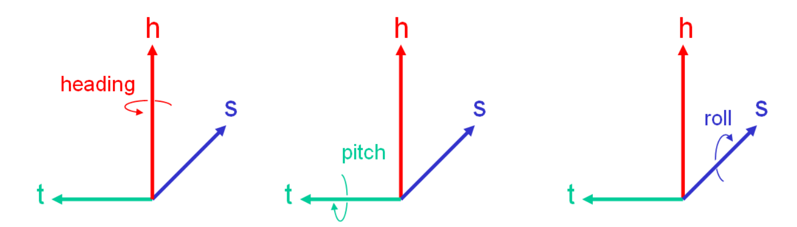

# Autonomous Hdmap Format

After collecting map data, we need to describe the map in detail and store it, which needs `HD Map` format.
There are two generally used data standards in the world for `HD Map`: NDS(Navigation Data Standard) and OpenDRIVE. Based on OpenDRIVE format, Baidu develop its own format, `appollo OpenDRIVE`.

## Navigation Data Standard

The Navigation Data Standard(NDS) is a standardized format for automotive-grade navigation databases, jointly developed by automobile manufactures and supplies. NDS is an association registered in Germany, members are automotive OEMs, map data providers, and navigation device/applications providers.
NDS seperates navigation software from navigation data, thus enhancing flexibility for creating various navigation products for end users. In addition to this interoperability, NDS databases support incremental updates, protection against illegal use and compactness.

NDS uses the SQLite Database File Format. An NDS database can consist of several product databases, and each product database may be divided further into update regions. This concept supports a flexible and consistent versioning concept for NDS databases and makes it possible to integrate databases from different database suppliers into one NDS database.

NDS format is very heavy, there is little usage in china, it's mainly used by big OEMs like BMW, Daimler and Volkswagen.

## OpenDRIVE
OpenDRIVE is an open format specification to describe a road network's logic, its objective is to standardize the logical road description to facilitate the data exchange between different driving simulators.

### Co-ordinate Systems
OpenDRIVE uses two co-ordinate systems: track system for road and lane and inertial system for point.

#### Track System
The Track co-ordinate system applies along the reference line of the road. It is a right-handed co-ordinate system. The following degrees of freedom are defined:




- $s$: poistion along reference line, measured in [m] from the beginning of the track;
- $t$: lateral position, positive to the left;
- $h$: height position, positive to the up;
- $heading$: around $h-axis$;
- $pitch$: around $t-axis$;
- $roll$: around $s-axis$;

#### Inertial System
The inertial system is a right-handed co-ordinate system according to ISO 8855 projected on a drawing plane with the axes pointing to the following directions:


- $x$: right(east);
- $y$: up(north);
- $z$: coming out of drawing plane(up);
- $heading$: around $z-axis$, 0 = direction of $x-axis/east$;
- $pitch$: around $y-axis$;
- $roll$: around $x-axis$;

### Road Layout
A full overview of OpenDRIVE road layout can be shown below:


All roads contain a reference line which defines the basic geometry(arcs, straight lines etc.). Along the reference line, various properties of the road can be defined like elevation profile, lanes, traffic signs, etc. Roads can be linked to each other directly(see road1 and road2) or via junctions(see road2 and road6).

The convention applies that properties of the same type defined along a single reference line must be listed in ascending order. 

#### Reference Line
The geometry of the reference line is described as a sequence of primitives of various types. The available primitives are:

- straight line: constant zero curvature;
- spiral line: linear change of curvature;
- curve line: constant non-zero curvature along run-length;
- cubic polynom: expenstion as $ax^3 + bx^2 + cx + d$;
- parametric cubic curves.

The following figure illustrates the composition of a reference line from some of the above mentioned elements.


In OpenDRIVE format, reference line is described by `geometry` under `planView` element. For example, the reference line above can be described as:
```xml
<planView>
  <geometry s="0.0" x="-7.07" y="7.07" hdg="5.49" length="5.0"/>
    <line/>
  <geometry s="5.0" x="-9.57" y="12.36" hdg="0.4" length="5.0"/>
    <spiral curvStart="0.0" curvEnd="-3.0"/>
  <geometry s="10.0" x="-12.33" y="16.17" hdg="1.9" length="5.0"/>
    <spiral curvature="-3.0"/>
</planView>
```
A road may contains more than one reference line, it depends on the road shape. In above xml code, $x$, $y$, $hdg$ are start point's position$(x, y)$ and initial angle.

#### Lanes
Lanes are identified by numbers which are:

- unique
- insequence
- starting from 0 on reference line
- ascending to the left
- descending to the right

The total number of lanes is not limited. The reference line is defined as lane zero and must not have a width entry.
A road may contains many lanes, and lane has its width and `roadMark` like dotted line, solid line, double lines, etc.

##### Lane Offset
In certain situations(see raod picture above) it may be more convenient to shift the lane profile instead of shifting the reference line.

##### Lane Sections
The lanes appearing in a given cross-section along the road are defined in so-called lane sections. Multiple lane sections may be defined in ascending order along a reference line.
Per lane section, the number of lanes is constant. However, the properties of each lane(e.g. width, road marks, friction etc.) may change.

##### Lane Properties
Lane properties are defined to the start of the corresponding lane section. Offset start at 0.0 for the beginning of the lane section and increase corresponding to the road co-ordinate s. In OpenDRIVE, `width` defines the width of the lane, and `roadMark` defines the properties of lane. The lane properties can be following:

- none
- solid
- broken
- solid solid (for double solid line)
- solid broken (from inside to outside, exception: center lane - from left to right)
- broken solid (from inside to outside, exception: center lane - from left to right)
- broken broken (from inside to outside, exception: center lane - from left to right)
- botts dots
- grass (meaning a grass edge)
- curb

#### Superelevation and Crossfall
In many cases, a road's cross section will not be parallel to the underlying terrain. Instead, it will be elevanted to one side (e.g. in curves) or to the center(for drainage). Both properties are covered by the OpenDRIVE format with the former being called "superelevation" and the latter "crossfall".


#### Road Linkage
In order to navigate through a road network, the application must know the linkage between different roads. Two types of linkage are possible:

- successor/predecessor linkage (standard linkage)
- junctions

Whenever the linkage between two roads is clear, a standard linkage is sufficient. A junction is required when the successor or predecessor relationship of a road is ambiguous.

##### Junctions
> Junctions link in-coming roads via paths(connecting roads) to out-going roads.

In road layout figure, Road 2 is a in-coming road, Road 6 - 8 are out-going roads, Road 3 - 5 are connecting roads.

Junctions consist of a connection matrix which indicates all possibilities to enter a connecting road from a given in-coming road. These connections are listed on a per-lane basis in order to facilitate navigation. Once a connecting road is entered, the following connection to the corresponding outgoing road can be retrieved from the general successor/predecessor information that is stored with each road.

#### Surface
OpenDRIVE provides two approaches for describing surface properties:

- Standard description: a `<material>` record may be defined per lane of the road, providing parameters for:
    - surface material code
    - roughness
    - friction
- Extended description: A more detailed description of road surface data may be provided within the newly introduced `<surface>` record. OpenDRIVE provides reference to the respective data files, formats supported are listed below:
    - Open Curved Regular Grid (OpenCRG)

## Apollo OpenDRIVE
OpenDRIVE format is mainly designed for simulator, it lacks lots of information that autodirve need. Apollo OpenDRIVE is based on OpenDRIVE and expends some specifications. 


Some concepts may cause ambiguity:

- overlap: link two elements, describe two elements's spatial relations. If two elements have overlaps, we make them a Overlap. For example, Deceleration Zone on a Lane, or Stop Zone on a Lane
- virtual lane: guide the driving at intersection
- left sample: distance between lane center and left boundary
- right sample: distance between lane center and right boundary
- co-ordinate system: utm, WGS84

### Main Difference

Apollo OpenDRIVE change the discription of elements' shape and classify all the elements: all the roadMark are classified into Objects; all the signals classified into Signal; use Overlap to link them.

| No. |                   Iterm                   | OpenDRIVE |                                           Apollo OpenDRIVE                                           | Note |
|:---:|:-----------------------------------------:|:---------:|:----------------------------------------------------------------------------------------------------:|:----:|
|  1  |     The description of elements' shape    | Equations |                                          Co-ordination Point                                         |      |
|  2  |      The expansion of elements' type      |     -     |                         Add no-stop area, crosswalk, deceleration zone, etc.                         |      |
|  3  | The expansion of linkage between elements |     -     |                    Add the linkage between junction and elements inside junctions                    |      |
|  4  |              Other expansion              |     -     | Add the distance between lane center and road boundary, linkage between stop line and traffic lights |      |

## Reference
- [wikipedia-Navigation Data Standard](https://en.wikipedia.org/wiki/Navigation_Data_Standard)
- [wikipedia-OpenDRIVE](https://en.wikipedia.org/wiki/OpenDRIVE_(specification))
- [OpenDRIVE Format Spec Rev 1.5](http://www.opendrive.org/docs/OpenDRIVEFormatSpecRev1.5M.pdf)
- [OpenDrive格式地图数据解析](https://blog.csdn.net/lewif/article/details/78575840)
- [Apollo高精地图详解](http://bit.baidu.com/Course/detail/id/282.html)
