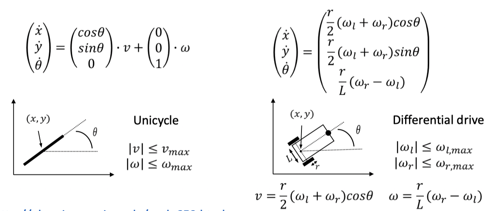
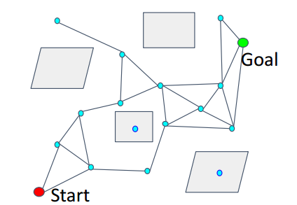
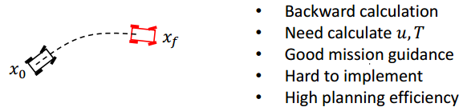
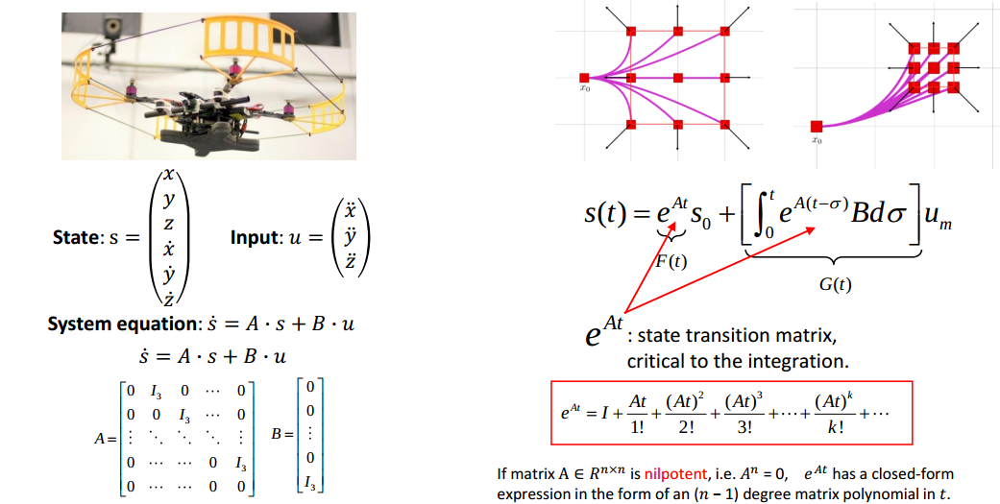
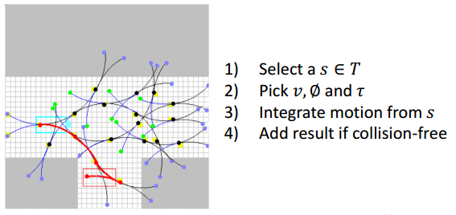
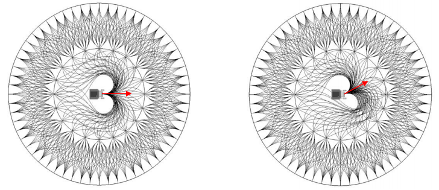
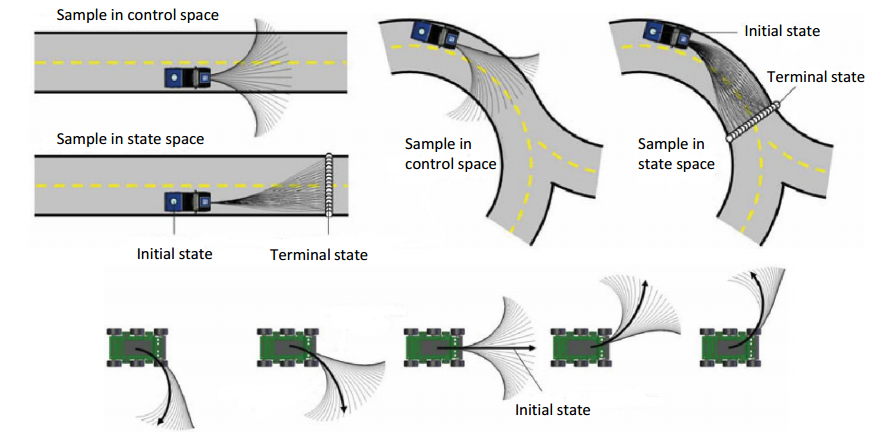
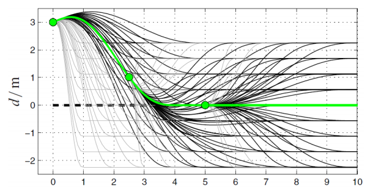
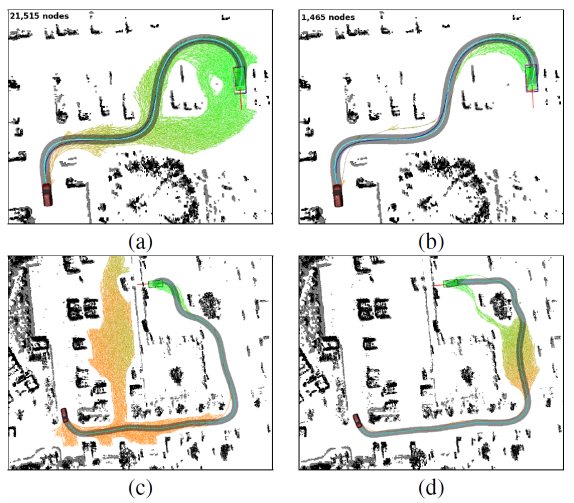

# Kinodynamic Path Finding

## Introduction

The `kinodynamic` planning problem is to synthesize a robot subject to simultaneous 

- `kinematic` constraints, such as `avoiding obstacles`
- `dynamic` constraints, such as modulus `bounds on velocity, acceleration, and force`

A kinodynamic solution is a mapping from time to generalized forces or accelerations.

We choose kinodynamic planning because:

- Straight-line connections between pairs of states are typically not valid trajectories due to the system's `differential constraints`.
- The smoother the path we found, the easier we optimize it.
- Coarse-to-fine process
- Trajectory only optimizes locally
- Infeasible path means nothing to nonholonomic system

The typical models we used are:

- [Unicycle model](http://planning.cs.uiuc.edu/node658.html):

- [Bicycle model](http://planning.cs.uiuc.edu/node659.html):

## State Lattice Planning

As learned in [search-based path finding](01_search.md), we have many weapons to attack graph search. But to assume the robot a mass point is not satisfactory any more, we require a graph with `feasible motion connections` now.

The search-based path finding is actually a discretization of control space with the assumption that the robot can move in 4/8 directions:

And the sample-based path finding is a discretization of state sapce where the state is $\mathbb{R}^2$, only position $(x, y)$ is considered.

We can manually create(build) a graph with all edges executable by robot in two ways:

- forward direction: discrete (sample) in `control` space
- reverse direction: discrete (sample) in `state` space

This is the basic motivation for all kinodynamic planning, and state lattice planning is the most straight-forward one.

### Build the Graph, Sample in Control vs. State Space

For a robot model:

$$
\dot{s} = f(s, u)
$$

- The robot is differentially driven
- We have an inital state $s_0$ of the robot
- We can generate feasible local motions by:
    - Select a $u$, fix a time duration $T$, forward simulate the system(numerical integration)
    - 
    - Select a $s_f$, find the connection (a trajectory) between $s_0$ and $s_f$
    - 

### Sample in Control Space

- [Search-based Motion Planning for Quadrotors using Linear Quadratic Minimum Time Control](https://arxiv.org/abs/1709.05401)

The lattice graph obtained by searching is:

Note that:

- During searching, the graph can be built when necessary.
- Create nodes(state) and edges(motion primitive) when nodes are newly discovered.
- Save computational time/space.

And for vehicle, things are different.

The `state` can be:

$$
s = \begin{bmatrix} x \\ y \\ \theta \end{bmatrix}
$$

`Input`:

$$
u = \begin{bmatrix} v \\ \phi \end{bmatrix}
$$

`System equation`:

$$
\begin{bmatrix} \dot{x} \\ \dot{y} \\ \dot{\theta} \end{bmatrix}
=
\begin{bmatrix} v \cdot cos\theta \\ v \cdot sin\theta \\ \frac{R}{L} \cdot tan\phi \end{bmatrix}
$$

where:

- $\theta$ is heading angle
- $\phi$ is steering angle
- $R$ is steering radius
- $L$ is the length from front to rear axle

For every $s \in T$ from the search tree, we pick a control vector $u$ and integrate the equation over short duration, and finally add collision-free motions to the search tree.

### Sample in State Space

We build a lattice graph with:

- Given an origin
- For 8 neighbor nodes around the origin, feasible paths are found
- Extend outward to 24 neighbos.
- Complete lattice

Following is build with `Reeds-Shepp Car Model`:

- [Generating Near Minimal Spanning Control Sets for Constrained Motion Planning in Discrete State Spaces](http://citeseerx.ist.psu.edu/viewdoc/download?doi=10.1.1.70.686&rep=rep1&type=pdf)

And for two or more layers lattice graph, only first layer is different:

- [Optimal Rough Terrain Trajectory Generation for Wheeled Mobile Robot](http://citeseerx.ist.psu.edu/viewdoc/download?doi=10.1.1.375.9234&rep=rep1&type=pdf)

### Comparison

- Trajectories are denser in the direction of the initial angular velocity
- Very similar outputs for several distinct inputs

- [State Space Sampling of Feasible Motions for High-Performance Mobile Robot Navigation in Complex Environments](https://www.ri.cmu.edu/pub_files/pub4/howard_thomas_2008_1/howard_thomas_2008_1.pdf)

## Boundary Value Problem(BVP)

Boundary Value Problem is the basis of state sampled lattice planning. It has no general solution, we have to design case by case. It often envolves complicated numerical optimization.

The basic problem is to design a trajectory (in x direction, for example) such that:

- $x(0) = a$
- $x(T) = b$

We can take the trajecotry $5^{th}$ order polynomial trajectory:

$$
x(t) = c_{5}t^{5} + c_{4}t^{4} + c_{3}t^{3} + c_{2}t^{2} + c_{1}t + c_{0}
$$

The boundary condition will be:

|  | Position | Velocity | Acceleration |
| --- | --- | --- | --- |
| t = 0 | a | 0 | 0 |
| t = T | b | 0 | 0 |

The problem will be solved with:

$$
\begin{bmatrix}
a \\ b \\ 0 \\ 0 \\ 0 \\ 0
\end{bmatrix}
=
\begin{bmatrix}
0 & 0 & 0 & 0 & 0 & 1 \\
T^5 & T^4 & T^3 & T^2 & T & 1 \\
0 & 0 & 0 & 0 & 1 & 0 \\
5T^4 & 4T^3 & 3T^2 & 2T & 1 & 0 \\
0 & 0 & 0 & 2 & 0 & 0 \\
20T^3 & 12T^2 & 6T & 2 & 0 & 0 \\
\end{bmatrix}
\begin{bmatrix}
c_5 \\ c_4 \\ c_3 \\ c_2 \\ c_1 \\ c_0
\end{bmatrix}
$$

### Optimal Boundary Value Problem(OBVP)

If $T$ is fixed, we can get the unique solution of:

$$
\begin{bmatrix}
c_5 \\ c_4 \\ c_3 \\ c_2 \\ c_1 \\ c_0
\end{bmatrix}
$$

But if $T$ is a variable, we can get more than one solutions. This is an optimal boundary value problem.

The general step for this problem is:

1. System modelling
2. `Pontryain's Minimum Principle` constructing
3. Solving costate
4. Solving optimal control

We take the quadratic as an example.

### Fixed Final State

#### 1. System modeling

a. State:

$$
S_{k} = \begin{bmatrix} p_{k} \\ v_{k} \\ a_{k} \end{bmatrix} \tag{2}
$$

b. System modle

$$
\dot {S_{k}} = f_s(s_k, u_K) = \begin{bmatrix} v_k \\ a_k \\ j_k \end{bmatrix} \tag{4}
$$

c. Input:

$$
u_{k} = j_{k} \tag{3}
$$

d. Boundary state:

$$
S(0) = \begin{bmatrix} p(0) \\ v(0) \\ a(0) \end{bmatrix} \tag{5}
$$

$$
S(f) = \begin{bmatrix} p(f) \\ v(f) \\ a(f) \end{bmatrix} \tag{6}
$$

e. Cost Function:

$$
J_{\sum} = \sum_{k=1}^{3}J_{k}, J_{k} = \frac{1}{T} \int_0^T j_{k}^2(t) dt \tag{1}
$$

The $k$ in equation is the dimension(x, y, z) of state, and we assume that three dimensions are independent, so we throw away the $k$ in the following equations.

And we also define that the quadratic must arrive the final position with the state of $S(f)$, which causes some difference with undefined dimensions' case, we'll discuss this condition later.

- [A Computationally Efficient Motion Primitive for Quadrocopter Trajectory Generation](https://ieeexplore.ieee.org/document/7299672)
- [Dynamic Programming and Optimal Control](http://www.athenasc.com/dpbook.html)

#### 2. `Pontryain Minimum Principle` constructing

Generally, the cost function can be described as:

$$
J = h(s(T)) + \int^T_0{g(s(t), u(t)) \cdot dt}
$$

where:

- $h(s(T))$ is the `final state`;
- $\int^T_0{g(s(t), u(t)) \cdot dt}$ is the `transition cost`.

Write the `Hamiltonian function` and `costate`:

$$
H(s, u, \lambda) = g(s, u) + \lambda^T f(s, u)
$$

$$
\lambda = (\lambda_1, \lambda_2, \lambda_3)
$$

and suppose:

- $s^\star$ is the `optimal state`
- $u^\star$ is the `optimal input`

We have following conclusions:

$$
\dot{s^\star} = f(s^\star(t), u^\star(t)), given: s^\star(0) = s(0)
$$

$\lambda(t)$ is the solution of:

$$
\dot{\lambda(t)} = -\nabla_s H(s^\star(t), u^\star(t), \lambda(t))
$$

with the boundary condition of:

$$
\lambda(T) = - \nabla h(s^\star(T))
$$

and the optimal control input is:

$$
u^\star(t) = arg \min_{u(t)} H(s^\star (t), u(t), \lambda(t))
$$

By `Pontryain's minimum principle`, we first inctroduce the `costate`:

$$
\lambda = \begin{bmatrix} \lambda_1 \\ \lambda_2 \\ \lambda_3 \end{bmatrix} \tag{7}
$$

And define the `Hamiltonian function`:

$$
\begin{align}
H(s, u, \lambda) &= \frac{1}{T} j^2 + \lambda^T f_s(s, u) \\
                 &= \frac{1}{T} j^2 + \lambda_1v + \lambda_2a + \lambda_3j \\ 
\end{align} \tag{8}
$$

The `Pontryain's minimum principle` says:

$$
\dot {S}^*(t) = f(S^*(t), u^*(t)) \tag{9}
$$

with $S^*(0) = S(0)$, where:

- `*`, means optimal.

And $\lambda(t)$ is the solution of:

$$
\dot{\lambda}(t) = - \nabla H(S^*(t), u^*(t), \lambda(t)) \tag{10}
$$

with the boundary condition of:

$$
\lambda(T) = - \nabla h(S^*(T)) \tag{11}
$$

and the optimal control input is:

$$
u^*(t) = arg \min_{u(t)} H(S^*(t), u(t), \lambda(t)) \tag{12}
$$

#### 3. Solving costate

From equation (8) and (10), calculating the partial derivatives of $(p, v, a)$, we get:

$$
\dot{\lambda}(t) = \begin{bmatrix} 0 \\ -\lambda_1 \\ -\lambda_2 \end{bmatrix}
$$

We define $\lambda_1 = \alpha$, and calculate the integration of $\lambda_2$ and $\lambda_3$:

$$
\lambda (t) = \begin{bmatrix} \alpha \\ -\alpha t + \beta  \\ \frac{1}{2} \alpha t^2 + \beta t + \gamma \end{bmatrix}
$$

As for that $\alpha$, $\beta$ and $\gamma$ are all unknown variables, we can organize the formula above to:

$$
\lambda (t) = \frac{1}{T} \begin{bmatrix} -2 \alpha \\ 2 \alpha t + 2 \beta  \\ - \alpha t^2 - 2 \beta t - 2 \gamma \end{bmatrix}
$$

According to (12), $u^*(t)$ is the $u(t)$ value when formula (8) get minimum value with the costate $[\lambda_1, \lambda_2, \lambda_3]'$, so:

$$
u(t) = \frac{1}{T} (j^2 -(\alpha t^2 + 2\beta t + 2\gamma) j + - 2\alpha v + 2\alpha ta + 2 \beta a)
$$

As we have known (3), to minimize the $u(t)$, we let the derivative of $j$ to $0$:

$$
2j - (\alpha t^2 + 2\beta t + 2\gamma) = 0
$$

$$
u^*(t) = j^* = \frac{1}{2} + \beta t + \gamma \tag{13}
$$

We already have the start state (5), according to (2), $S^{*}(t)$ is the `1/2/3` order integration of $u^{*}(t) = j$:

$$
S^{\star}(t) = 
\begin{bmatrix}
\frac{1}{120} \alpha t^5 + \frac{1}{24} \beta t^4 + \frac{1}{6} \gamma t^3 + \frac{1}{2} a_0 t^2 + v_0 t + p_0 \\
\frac{1}{24} \alpha t^4 + \frac{1}{6} \beta t^3 + \frac{1}{2} \gamma t^2 + a_0 T + v_0 \\
\frac{1}{6} \alpha t^3 + \frac{1}{2} \beta t^2 + \gamma t + a_0 \\
\end{bmatrix} \tag{14}
$$

The optimal $S^\star (t)$ should meet the end state (6), so:

$$
\begin{bmatrix}
\frac{1}{120} \alpha T^5 + \frac{1}{24} \beta T^4 + \frac{1}{6} \gamma T^3 + \frac{1}{2} a_0 T^2 + v_0 T + p_0 \\
\frac{1}{24} \alpha T^4 + \frac{1}{6} \beta T^3 + \frac{1}{2} \gamma T^2 + a_0 T + v_0 \\
\frac{1}{6} \alpha T^3 + \frac{1}{2} \beta T^2 + \gamma T + a_0 \\
\end{bmatrix}
=
\begin{bmatrix}
p_f \\
v_f \\
a_f \\
\end{bmatrix} \tag{15}
$$

The equation above is actually a combination of three independent equations, we can move some iterms from left of equal sign to right:

$$
\begin{bmatrix}
\frac{1}{120} \alpha T^5 + \frac{1}{24} \beta T^4 + \frac{1}{6} \gamma T^3 \\
\frac{1}{24} \alpha T^4 + \frac{1}{6} \beta T^3 + \frac{1}{2} \gamma T^2 \\
\frac{1}{6} \alpha T^3 + \frac{1}{2} \beta T^2 + \gamma T\\
\end{bmatrix}
=
\begin{bmatrix}
p_f - \frac{1}{2} a_0 T^2 - v_0 T - p_0 \\
v_f - a_0 T - v_0 \\
a_f - a_0 \\
\end{bmatrix}
$$

we let:

$$
\begin{bmatrix}
\Delta p \\
\Delta v \\
\Delta a \\
\end{bmatrix}
=
\begin{bmatrix}
p_f - \frac{1}{2} a_0 T^2 - v_0 T - p_0 \\
v_f - a_0 T - v_0 \\
a_f - a_0 \\
\end{bmatrix}
$$

in linear algebra form:

$$
\begin{bmatrix}
\frac{1}{120} T^5 & \frac{1}{24} T^4 & \frac{1}{6} T^3 \\
\frac{1}{24} T^4 & \frac{1}{6} T^3 & \frac{1}{2} T^2 \\
\frac{1}{6} T^3 & \frac{1}{2} T^2 & \gamma T\\
\end{bmatrix}
\begin{bmatrix}
\alpha \\
\beta \\
\gamma \\
\end{bmatrix}
=
\begin{bmatrix}
\Delta p \\
\Delta v \\
\Delta a \\
\end{bmatrix}
$$

We can calculate the inverse of first matrix with [Gauss-Jordan Elimination](https://blog.yongcong.wang/Math/Linear-Algebra/04_multi_inverse/#gauss-jordan-elimination):

$$
\begin{bmatrix}
\alpha \\
\beta \\
\gamma \\
\end{bmatrix}
=
\frac{1}{T^5}
\begin{bmatrix}
720 & -360T & 60T^2 \\
-360T & 168T^2 & -24T^3 \\
60T^2 & -24T^3 & 3T^4
\end{bmatrix}
\begin{bmatrix}
\Delta p \\
\Delta v \\
\Delta a \\
\end{bmatrix} \tag{16}
$$

And then take the result to (1), we will get the equation about $J$:

$$
J = \gamma ^ 2 + \beta \gamma T + \frac{1}{3} \beta ^ 2 T ^ 2 + \frac{1}{3} \alpha \gamma T^2 + \frac{1}{4} \alpha \beta T ^ 3 + \frac{1}{20} \alpha ^ 2 T ^ 4 \tag{17}
$$

$J$ only depends on $T$, and the boundary states are known, so we can get the optimal T.

This is a polynomial function root finding problem, we can solve it with:

##### 1. Quartic Equation Root Finding

There are many methods to find roots of [quartic equation](https://en.wikipedia.org/wiki/Quartic_equation), we need to ignore negtive and virtual root. But the root is very complex. Not recommanded.

##### 2. Use Companion Matrix to Find Determinant

In linear algebra, the Frobenius companion matrix of the monic polynomial:

$$
p(t) = c_0 + c_1 t + \cdots + c_{n - 1} t^{n - 1} + t^n
$$

is the square matrix defined as

$$
C(p) =
\begin{bmatrix}
0 & 0 & \cdots & 0 & -c_0 \\
1 & 0 & \cdots & 0 & -c_1 \\
0 & 1 & \cdots & 0 & -c_2 \\
\vdots & \vdots  & \vdots & \vdots & \vdots \\
0 & 0 & \cdots & 1 & -c_{n-1} \\
\end{bmatrix}
$$

We can calculate the determinant of $C(p)$ and take all positive root to equation (17) to get the optimal $T$, this can be done within `Eigen` library.

##### 3. Eigen PolynomialSolver

This is a solver in `Eigen`, more in [example](http://www.ce.unipr.it/people/medici/eigen-poly.html).

### Partial Free Final State

The previous process is about fixed final state problem, you may notice that the boundary contidtion (10):

$$
\dot{\lambda}(t) = - \nabla H(S^*(t), u^*(t), \lambda(t))
$$

is not used. That's because that:

$$
h(s(T)) =
\begin{cases}
0, & \text{if } s = s(T) \\
\infty, & otherwise \\
\end{cases}
$$

is not differentialble, so we discard this condition and use given $S(T)$ to directly solve for unknown variables.

We will solve this again with fixed final $p$ and free $v$ and $a$.

#### 1. Modeling

a. Cost Function:

$$
J_{\sum} = \sum_{k=1}^{3}J_{k}, J_{k} = \frac{1}{T} \int_0^T j_{k}^2(t) dt
$$

b. State:

$$
S_{k} = \begin{bmatrix} p_{k} \\ v_{k} \\ a_{k} \end{bmatrix}
$$

c. Input:

$$
u_{k} = j_{k}
$$

d. System Model:

$$
\dot {S_{k}} = f_s(s_k, u_K) = \begin{bmatrix} v_k \\ a_k \\ j_k \end{bmatrix}
$$

e. Start and End State:

$$
S(0) = \begin{bmatrix} p(0) \\ v(0) \\ a(0) \end{bmatrix}
$$

$$
S(f) = \begin{bmatrix} p(f) \\ v(f) \\ a(f) \end{bmatrix}
$$

The $k$ in equation is the dimension(x, y, z) of state, and we assume that three dimensions are independent, so we throw away the $k$ in the following equations.

And we also define that the quadratic must arrive the final position with the state of $S(f)$, which causes some difference with undefined dimensions' case, we'll discuss this condition later.

- [A Computationally Efficient Motion Primitive for Quadrocopter Trajectory Generation](https://ieeexplore.ieee.org/document/7299672)
- [Dynamic Programming and Optimal Control](http://www.athenasc.com/dpbook.html)

#### 2. Solving

By `Pontryain's minimum principle`, we first inctroduce the `costate`:

$$
\lambda = \begin{bmatrix} \lambda_1 \\ \lambda_2 \\ \lambda_3 \end{bmatrix}
$$

And define the `Hamiltonian function`:

$$
\begin{align}
H(s, u, \lambda) &= \frac{1}{T} j^2 + \lambda^T f_s(s, u) \\
                 &= \frac{1}{T} j^2 + \lambda_1v + \lambda_2a + \lambda_3j \\ 
\end{align}
$$

The `Pontryain's minimum principle` says:

$$
\dot {S}^*(t) = f(S^*(t), u^*(t))
$$

with $S^*(0) = S(0)$, where:

- `*`, means optimal.

And $\lambda(t)$ is the solution of:

$$
\dot{\lambda}(t) = - \nabla H(S^*(t), u^*(t), \lambda(t))
$$

with the boundary condition of:

$$
\lambda(T) = - \nabla h(S^*(T))
$$

and the optimal control input is:

$$
u^*(t) = arg \min_{u(t)} H(S^*(t), u(t), \lambda(t))
$$

#### 3. Details

From equation (8) and (10), calculating the partial derivatives of $(p, v, a)$, we get:

$$
\dot{\lambda}(t) = \begin{bmatrix} 0 \\ -\lambda_1 \\ -\lambda_2 \end{bmatrix}
$$

We define $\lambda_1 = -\frac{1}{T} 2 \alpha$, and calculate the integration of $\lambda_2$ and $\lambda_3$:

$$
\lambda (t) = \frac{1}{T} \begin{bmatrix} -2 \alpha \\ 2 \alpha t + 2 \beta  \\ - \alpha t^2 - 2 \beta t - 2 \gamma \end{bmatrix}
$$

Using the boundary condition (10), we know that the $v$ and $a$ are free, so the function $h$ has no relationships with $v, a$ at $T$. Then:

$$
\lambda_2(T) = 0
$$

$$
\lambda_3(T) = 0
$$

With the formula about $\lambda (t)$, we have:

$$
\begin{cases}
\beta = - \alpha T \\
\gamma = \frac{\alpha}{2} T^2 \\
\end{cases}
$$

So the equation can be simplified to:

$$
\lambda(t) = \frac{1}{T}
\begin{bmatrix}
-2\alpha \\
-2\alpha (t - T) \\
-\alpha t^2 + 2 \alpha T t - \alpha T^2 \\
\end{bmatrix}
$$

The optimal input can be solve:

$$
u^*(t) = - \frac{\lambda_3 T} {2} = -\frac{T}{2} \frac{1}{T}(-\alpha t^2 + 2 \alpha Tt - \alpha T^2) = \frac{1}{2}(\alpha t^2 - 2 \alpha Tt + \alpha T^2)
$$

Integrating the $u^\star(t) = j$, we have:

$$
S^\star (t) =
\begin{bmatrix}
\frac{1}{120} \alpha t^5 - \frac{1}{24} \alpha Tt^4 + \frac{1}{12} \alpha T^2t^3 + \frac{a(0)}{2} t^2 + v(0) t + p(0) \\
\frac{1}{24} \alpha t^4 - \frac{1}{6} \alpha Tt^3 + \frac{1}{4} \alpha T^2 t^2 + a(0) t + v(0) \\
\frac{1}{6} \alpha t^3 - \frac{1}{2} \alpha T t^2 + \frac{1}{2} \alpha T^2 t + a_0
\end{bmatrix}
$$

We have the final $p(f)$, so:

$$
\frac{1}{120} \alpha T^5 - \frac{1}{24} \alpha T^5 + \frac{1}{12} \alpha T^5 + \frac{a(0)}{2} T^2 + v(0) T + p(0) = p(f)
$$

so:

$$
\alpha = frac{20 \Delta p} {T^5}
$$

where:

$$
\Delta p = p(f) - p(0) - v(0)T - \frac{1}{2} a(0) T^2
$$

Finally, we get:

$$
u^\star(t) = \frac{1}{2}(\alpha t^2 - 2 \alpha Tt + \alpha T^2) = 
$$

$$
J = \frac{1}{T} \int_0^T (u^\star(t))^2 dt = \frac{20 (\Delta p)^2} {T^6}
$$

$J$ is the function about $T$, to minimize $J$, we calculate the result of $J' = 0$:

$$
(p(f) - p(0) - v(0) T - \frac{1}{2} T^2)(a(0) T^2 + 4 v(0) T - 6p(f) + 6p(0)) = 0
$$

So:

$$
T^\star = \frac{-v(0) \pm \sqrt{v(0)^2 + 2a(0)(p(f) - p(0))}} {a(0)}
$$

or 

$$
T^\star = \frac{-2v(0) \pm \sqrt{4v(0)^2 + 6a(0)(p(f) - p(0))}} {a(0)}
$$

- [A Computationally Efficient Motion Primitive for Quadrocopter Trajectory Generation](https://ieeexplore.ieee.org/document/7299672)

### Wheeled Robots

- [Optimal Rough Terrain Trajectory Generation for Wheeled Mobile Robot](http://citeseerx.ist.psu.edu/viewdoc/download?doi=10.1.1.375.9234&rep=rep1&type=pdf)
- Maximum Likelihood Path Planning for Fast Aerial Maneuvers and Collision Avoidance

### Heuristic Design

We can design the heuristic in practice, the principle is:

> Solve an easier problem

There are mainly two methods:

- Assume no obstacle existence
- Assume no dynamic existence

Ref:

- Planning Long Dynamically Feasible Maneuvers for Autonomous Vehicle
- Path Planning for Autonomous Vehicles in Unknown Semi-structured Environment

### Planning in Frenet-serret Frame

The frenet-serret frame is widely used in autonomous driving, it's a dynamic reference frame.

The lateral and longitudinal motivations of autonomous vehicle are independently, for lane following problem, the lateral and longitudinal motions are decoupled.

We firstly define the motion/control parametrization(quintic polynomial):

$$
d(t) = a_{d0} + a_{d1}t + a_{d2} t^2 + a_{d3} t^3 + a_{d4} t^4 + a_{d5} t^5
$$

$$
s(t) = a_{s0} + a_{s1}t + a_{s2} t^2 + a_{s3} t^3 + a_{s4} t^4 + a_{s5} t^5
$$

and then solve the optimal control problem.

We only discuss the lateral planning here, for longitudinal planning, please refer to:

- Optimal Trajectory Generation for Dynamic Street Scenarios in a Frenet Frame
- Optimal trajectoires for time-critical street scenarios using discretized terminal manifolds

We have known the initial state:

$$
d(0) = \begin{bmatrix} d_{0} \\ \dot d_{0} \\ \ddot d_{0} \end{bmatrix}
$$

As we need a lane following, the terminate state will be:

$$
d(T) = \begin{bmatrix} d_{T} \\ \dot d_{T} \\ \ddot d_{T} \end{bmatrix} = \begin{bmatrix} d_{T} \\ 0 \\ 0 \end{bmatrix}
$$

Use what we have learned from `Partial Free Final State`, we can get everything.

$$
\begin{bmatrix}
T^3 & T^4 & T^5 \\
3T^2 & 4T^3 & 5T^4 \\
6T & 12T^2 & 20T^3 \\
\end{bmatrix}
\begin{bmatrix}
a_{d3} \\
a_{d4} \\
a_{d5} \\
\end{bmatrix}
=
\begin{bmatrix}
\Delta p \\
\Delta v \\
\Delta a \\
\end{bmatrix}
$$

where:

$$
\begin{bmatrix}
\Delta p \\
\Delta v \\
\Delta a \\
\end{bmatrix}
=
\begin{bmatrix}
d_{f} - (d_{0} + \dot d_{0} T + \frac{1}{2} \ddot d_{0} T^2) \\
\dot d_{f} - (\dot d_{0} + \ddot d_{0} T) \\
\ddot d_{f} - \ddot d_{0}
\end{bmatrix}
$$

- [optimal trajectory in a frenet frame](https://pythonrobotics.readthedocs.io/en/latest/modules/path_planning.html#optimal-trajectory-in-a-frenet-frame)

## Hybrid A*

### Basic Idea

Online generating a dense lattice costs too much time, so how about `prune` some nodes?

Hybird A star use the grid map to prune the branches.

If there is no node in the grid, we add the node to grid; if there is a node in grid, we check the cost of the node in grid and new node and reserve the lower one.

Reference:

- Pratical Search Techniques in Path Planning for Autonomous Driving
- Path Planning for Autonomous Vehicles in Unknown Semi-structured Environments

### Heuristic Design

To accumulate the search process, we can use following methods to design the heuristic:

1. 2D-Euclidean distance
2. non-holonomic-without-obstacles
3. non-holonomic-without-obstacles, bad performance in dead ends
4. non-holonomic-without-obstacles + holonomic-with-obstacles(2D shortest path)

### Other Tricks

Control space sample(discretization) is kind of low-efficient, since no target biasing is encoded. So how about we manually add(try) state space sample?

Here come's the `Analytic Expansions`(One shot): add a state-driven bias towards the searching process, if at some state we can get an optimal path to the final state, the search process is terminated. A trade-off is that if we do this `one-shot` each time visit a node, the cost will be huge. We can do this `one-shot` each $N$ nodes. And as the frontier of graph goes towards the target node, we can decrease the $N$.

### Application

- Practical Search Techniques in Path Planning for Autonomous Driving
- [Robust and Efficient Quadrotor Trajectory Generation for Fast Autonomous](https://github.com/HKUST-Aerial-Robotics/Fast-Planner)

## Kinodynamic RRT*

Kinodynamic RRT\* is similar to $RRT\star$, but different in details, the main process is:

- **Input**: $E$, $x_{init}$, $x_{goal}$
- **Output**: A trajectory $T$ from $x_{init}$ to $x_{goal}$
- T.init()
- **for** $i = 1 \to n$ **do**:
    - $x_{rand} \gets Sample(E)$
    - $x_{near} \gets Near(x_{rand})$
    - $x_{min} \gets ChooseParent(x_{near}, x_{rand})$
    - T.addNode($x_{rand}$)
    - T.rewire()

### How to "Sample"?

System state-space equation:

$$
\dot{x(t)} = A x(t) + B u(t) + c
$$

For example for double integrator systems:

$$
x = \begin{bmatrix} p \\ v \end{bmatrix},
A = \begin{bmatrix} 0 & I \\ 0 & 0 \end{bmatrix},
B = \begin{bmatrix} 0 \\ I \end{bmatrix}
$$

Instead of sampling in Euclidean space like RRT, it requires to `sample in full state space`.

### How to define "Near"?

If without motion constraints, Euclidean distance or Manhattan distance can be used.

In state space with motion constriants, binging in `optimal control`.

We can define `cost funtion` of transferring from states to states, typically, a quadratic form of time energy optimal is adopted.

$$
c[\tau] = \int^{\tau}_{0} (1 + u(t)^T R u(t)) dt
$$

where:

- $\tau$ is the arriving time
- $u(t)$ is the control policy of transferring
- $R$ is the weight matrix

Two states are `near` if the cost of transferring from one state to the other is small.(Note that the cost may be different if transfer reversely.)

If we know $\tau$ and $u(t)$, we can calculate the cost, it'll in classic optimal control solutions(OBVP).

Reference:
- Optimal Control

#### Fixed final state x1, fixed final time $\tau$

The optimal control policy $u^{\star}(t)$:

$$
u^{\star}(t) = R^{-1} B^T e^{A^T(\tau - t)}G(\tau)^{-1}[x_1 - \bar{x}(\tau)]
$$

Where $G(t)$ is the weighted controllability Gramian:

$$
G(t) = \int^{t}_0 e^{A(t - t')} BR^{-1} e^{A^T(t - t')} dt'
$$

Which is the solution to the Lyapunov equation:

$$
\dot{G}(t) = AG(t) + G(t)A^T + BR^{-1} B^T, G(0) = 0
$$

And $\bar{x}(t)$ describe what the state x would be at time t if no control input were applied:

$$
\bar{x}(t) = e^{At} x_0 + \int^t_0 e^{A(t - t')} c dt'
$$

Which is the solution to the differential equation:

$$
\dot{\bar{x}}(t) = A\bar{x}(t) + c, \bar{x}(0) = x_0
$$

#### Fixed final state x1, free final time $\tau$

If we want to find the optimal arrival time $\tau$, we do this by filling in the control policy $u^\star(t)$ into the cost function $c[\tau]$ and evaluating the integral:

$$
c[\tau] = \tau + [x_{1} - \bar{x}(\tau)]^T G(t)^{-1} [x_{1} - \bar{x}(\tau)]
$$

The optimal $\tau$ is found by taking the derivative of $\c[\tau]$ with respect to $\tau$:

$$
\dot{c}[\tau] = 1 - 2(Ax_1 + c)^T d(\tau) - d(\tau)^T B R^{-1} B^T d(\tau)
$$

where:

$$
d(\tau) = G(t)^{-1} [x_1 - \bar{x}(\tau)]
$$

Solve $\dot c [\tau] = 0$ for $\tau^\star$.

Noted that the function $c[\tau]$ may have multiple local minima.
And for a double integrator system, it's a $4^{th}$ order polynomail.

Given the optimal arrival time $\tau^\star$ as defined above, it again turns into a fixed final state, fixed final time problem.

### How to `ChooseParent`?

Now if we sample a random state, we can calculate control policy and cost from those state-nodes in the tree to the sampled state.

Choose one with the minimal cost and `check x(t) and u(t) are in bounds`. If no qualified parent found, sample another state.

### How to find near nodes efficiently

Every time we sample a random state $x_{rand}$, it requires to check every node in the tree to find its parent, that is solving a `OBVP` for each node, which is not efficient.

If we set a `cost tolerance` $r$, we can actually calculate bounds of the states(forward-reachable set) that can be reached by $x_{rand}$ and bounds of the states (backward-reachable set) that can reach $x_{rand}$ with cost less than $r$.

And if we store nodes in from of a `kd-tree`, we can then do range query in the tree.

$$
c[\tau] = \tau + [x_{1} - \bar{x}(\tau)]^T G(t)^{-1} [x_{1} - \bar{x}(\tau)]
$$

This formula describes how cost of transferring from state $x_0$ to state $x_1$ changes with arrval time $\tau$.

We can see that given inital state $x_0$, cost tolerance $r$ and arrival time $\tau$, the forward-reachable set of $x_0$ is:

$$
\begin{align}
 &\{x_1 | \tau + [x_1 - \bar{x}(\tau)]^T g(t)^{-1} [x_1 - \bar{x}(\tau)] < r\} \\
=&\{x_1 | [x_1 - \bar{x}(\tau)^T \frac{G(t)^{-1}}{r - \tau} [x_1 - \bar{x}(\tau)] < 1\} \\
=& \varepsilon [\bar{x}(\tau), G(t) (r - \tau)]
\end{align}
$$

where $\varepsilon[x, M]$ is an `ellipsoid` with center $x$ and positive definite weight matrix $M$, formally defined as:

$$
\varepsilon[x, M] = \{x' | (x' - x)^T M^{-1} (x' - x) < 1\}
$$

Hence, the forward-reachable set is the union of high dimensional ellipsoids for all possible arrival times $\tau$.

For simplification, we sample several $\tau$s and calculate axis-aligned bounding boxe of the ellipsoids for each $\tau$ and update the maximum and minimum in each dimension:

$$
\Pi^n_{k = 1}
\begin{bmatrix}
min\{0 < \tau < r\}(\bar{x}(\tau)_k - \sqrt{G[\tau]_{(k, k)}(r - \tau)}), \\
max\{0 < \tau < r\}(\bar{x}(\tau)_k - \sqrt{G[\tau]_{(k, k)}(r - \tau)}) \\
\end{bmatrix}
$$

Simmilar for the calculation of the backward-reachable set.

When do `Near` query and `ChooseParent`, $x_{near}$ can be found from the `backward-reachable set` of $x_{rand}$

### How to `Rewire`?

When `Rewire`, we calculate the `forward-reachable set` of $x_{rand}$, and solve `OBVP`s.
