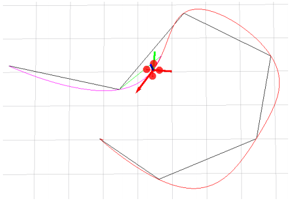

# Minimum Snap Trajectory Generation

## Introduction

### Why Smooth Trajectory?

- Good for autonomous moving
- Velocity/higher-order dynamics can't change immediately
- The robot should not stop at turns
- Save energy

### Smooth Trajectory Generation

There are ways to generate smooth trajectory:

- Boundary condition: start, goal positions(orientations)
- Intermediate condition: waypoint positions(orientations) 
    - Waypoints can be found by path planning (A star, RRT star, etc.)
- Smoothness criteria
    - Generally translates into minimizing rate of change of "input"

## Minimum Snap Optimization

### Differential Flatness

The states and the inputs of a quadrotor can be written as algebraic functions of four carefully selected flat outputs and their derivatives.

- Enables automated generation of trajectories
- Any smooth trajectory in the space of flat outputs (with reasonably bounded derivatives) can be followed by the under-actuated quadrotor.
- A possible choice: $\sigma = [x, y, z, \psi]^T$
- Trajectory in the space of flat outputs: $\sigma(t) = [T_0, T_M] \to \mathbb{R}^3 \times SO(2)$

Reference:

- [Minimum Snap Trajectory Generation and Control for Quadrotors, Daniel Mellinger and Vijay Kumar](https://ieeexplore.ieee.org/document/5980409)

Polynomial functions can be used to specify trajectories in the space of flat outputs:

- Easy determination of smoothness criterion with polynomial orders.
- Easy and closed form calculation of derivatives.
- Decoupled trajectory generation in three dimensions.

### Mimimum Snap

#### Smooth 1D Trajectory
It's just a simple BVP(Boundary Value Problem).

We design a trajectory $x(t)$ follows boundary condition:

$$
\begin{align}
x(0) = a \\
x(T) = b
\end{align}
$$

As we have known, smoothness means continuous and differential, and polynomial is $n$ order differential and $n + 1$ order continuous. So the smoothness is ensured by parametrization, we use a $5^{th}$ order polynomial trajectory, this is the smoothness criteria:

$$
x(t) = p_5t^5 + p_4t^4 + p_3t^3 + p_2t^2 + p_1t + p_0
$$

The boundary condition is:

| | Position | Velocity | Acceleration |
| --- | --- | --- | --- |
| t = 0 | a | 0 | 0 |
| t = T | b | 0 | 0 |

It can be solved with:

$$
\begin{bmatrix}
a \\
b \\
0 \\
0 \\
0 \\
0 \\
\end{bmatrix}
=
\begin{bmatrix}
0 & 0 & 0 & 0 & 0 & 1 \\
T^5 & T^4 & T^3 & T^2 & T & 1 \\
0 & 0 & 0 & 0 & 1 & 0 \\
5T^4 & 4T^3 & 3T^2 & 2T & 1 & 0 \\
0 & 0 & 0 & 2 & 0 & 0 \\
20T^3 & 12T^2 & 6T & 2 & 0 & 0 \\
\end{bmatrix}
\begin{bmatrix}
p_5 \\
p_4 \\
p_3 \\
p_2 \\
p_1 \\
p_0 \\
\end{bmatrix}
$$

#### Smooth Multi-Segment Trajectory
If intermediate conditions are given, we get a multi-segment problem. We prefer constant velocity motion at $v$, and zero acceleration.

The boundary conditions become:

| | Position | Velocity | Acceleration |
| --- | --- | --- | --- |
| t = 0 | a | $v_0$ | 0 |
| t = T | b | $v_T$ | 0 |

The solution is:

$$
\begin{bmatrix}
a \\
b \\
v_0 \\
v_T \\
0 \\
0 \\
\end{bmatrix}
=
\begin{bmatrix}
0 & 0 & 0 & 0 & 0 & 1 \\
T^5 & T^4 & T^3 & T^2 & T & 1 \\
0 & 0 & 0 & 0 & 1 & 0 \\
5T^4 & 4T^3 & 3T^2 & 2T & 1 & 0 \\
0 & 0 & 0 & 2 & 0 & 0 \\
20T^3 & 12T^2 & 6T & 2 & 0 & 0 \\
\end{bmatrix}
\begin{bmatrix}
p_5 \\
p_4 \\
p_3 \\
p_2 \\
p_1 \\
p_0 \\
\end{bmatrix}
$$

#### Optimization-based Trajectory Generation

If we know the $v$ and $a$, we can use multi-segment trajectory generation method to solve the problem. But the critical point is, we have no idea what is the best value for these variables. That's where we use optimization-base method.

##### Smooth 3D Trajectory

Let's take an example of quadrotor trajectory generation. The problem can be described as:

- Boundary condition: start, goal positions(orientations)
- Intermediate condition: waypoint positions(orientations)
    - Waypoints can be found by path planning(A star, RRT star, etc)
    - Introduced in previous lectures
- Smoothness criterion
    - Generally translates into minimizing rate of change of "input"

But what derivatives should we minimize?

As inferenced before, we have following relationships between derivatives and state of quadrotor:

| Derivative | Translation | Rotation | Thrust |
| --- | --- | --- | --- |
| 0 | Position | | |
| 1 | Velocity | | |
| 2 | Acceleration | Rotation | |
| 3 | Jerk | Angular Velocity | Thrust |
| 4 | Snap| Angular Acceleration | Differential Thrust |

We got following conclutions:

- Minimum jerk: minimizing angular velocity, which is good for visual tracking;
- Minimum snap: minimizing differential thrust, which saves energy.

So in math language, the problem is:

$$
f(t) = 
\begin{cases}
f_1(t) \doteq \sum^N_{i = 0} p_{1, i}t^i, &T_0 <= t <= T_1 \\
f_2(t) \doteq \sum^N_{i = 0} p_{2, i}t^i, &T_0 <= t <= T_2 \\
\vdots
f_M(t) \doteq \sum^N_{i = 0} p_{M, i}t^i, &T_{M - 1} <= t <= T_{M} \\
\end{cases}
$$

Attention:

- Each segment is a polynomial
- No need to fix the order, but keeping the same order makes this problem simpler
- `Time durations` for each segment must be known

The constraints:

> Smoothness means its derivative is continuous!

How to determine the trajectory order? Following iterms are what we should think about:

- which order to ensure the smoothness?
- which order to ensure the continuity?
- which order to minimize control input?

and these three items are `not` coupled, we can set them seperately.

A general method to define the order of `1D trajectory` is:

$$
N = 2 * d - 1
$$

where $N$ is the minimum degree of polynomial, $d$ is the order of difference. For example:

- Minimum jerk: $N = 2 * 3(jerk) - 1 = 5$
- MInimum snap: $N = 2 * 4(snap) - 1 = 7$

How this works? If we want to solve the minimum jerk problem, the number of equations is $2 * 3$, because we have start and end point, and each has $3$ equations(v, a, j), and the 5 order polynomial has $5 + 1$ unknowns.

And for k-segment trajectory, the constraints number of jerk will be $3 + 3 + (k - 1) = k + 5$, and the number of unknowns is $(N + 1) * k$, so the relationship between degree of polynomial and k is:

$$
(N + 1) * k = k + 5
$$

$$
N = \frac{5}{k}
$$

The more segments we divide, the less degrees of polynomial we need. But $k$ may be $1$, so $5$ is a good choice.

As for the timeline of problem, we can use

- many relative timeline, which is good for 

### Convex Optimization

## Closed-form Solution to Minimum Snap

## Implementation Details
