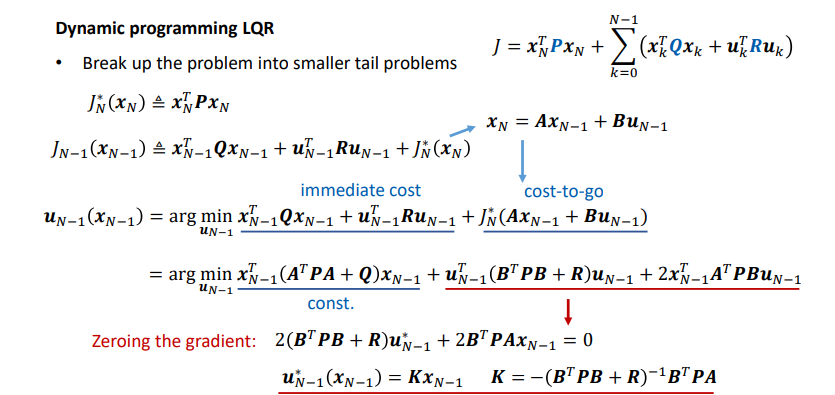
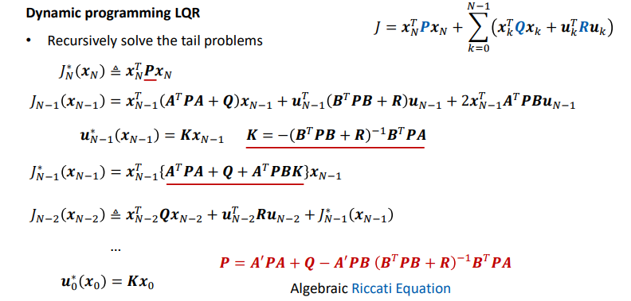
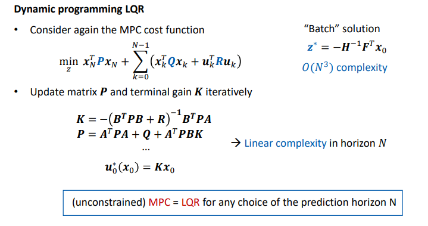
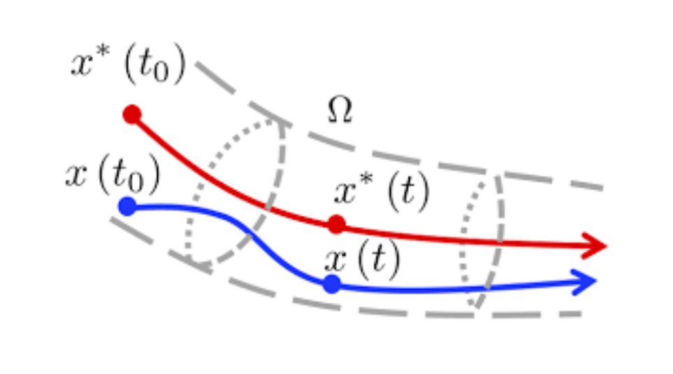
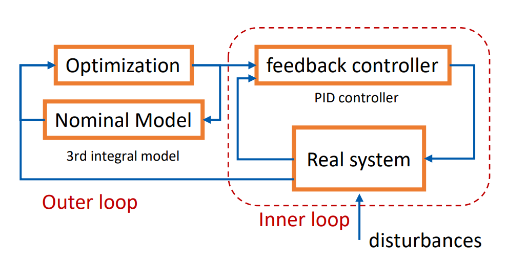

# Model Prediction Control (MPC)

As for the control problem, the simplest is `Reactive Control`. 

## Reactive Control

The advantages of reactive control are:

- Easy to design
- Consider errors

But there are also limitations:

- Non-trivial for more `complex systems`
- Control gains must be `tuned manually`
- No handling of `coupled dynamics`  and `constraints`
- Ignores `future dicision`

## Optimal Control

`Optimal Control` solves the problem that how to `best` control the system.
In order to answer the question how the input influences the future state, we should build the system model firstly.

`Model` of the system can be continuous:

$$
\dot {\mathbf{x}} = f_c(\mathbf{x}, \mathbf{u})
$$

or discrete:

$$
\mathbf{x}_{k + 1} = f_d(\mathbf{x}_k, \mathbf{u}_k)
$$

where:

- $\mathbf{x}_0$ is the initial condition
- $\mathbf{x}_k$ is state
- $\mathbf{u}_k$ is input

After the system model, another neccesary thing we define is the `Objective Function`, which describes the expectation of future trajectory.


$$
\min_{u_0 : N-1} \sum_{k = 0}^{N-1} q(x_k, u_k) + p(x_N)
$$

where:

- $q(x_k, u_k)$ describes the `stage cost`
- $p(x_N)$ describes the `terminal cost`

we can define the $q(x_k, u_k) = ||e_k||^2 + \rho \Delta u_k^2$ , where $e_k = x_k - x_k^{ref}$ is the tracking error, $\rho \Delta u_k^2$ is the smoothing cost.


Except for the objective function, `constraints` should also be considered:

$$
\begin{align}
x_{k + 1} &= f_d(x_k, u_k) \\
h(x_k, u_k) &= 0 \\
g(x_k, u_k) &\le 0 \\
\end{align}
$$

where $h(x_k, u_k)$ is the euqality constraints, $g(x_k, u_k)$ is the inequality constrains.


So in general, the procedure of the optimal control is:

- Build `Objective Function`:

$$
\min_{u_0 : N-1} \sum_{k = 0}^{N-1} q(x_k, u_k) + p(x_N)
$$

- Add `Constraints`:

$$
\begin{align}
x_{k + 1} &= f_d(x_k, u_k) \\
h(x_k, u_k) &= 0 \\
g(x_k, u_k) &\le 0 \\
\end{align}
$$

- Solve `Optimal vector`:

$$
z^\star = (u_0^T, \cdots, u_{N - 1}^T)
$$


The optimal vector is ideal, of course. In reality, the difficulties of (Open Loop) optimal control are:

- The `dynamic model` is usually `inaccurate`, model errors accumulate over time.
- The optimizer $z^\star$ we get can not be accurately applied.
- Long task-horizons make the problem `intractable`.
- The system may be affected by `external disturbances`.

## Model Predictive Control (MPC)

MPC combines `Reactive Control` and `Optimal Control`, it uses a dynamic `model` of the process to `predict` its future evolution(finite time horizon) and choose the best `control` action.

```
  +------------------+ update states
  | prediction model <---------+
  +--------+---------+         |
           |                   |
           |                   |
+----------v------------+      |
| model|based optimizer |      | measurements
+----------+------------+      |
           | control inputs    |
           |                   |
     +-----v------+            |
     | real model +------------+
     +------------+

```

The process is:

- `Feedback` of the measurement information, which starts from the estimated `current state`
- `Optimize` the best control sequence, which finds controls for `limited preview` into the future
- `Receding horizon` framework, which applies only the first input, then `replan`

The advantages of MPC are:

- Considers future (although a limited future)
- Accounts for errors
- Reduces problem size (solver is usually warm-started with the previous solution)


## Design of MPC

- `Prediction model`, trade-off in choice of model family:
	- Simplicity model, lower computation
	- Accuracy model, higher computation
- `Cost function`, vary in different requirements
- `Prediction horizon`, trade-off of
	- computation overload
	- recursive feasibility
- `Terminal constraints`


## Linear MPC

Linear MPC has following `linear prediction model`:

$$
\begin{cases}
x_{k + 1} &= A x_k + B u_k \\
y_k &= C x_k
\end{cases}
$$

And each state at time $k$ has the relation with inputs:

$$
x_k = A^k x_0 + \sum_{j = 0}^{k - 1} A^j B u_{k - 1 - j}
$$

Rewrite the equation above as matrix:

$$
\begin{bmatrix}
x_1 \\ x_2 \\ \vdots x_{N - 1} \\ x_{N}
\end{bmatrix}
=
\begin{bmatrix}
B & 0 & \cdots & 0 \\
AB & B & \cdots & 0 \\
\vdots & \vdots & \ddots & \vdots \\
A^{N - 1}B & A^{N - 2}B & \cdots & B
\end{bmatrix}
\begin{bmatrix}
u_0 \\ u_1 \\ \vdots \\ u_{N - 1}
\end{bmatrix}
+
\begin{bmatrix}
A \\ A^2 \\ \vdots \\ A^N
\end{bmatrix}
x_0
$$

The cost function of linear MPC is quadratic:

$$
J = x_N^T P x_N + \sum_{k = 0}^{N - 1} (x_k^T Q x_k + u_k^T R u_k)
$$

where $P$, $Q$ and $R$ are `positive semi-definite`.

The goal is to find the best control sequence $u_{0:N-1}^\star$ that minimizes:

$$
J = x_0^T Q x_0 +
\begin{bmatrix} x_1 \\ x_2 \\ \vdots \\ x_{N - 1} \\ x_{N} \end{bmatrix}^T
\begin{bmatrix} Q & 0 & 0 & \cdots & 0 \\ 0 & Q & 0 & \cdots & 0 \\ \vdots & \vdots & \ddots & \vdots & \vdots \\ 0 & \cdots & 0 & Q & 0 \\ 0 & 0 & \cdots & 0 & P \end{bmatrix}
\begin{bmatrix} x_1 \\ x_2 \\ \vdots \\ x_{N - 1} \\ x_{N} \end{bmatrix}
+ \begin{bmatrix} u_0 \\ u_1 \\ \vdots \\ u_{N - 1} \end{bmatrix}^T
\begin{bmatrix} R &  0 & \cdots & 0 \\ 0 & R & \cdots & 0 \\ \vdots & \vdots & \ddots & \vdots \\ 0 & \cdots & 0 & R \\ \end{bmatrix}
\begin{bmatrix} u_0 \\ u_1 \\ \vdots \\ u_{N - 1} \end{bmatrix}
$$

We define:

- $\bar{S} =  \begin{bmatrix} B & 0 & \cdots & 0 \\ AB & B & \cdots & 0 \\ \vdots & \vdots & \ddots & \vdots \\ A^{N - 1}B & A^{N - 2}B & \cdots & B \end{bmatrix}$ 
- $z = \begin{bmatrix} u_0 \\ u_1 \\ \vdots \\ u_{N - 1} \end{bmatrix}$ 
- $\bar{T} = \begin{bmatrix} A \\ A^2 \\ \vdots \\ A^N \end{bmatrix}$
- $\bar{Q} = \begin{bmatrix} Q & 0 & 0 & \cdots & 0 \\ 0 & Q & 0 & \cdots & 0 \\ \vdots & \vdots & \ddots & \vdots & \vdots \\ 0 & \cdots & 0 & Q & 0 \\ 0 & 0 & \cdots & 0 & P \end{bmatrix}$
- $\bar{R} = \begin{bmatrix} R &  0 & \cdots & 0 \\ 0 & R & \cdots & 0 \\ \vdots & \vdots & \ddots & \vdots \\ 0 & \cdots & 0 & R \\ \end{bmatrix}$

Then:

$$
\begin{align}
J(z, x_0) &= (\bar{S}z + \bar{T}x_0)^T\bar{Q}(\bar{S}z + \bar{T}x_0) + z^T \bar{R} z + x_0^T Q x_0 \\
&= \frac{1}{2} z^T 2 (\bar{R} + \bar{S}^T \bar{Q} \bar{S}) z + x_0^T 2 \bar{T}^T\bar{Q}\bar{S}z + \frac{1}{2} x_0^T 2 (Q + \bar{T}^T \bar{Q} \bar{T})x_0
\end{align}
$$

Then define:

- $H = 2 (\bar{R} + \bar{S}^T \bar{Q} \bar{S})$
- $F = 2 \bar{T}^T\bar{Q}\bar{S}$
- $Y = 2 (Q + \bar{T}^T \bar{Q} \bar{T})$

So we got the `Condensed form` of MPC:

$$
J(z, x_0) = \frac{1}{2} z^T H z + x_0^T F z + \frac{1}{2} x_0^T Y x_0
$$

where, $z = \begin{bmatrix} u_0 \\ u_1 \\ \vdots u_{N - 1} \end{bmatrix}$

The optimum is obtained by zeroing the gradient:

$$
\Delta_z J(z, x_0) = Hz + F^Tx_0
$$

So we got the optimal batch solution $z$:

$$
z^\star = - H^{-1} F^T x_{0}
$$

> Unconstrained linear MPC is a linear state-feedback


### Linear Quadratic Regulator(LQR)

Linear Quadratic Regulator(LQR) uses `dynamic programming` to solve the problem. It exploiting the sequential structure of the problem.

According to `Bellman's principle of optimality`:

> An optimal policy has the property that, regardless of the decisions taken to enter a particular state, the remaining decisions made for leaving that stage must constitute an optimal policy.

We can solve the problem from back to front.







## Other MPC

### Explicit MPC

Explicit MPC implement constrained linear MPC `without an online QP solver`

For an `online` optimization, with given $x(t)$, we solve the problem at each time step $t$, which is  a `Quadratic Programming(QP)`.

For an `offline` optimization, we solve the QP in advance for all $x(t)$ in a given range to find the control law $u = u_0^\star (x)$ explicity, which is a `Multi-parametric Quadratic Programming(mpQP)`

## Linear Time-Varying MPC and Nonlinear MPC

`Time-Varying` means in linear model:

$$
x_{k + 1} = A x_k + B u_k = A_k x_k + B_k u_k
$$

the matrix $A$ and $B$ are varying by time.

A nonlinear MPC has nonlinear model:

$$
\dot x = f(x, u)
$$


A `Linear Time-Varying` model can be obtained by linearing a nonlinear model.

Convert linear model to `discrete-time` using forward Euler method:

$$
\begin{align}
\dot x &= A_c x + B_c u + g_c \\
\frac{x_{k + 1} - x_k}{T_s} &= A_c x_k + B_c u_k + g_c \\
x_{k + 1} &= (I + T_s A_c) x_k + T_s B_c u_k + T_s g_c \\
x_{k + 1} &= A_kx_k + B_ku_k + g_k
\end{align}
$$

Then we can solve a linear MPC online.

`Augmented model` is often used in practice, which use the state matrix and control matrix as state, difference of control as new input vector. It's good to add cost on difference of input.

$$
\begin{bmatrix} x \\ u \end{bmatrix}_{k + 1} = 
\begin{bmatrix} A & B \\ 0 & I \end{bmatrix}\begin{bmatrix} x \\ u \end{bmatrix}_{k} + \begin{bmatrix} B \\ I \end{bmatrix} \Delta u_k
$$


### Tube MPC

The advantages of nonlinear MPC:

- Sometimes it's hard to carry out `system identification`, especially for nonlinear systems;
- Recursive feasibility and stability cannot be guaranteed for complex systems.

Here comes the `Tube MPC`, which use an independent `noninal model` of the system, and use a feedback controller to ensure the actual state converges to the nomial state.

An ancillary feedback controller is designed to keep the actual state within an invariant `tube` around a nomial trajectory computed neglecting `disturbances`.





### Hybrid MPC

### Model Predictive Contouring Control(MPCC)
