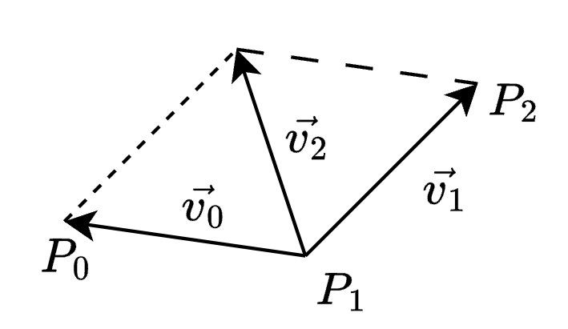
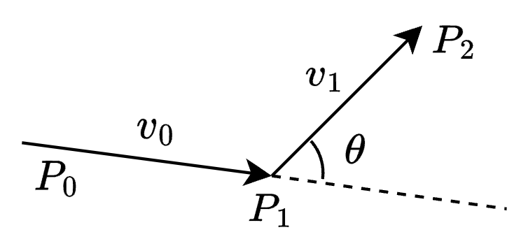
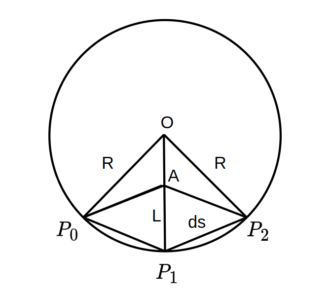

# Reference Line

## Fem(Finite Element Method)pos Smooth
The optimization variables are points(x, y) position.
The object function can be wrriten as:

$$
Cost_{all} = Cost_{smooth} + Cost_{length} + Cost_{deviation}
$$

### Smooth Cost

As we can see, 

$$
\vec{v_2} = \vec{v_0} + \vec{v_1}
$$

and the shorter $|\vec{v_2}|$ is, the smoother $p_0 \to p_1 \to p_2$  become. In vector format:

$$
\begin{align}
\vec{v_0} &= P_0 - P_1 \\
\vec{v_1} &= P_2 - P_1 \\
\vec{v_2} &= \vec{v_0} + \vec{v_1}
\end{align}
$$
So,

$$
Cost_{smooth} = \sum_{k = 1}^{n - 2} ||2 P_k - P_{k - 1} + P_{k + 1}||^2_2
$$

This cost can also be descriped as:

As $\theta$ decreases, $cos \theta$ decreases too. So,

$$
Cost_{smooth} = \sum_{k = 1}^{n - 2} \frac{\vec{v_0} \cdot \vec{v_1}}{|\vec{v_0}| \cdot |\vec{v_1}|}
$$

As we can see, if we use $\theta$ for smooth, the cost will not be a `qp problem`, we should solve it with a nonlinear solver.

### Length Cost

$$
Cost_{length} = \sum_{k = 0}^{n - 2} ||P_{k + 1} - P_{k}||^2_2
$$

### Deviation Cost

$$
Cost_{deviation} = \sum_{k = 0}^{n - 1} ||P_k - P_{k_{ref}}||_2^2
$$

### Curve Rate Constraints

Assumption:

- $|P_0 P_1| \approx |P_1 P_2|$, each piece of segment has almost the same length;
- $\theta$ is small, so $sin\theta \approx cos \theta$;
- $ds \approx arc P_1 \to P_2$ , distance between two points is approximately equal to the arc of them.

As we can see in above figure, $|P_0P_1| = |P_1 P_2|$, $|P_0 A| = |P_0P_1|$ :

$$
\frac{L}{ds} =\frac{ds}{R}
$$

$$
L = |\vec{P_0P_1} + \vec{P_1P_2}| = \frac{|\vec{P_1P_2}|^2} {R}
$$
