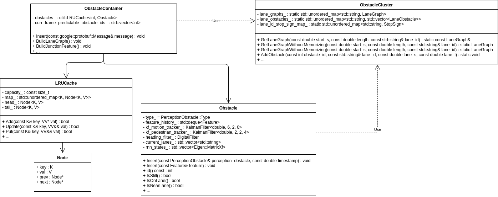
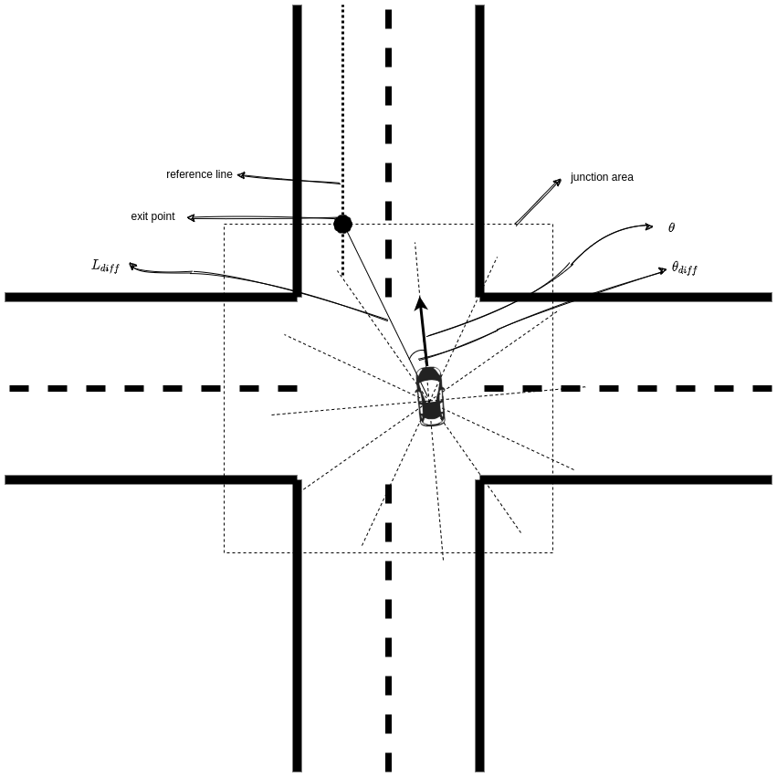
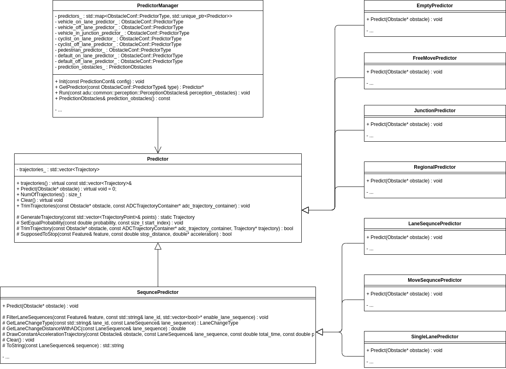

# Introduce to Apollo(3.5) Prediction Module
The prediction module studies and predicts the behavior of all the obstacles detected by the perception module. Prediction receives data of obstacles along with basic perception information including positions, headings, velocities, accelerations and then generates predicted trajectories with probabilities for those obstacles.

## Input

- **Obstacles** information from the perception module;
- **Localization** information from the localization module;
- **Planning trajectory** of ego vehicle of the previous computing cycle from the planning module.

## Output

- Obstacles annotated with predicted trajectories and their priorities.

Obstacle priority is now calculated as individual scenarios are prioritized differently. The priorities include:

- ignore;
- caution;
- normal(default).

## Functionalities
The prediction module comprises of 4 main functionalities: 

- Container
- Scenario
- Evaluator
- Predictor

shown as below:
```
Localization +-------------+          +-------------+           +-------------+          +-------------+
pose         |             |          |             |           |             |          |             |
+------------>             |          |             |           |             |          |             |
Planning     |             |structured|             | Scenario  |             |Lane      |             |Predicted
trajectory   |             |obstacle  |             | type      |             |probability             |trajectory
+------------>  CONTAINER  +---------->  SCENARIO   +----------->  EVALUATOR  +---------->  PREDICTOR  +---------->
Perception   |             |          |             |           |             |          |             |
obstacles    |             |          |             |           |             |          |             |
+------------>             |          |             |           |             |          |             |
             |             |          |             |           |             |          |             |
             +-------------+          +-------------+           +-------------+          +-------------+
```

### Container

Container stores structured data from subscribed channels. Current supported inputs:

- perception obstacles
- ego vehicle localization
- ego vehicle planning trajectory

#### Architecture

The architecture of the **container** is as below. The class `Container` defines the interface of all containers and it can't be realized because it has a pure virtual function `Insert`. `PoseContainer`, `ADCTrajectoryContainer` and  `ObstacleContainer` are derived from `Container` and realize the `Insert` function.
The `ContainerManager` class **has** many containers. It generates all three types of contianer and stores them in an unordered map to speed up the search process.
I just list some important methods of the class here, for more functions and their description, you can read the documents generated from `doxygen`.


Current container contains:

- PoseContainer
- ADCTrajectoryContainer
- ObstacleContainer

#### PoseContainer
`PoseContainer` receives localization message:

- position(3d);
- theta(orientation);
- velocity(3d);

and inserts ego vehicle as an obstacle into `ObstacleContainer` with id `-1` and type `VEHICLE`.

#### TrajectoryContainer
`TrajectoryContainer` receives trajectory message from planning and sets the information of current lane:

- junction id;
- the distance to junction;
- lane sequence;
- overlaps of the lane.

#### ObstacleContainer


`ObstacleContainer` structures and stores all obstacles from perception, it **has a** `LRU(Latest Recently Used)Cache` class to manage the latest recently used 10 items. The `value` of LRUCache is the obstacle and the `key`  is the id of the obstacle. The functionality of `ObstacleContainer` **depends on** the class `ObstacleCluster`, because method `SortObstacle` is used.

##### ObstacleCluster
`ObstacleCluster` contains not only `Obstcles` in an unordered map to speedup `set` and `get` but also the relationship between `Obstacles` and `LaneGraphs` from `HdMap` like `Overlaps` and `Stopsigns`.

##### Obstacle
`Obstacle` class is a basic unit to store `Obstacles` generated by `perception` module. It stores the information of an obstacle in a data structure `Feature` which is defined in google's data interchange format [protobuf](https://developers.google.com/protocol-buffers/). 

In addtion to the information about the obstacle, `Obstacle` uses

- a `KalmanFilter` to track the trajectory of pedestrian;
- a `KalmanFilter` to track the trajectory of other obstacles(vehicle, bicycle, etc.)
- a `DigitalFilter` to filter the heading of bicycles and pedestrians.

`Obstacle` contains many methods about obstacle's property:

###### `IsStill`: return true if the obstacle is still.
There are two checks to determine whether an obstacle is still or not:

- distance check.
- speed check.

Firstly, we can calculate the average distance deviation of an obstacle's history position:

$$
x_{avg} = \sum_{i = 1}^{n} \frac{x_{i} - x_{0}}{n - 1}
$$

$$
y_{avg} = \sum_{i = 1}^{n} \frac{y_{i} - y_{0}}{n - 1}
$$

In the above equations,

- $x_{avg}$ is the average distance deviation of $x$;
- $y_{avg}$ is the average distance deviation of $y$;
- $n$ is the history size of an obstacle, in the program is $10$;
- $x_{i}$ is the `i`th $x$ of the position in history;
- $y_{i}$ is the `i`th $y$ of the position in history;
- $x_{0}$ is the current $x$ of the position of an obstacle;
- $y_{0}$ is the current $y$ of the position of an obstacle.

Then, the speed sensibility is defined as:

$$
K_{v} = \frac{\sqrt{2 * n} * 4 * k_{std}}{(n + 1) * d_{t}}
$$

In the equation:

- $K_{v}$ is the sensibility of speed;
- $n$ is the history size of an obstacle;
- $k_{std}$ is the position standard deviation of an obstacle, it's $1.0$(obstacle) or $0.5$(other) in program;
- $d_{t}$ is the duration of the history.

Nextly, we calculate the distance:

$$
D = \sqrt{x_{avg}^2 + y_{avg}^2}
$$

$$
D_{std} = \sqrt{\frac{2.0}{n}} * k_{std}
$$

In the equation:

- $D$ is the distance of obstacle;
- $D_{std}$ is the standard distance of obstacle.

Now we can determine the obstacle is:

- still, if $v < v_{threshold}$($v$ is current speed, $v_{threshold}$ is the threshold of speed, it's $0.8$(obstacle) or $0.5$(other) in program);
- not still, if $v > v_{threshold}$ and $K_{v} < v_{threshold}$;
- not still, if $v > v_{threshold}$ and $K_{v} > v_{threshold}$ and $D > 2.0 * D_{std}$;
- still, if $v > v_{threshold}$ and $K_{v} > v_{threshold}$ and $D < 2.0 * D_{std}$;

### Scenario

The `Scenario` sub-module analyzes scenarios that includes the ego vehicle.
Currently, two scenarios are defined:

- **Cruise** : this scenario includes lane keeping and following.
- **Junction** : this scenario involves junctions. Junctions can either have traffic lights and/or STOP signs.

The architecture of `Scenario` is as below:


#### ScenarioManager
The `ScenarioManager` class **depends on** `FeatureExtractor` to generate environment features and **depends on** `ScenarioAnalyzer` to analyze current scenario. If necessary, `ScenarioManager` will set obstacls' priorities as:

- IGNORE, if the obstacle is no need to be considered;
- NORMAL, if the obstacle should be considered.


The obstacle is set to `NORMAL` if the obstacle is:

- `in scan area`, the scan arear is a rectanglar in front of ego vehicle with the length($80$ in program) and width($12$ in program), for example, the obstacle with id of 5 is in scan area but 6 not;
- `on lane`, for example, the obstacle with id of 3 is on lane but 2 not;
- `near junction`, means that the distance between obstacle and junction is less than threshold(it's $1$ in program), see obstacle 4 and 5;
- `near lane`, this rule is not for the obstacle with the type of `VEHICLE`, if the distance is less than threshold($3$ in program), obstacle 2 and 3 is near lane.

Otherwise the priority of the obstacle is `IGNORE`.

#### FeatureExtractor
`FeatureExtractor` sets

- Ego lane feature, including ego lane `id` and distance `s` of lane;
- Left and right lane feature, including lane `id` and distance `s` of lane;
- Junction feature, including junction `id`, we only consider the junction that has signals or stop signs. 

#### ScenarioAnalyzer
`ScenarioAnalyzer` determines which scene ego vehicle is in:

- Junction, if the distance between ego vehicle and junction is less than threshold($10$ in program);
- Cruise, otherwise.

`ScenarioAnalyzer` works **depends on** `ScenarioFeatures`. Once which scenario is determined, it will generate corresponding scenario features.

#### ScenarioFeatures
`CruiseScenariosFeatures` and `CruiseScenariosFeatures` are derived from the base class `ScenarioFeatures`.

### Evaluator

The `Evaluator` predicts path and speed separately for any given obstacle. An evaluator evaluates a path by outputting a probability for it (lanesequence) using the given model stored in `prediction/data/`.

Now in `prediction`, the `Evaluator` for `Cyclist` are:

- `CyclistKeepLaneEvaluator`;

and the `Evaluator` for `Vehicle` are:

- `CostEvaluator`: probability is calculated by a set of cost functions;
- `MLPEvaluator`: probability is calculated using an MLP model;
- `RNNEvaluator`: probability is calculated using an RNN model;
- `CruiseMLPEvaluator`: probability is calculated using a mix of MLP and CNN-1d models for the cruise scenario;
- `JunctionMLPEvaluator`: probability is calculated using an MLP model for junction scenario.

The architecture of `Evaluator` is as below:


#### EvaluatorManager
The `EvaluatorManager` creates and stores all types of evaluators, so it **has** many `Evaluator` pointers. The `Evaluator` class is a base class that defines a pure virtual function `Evaluate`. `EvaluatorManager` calls `Evaluator`'s subclass's function `Evaluate` to calculate probability for a lanesequence. If the `obstacle` type is:

- `VEHICLE` and it's 
    - `ON_LANE`, the `Evaluator` will be `CruiseMLPEvaluator`;
    - `IN_JUNCTION`, the `Evaluator` will be `JunctionMLPEvaluator`;
- `BICYCLE` and it's
    - `ON_LANE`, the `Evaluator` will be `CyclistKeepLaneEvaluator`;
- `UNKNOWN` and it's
    - `ON_LANE`, the `Evaluator` will be `MLPEvaluator`;

otherwise, the `Evaluator` would not work.

#### CyclistKeepLaneEvaluator
The `CyclistKeepLaneEvaluator` is simple and has only two probability values:

- 1.0, if current lane id is equal to the lane id in lane sequence;
- 0.0, if current lane id is not equal to the lane id in lane sequence.

The lanes sequence is a list of lane id that covers the length:

$$
D_{lane} = v_{0} * t_{max} + 0.5 * a_{max} * t_{max}^2
$$

In equation,

- $D_{lane}$ is the distance the lane sequance covers;
- $v_{0}$ is current speed the obstacle has;
- $t_{max}$ is the predicted trajectory duration, it's 8.0 in program;
- $a_{max}$ is the maximum linear acceleration of vehicle, it's 4.0 in program;

#### MLPEvaluator
This `Evaluator` uses a MLP(Multilayer Perceptron):


The model has $62$ inputs, $22$ of which are obstacle features:

- $\theta_{filter}$, the average of the latest 5 heading values in an obstacle's history;
- $\theta_{mean}$, the average of all the heading values in an obstacle's history;
- $\theta_{filter} - \theta_{mean}$;
- $\theta_{diff} = \theta_{curr} - \theta_{prev}$, where $\theta_{curr}$ is the average of the latest $0 \to 4$ heading values in an obstacle's history, $\theta_{prev}$ is the average of the latest $5 \to 9$ heading values;
- $\theta_{diff}'$, $\theta_{diff}' = \frac{\theta_{diff}}{\Delta_t} $;
- $l_{filter}$, the average of the latest 5 lateral distance values in an obstacle's history;
- $l_{mean}$, the average of all the lateral distance values in an obstacle's history;
- $l_{filter} - l_{mean}$;
- $l_{diff} = l_{curr} - l_{prev}$, where $l_{curr}$ is the average of the latest $0 \to 4$ lateral distance values in an obstacle's history, $l_{prev}$ is the average of the latest $5 \to 9$ lateral distance values;
- $v$, the velocity of the obstacle;
- $a$, the acceleration of the obstacle;
- $D_{lb}$, the distance from obstacle to left lane boundary;
- $D_{lb}' = \frac{D_{first} - D_{last}}{dt}$, where $D_{first}$ is the first $D_{lb}$ of the history, $D_{last}$ is the last $D_{lb}$ of the history, $dt$ is the duration of the history;
- $D_{lb diff}' = D_{lb curr} - D_{lb prev}$, where $D_{lb curr}$ is the average of the latest $0 \to 4$ $D_{lb}$ values in an obstacle's history, $D_{lb prev}$ is the average of the latest $5 \to 9$ $D_{lb}$ values;
- $D_{rb}$, the distance from obstacle to right lane boundary;
- $D_{rb}' = \frac{D_{first} - D_{last}}{dt}$, where $D_{first}$ is the first $D_{rb}$ of the history, $D_{last}$ is the last $D_{rb}$ of the history, $dt$ is the duration of the history;
- $D_{rb diff}' = D_{rb curr} - D_{rb prev}$, where $D_{rb curr}$ is the average of the latest $0 \to 4$ $D_{rb}$ values in an obstacle's history, $D_{rb prev}$ is the average of the latest $5 \to 9$ $D_{rb}$ values;
- `is_curr_lane_no_turn`, this value is $1$ if current lane is `NoTurn`, or it's $0$;
- `is_curr_lane_left_turn`, this value is $1$ if current lane is `LeftTurn`, or it's $0$;
- `is_curr_lane_right_turn`, this value is $1$ if current lane is `RightTurn`, or it's $0$;
- `is_curr_lane_uturn`, this value is $1$ if current lane is `UTurn`, or it's $0$.

And the other 40 features are lane features, we choose 10 points from the reference line, each of them has 4 features:

- $\psi_{diff}$: the heading deviation between obstacle and reference line;
- $l_{point}$: the lateral distance of the lane point;
- $\psi_{point}$: the heading of the lane point;
- $\psi_{dev}$: the heading divation between obstacle and the point closet to the obstacle.

The output $\widehat{y}$ is the probability that an obstacle stays on a lane.

#### CruiseMLPEvaluator


The model has $23 + 5 * 9 + 8 + 20 * 4 = 146$ inputs, $23$ of which are obstacle features:

- $\theta_{filter}$, the average of the latest 5 heading values in an obstacle's history;
- $\theta_{mean}$, the average of all the heading values in an obstacle's history;
- $\theta_{filter} - \theta_{mean}$;
- $\theta_{diff} = \theta_{curr} - \theta_{prev}$, where $\theta_{curr}$ is the average of the latest $0 \to 4$ heading values in an obstacle's history, $\theta_{prev}$ is the average of the latest $5 \to 9$ heading values;
- $\theta_{diff}'$, $\theta'_{diff} = \frac{\theta_{diff}}{\Delta_t}$;
- $l_{filter}$, the average of the latest 5 lateral distance values in an obstacle's history;
- $l_{mean}$, the average of all the lateral distance values in an obstacle's history;
- $l_{filter} - l_{mean}$;
- $l_{diff} = l_{curr} - l_{prev}$, where $l_{curr}$ is the average of the latest $0 \to 4$ lateral distance values in an obstacle's history, $l_{prev}$ is the average of the latest $5 \to 9$ lateral distance values;
- $v$, the velocity of the obstacle;
- $a$, the acceleration of the obstacle;
- $j$, the jerk of the obstacle;
- $D_{lb}$, the distance from obstacle to left lane boundary;
- $D_{lb}' = \frac{D_{first} - D_{last}}{dt}$, where $D_{first}$ is the first $D_{lb}$ of the history, $D_{last}$ is the last $D_{lb}$ of the history, $dt$ is the duration of the history;
- $D_{lb diff}' = D_{lb curr} - D_{lb prev}$, where $D_{lb curr}$ is the average of the latest $0 \to 4$ $D_{lb}$ values in an obstacle's history, $D_{lb prev}$ is the average of the latest $5 \to 9$ $D_{lb}$ values;
- $D_{rb}$, the distance from obstacle to right lane boundary;
- $D_{rb}' = \frac{D_{first} - D_{last}}{dt}$, where $D_{first}$ is the first $D_{rb}$ of the history, $D_{last}$ is the last $D_{rb}$ of the history, $dt$ is the duration of the history;
- $D_{rb diff}' = D_{rb curr} - D_{rb prev}$, where $D_{rb curr}$ is the average of the latest $0 \to 4$ $D_{rb}$ values in an obstacle's history, $D_{rb prev}$ is the average of the latest $5 \to 9$ $D_{rb}$ values;
- `is_curr_lane_no_turn`, this value is $1$ if current lane is `NoTurn`, or it's $0$;
- `is_curr_lane_left_turn`, this value is $1$ if current lane is `LeftTurn`, or it's $0$;
- `is_curr_lane_right_turn`, this value is $1$ if current lane is `RightTurn`, or it's $0$;
- `is_curr_lane_uturn`, this value is $1$ if current lane is `UTurn`, or it's $0$.

And $5 * 9$ features are obstacle history features, we search $5$ frames of history, each frame has $9$ fearures:

- `is_curr_frame_has_hisotry`, the value is $1$ if current frame and previous frame all have position/velocity/acceleration/velocity_heading information, otherwise it's $0$;
- $x$, in local coordinate system;
- $y$, in local coordiante system;
- $x^{\prime}$;
- $y^{\prime}$;
- $x^{\prime\prime}$;
- $y^{\prime\prime}$;
- $\theta_{v}$, the heading of velocity;
- $\theta_{v}^{\prime}$.

$8$ features are for forward and backward obstacles:

- $s_{forward}$, the forward obstacle's distance;
- $l_{forward}$, the forward obstacle's lateral distance;
- $L_{forward}$, the forward obstacle's length;
- $v_{forward}$, the forward obstacle's velocity;
- $s_{backward}$, the backward obstacle's distance;
- $l_{backward}$, the backward obstacle's lateral distance;
- $L_{backward}$, the backward obstacle's length;
- $v_{backward}$, the backward obstacle's velocity;

And the other $20 * 4$ features are lane features, we choose $20$ points from the reference line, each of them has 4 features:

- $s_{point}$, the lane point's distance;
- $l_{point}$, the lane point's lateral distance;
- $\psi_{point}$: the heading of the lane point;
- $\kappa_{point}$: the curvature of the lane point.

The result of `CruiseMLPEvaluator` is:

- the probability of an obstacle on a lane;
- the time of an obstacle to travel to reference line.

#### JunctionMLPEvaluator


This model has 3 obstacle features:

- $v$, the velocity of an obstacle;
- $a$, the acceleration of an obstacle;
- $S_{junction}$, the area of the junction.

The other $12 * 5$ features are junction features. We divide area aroud the vehicle to 12 regions and calculate the probability of each exit.

Each exit has 5 features:

- `is_exit_exist`, it's 1 if the exit of junction exists;
- $x_{diff} / S_{junction}$, $x_{diff}$ is the deviation between obstacle and exit in x direction;
- $y_{diff} / S_{junction}$, $y_{diff}$ is the deviation between obstacle and exit in y direction;
- $L_{diff} / S_{junction}$, $L_{diff}$ is the distance between obstacle and exit;
- $\theta_{diff}$, the heading difference between obstacle and exit.

And the output of the model is the probability of an obstacle to exit in 12 directions.

#### CostEvaluator
`CostEvaluator` calculates the probability based on the distance between obstacle and lane boundary.

$$
E_{l} = \frac{W_{lane}}{2} - W_{l}
$$

$$
P_{cost} = \frac{1}{1 + e^{-E_{l}}}
$$

In the equation:

- $E_{l}$ is the distance from lane boundary to obstacle's location;
- $W_{lane}$ is the width of lane;
- $W_{l}$ is the lateral distance from lane reference line to obstacle's location;
- $P_{cost}$ is the probability, calculated by a [Sigmoid function](https://en.wikipedia.org/wiki/Sigmoid_function).

#### RNNEvaluator
Not used in program.

### Predictor

Predictor generates predicted trajectories for obstacles. Currently, the supported predictors include:

- **Empty**: obstacles have no predicted trajectories;
- **Single lane**: Obstacles move along a single lane in highway navigation mode. Obstacles not on lane will be ignored;
- **Lane sequence**: obstacle moves along the lanes;
- **Move sequence**: obstacle moves along the lanes by following its kinetic pattern;
- **Free movement**: obstacle moves freely;
- **Regional movement**: obstacle moves in a possible region;
- **Junction**: Obstacles move toward junction exits with high probabilities.

The relationship between `predictor`s is as below:


#### PredictorManager
`PredictorManager` creates and stores all kinds of `predictor`s. It **has** pointers of base class `Predictor` to points to its subclasses, the specail predictors.
`PredictorManager` runs the special predictor's method `Predict` to generate trajectories according to obstacles's type. If the obstacle's type is:

- `Vehicle`, and it's
    - `InJunction`, the predictor will be `LaneSequencePredictor`;
    - `OnLane`, the predictor will be `MoveSequencePredictor`;
    - `OffLane`, the predictor will be `FreeMovePredictor`;
- `Pedestrian`, the predictor will be `FreeMovePredictor`;
- `Bicycle`, and it's
    - `OnLane`, the predictor will be `MoveSequencePredictor`;
    - `OffLane`, the predictor will be `FreeMovePredictor`;
- `Unknown`, and it's
    - `OnLane`, the predictor will be `MoveSequencePredictor`;
    - `OffLane`, the predictor will be `FreeMovePredictor`;
- other case, the predictor will be `EmptyPredictor`.

#### Predictor
`Predictor` is a base class with the pure virtual function `Predict`. It also realizes some methods about trajectories:

##### TrimTrajectory
If the obstacle is in junction, we don't trim obstacle's trajectory; otherwise, trim the trajectory to the front of junction.

##### SupposedToStop
Determine if an obstacle is supposed to stop within a distance.

#### EmptyPredictor
`EmptyPredictor` does nothing but clear the trajectory of obstacle.

#### FreeMovePredictor
`FreeMovePredictor` assumes that the obstacle always moves with initial velocity and acceleration, the state is:

$$
\begin{bmatrix}
x \\\\
y \\\\
x^\prime \\\\
y^\prime \\\\
x^{\prime\prime} \\\\
y^{\prime\prime}
\end{bmatrix}
$$

and the transition matrix is:

$$
\begin{bmatrix}
1 & 0 & t & 0 & 0.5 * t^2 & 0 \\\\
0 & 1 & 0 & t & 0 & 0.5 * t^2 \\\\
0 & 0 & 1 & 0 & t & 0 \\\\
0 & 0 & 0 & 1 & 0 & t \\\\
0 & 0 & 0 & 0 & 1 & 0 \\\\
0 & 0 & 0 & 0 & 0 & 1
\end{bmatrix}
$$

#### JunctionPredictor
`JunctionPredictor` uses a cubic polynomial to fit start-point(obstacle's position) and end-point(junction exit position) within given time.

#### RegionalPredictor
Not used in program.

#### SequencePredictor
`SequencePredictor` defines some common methods relatived to sequence.

##### FilterLaneSequence
This method filters out those obstacles that are close to the ego vehicle so that we will ignore them and drive normally unless they really kick into our lane.

#### LaneSequencePredictor
`LaneSequencePredictor` is derived from `SequencePredictor`. After filtering lane sequence, it use the method from `Predictor` to check if an obstacle is to stop:

- `true`, generate constant acceleration trajectory;
- `false`, generate lane sequence trajectory.

##### Constant acceleration trajectory
In this case, `predictor` refresh trajectory point with the equation:

$$
s = v * t + 0.5 * a * t^2
$$

$$
v = v_0 + a * t
$$

$$
l = l_0 * K_{approach}
$$

In equation:

- $s$ is the obstacle distance on the lane;
- $v$ is current velocity;
- $t$ is the duration;
- $a$ is current acceleration;
- $v_0$ is the velocity from last step;
- $l$ is the lateral distance between obstacle and lane reference line;
- $l_0$ is the lateral distance last step.
- $K_{approach}$ is the coefficient that obstacle moves towards lane reference line;

##### Lane sequence trajectory
In this case, we assume that the obstacle moves with constant velocity:

$$
s = s_0 + v * t
$$

$$
l = l_0 * K_{approach}
$$

#### MoveSequencePredictor
`MoveSequencePredictor` is derived from `SequencePredictor`. After filtering lane sequence, it use the method from `Predictor` to check if an obstacle is to stop:

- `true`, generate constant acceleration trajectory;
- `false`, generate lane sequence trajectory using best trajectory selection.

##### Const acceleration trajectory
This trajectory is the same as LaneSequencePredictor

##### Lane sequence trajectory using best trajectory selection
This trajectory traverses all the time to reach the end point and selects the best trajectory that has the minimum cost.

##### Generate a list of time to reach the end.
In program, we use the method `GenerateCandidateTimes` with the time gap of $0.5$ and end time $8.0$ to generate a sample time list: `{0, 0.5, 1, 1.5, ..., 7.5, 8.0}`.
##### Calculate the 5th degree polynomial of lateral ditance with each end time.
Since we have known the start state:

$$
\begin{cases}
l_{0} = l_{obstacle} \\
l_{0}^\prime = v_{lateral} \\
l_{0}^{\prime\prime} = 0
\end{cases}
$$

and end state:

$$
\begin{cases}
l_{1} = 0 \\
l_{1}^{\prime} = 0 \\
l_{1}^{\prime\prime}= 0
\end{cases}
$$

with the 5th degree polynomial equation:

$$
\begin{cases}
l = a_0 + a_1 \cdot t + a_2 \cdot t^2 + a_3 \cdot t^3 + a_4 \cdot t^4 + a_5 \cdot t^5 \\
l^{\prime} = a_1 + 2 \cdot a_2 \cdot t + 3 \cdot a_3 \cdot t^2 + 4 \cdot a_4 \cdot t^3 + 5 \cdot a_5 \cdot t^4 \\
l^{\prime\prime} = 2 \cdot a_2 \cdot t + 6 \cdot a_3 \cdot t + 12 \cdot a_4 \cdot t^2 + 20 \cdot a_5 \cdot t^3
\end{cases}
$$

we can get the coefficients $a_0$ to $a_5$.

##### Calculate the 4th degree polynomial of longitude distance with each end time.
Since we have known the start state:

$$
\begin{cases}
s_{0} = s_{obstacle} \\
s_{0}^\prime = v_{longitude} \\
s_{0}^{\prime\prime} = 0
\end{cases}
$$

and end state:

$$
\begin{cases}
s_{1} = s_{end} \\
s_{1}^{\prime} = v_{end} \\
s_{1}^{\prime\prime}= 0
\end{cases}
$$

with the 4th degree polynomial equation:

$$
\begin{cases}
s = a_0 + a_1 \cdot t + a_2 \cdot t^2 + a_3 \cdot t^3 + a_4 \cdot t^4 \\
s^{\prime} = a_1 + 2 \cdot a_2 \cdot t + 3 \cdot a_3 \cdot t^2 + 4 \cdot a_4 \cdot t^3 \\
s^{\prime\prime} = 2 \cdot a_2 \cdot t + 6 \cdot a_3 \cdot t + 12 \cdot a_4 \cdot t^2
\end{cases}
$$

we can get the coefficients $a_0$ to $a_4$.

##### Find the coefficients of lateral and longitude with the lowest cost.
The cost of each group of coefficients can be calculated with:

$$
C = a_{max lateral} + \alpha * t_{end}
$$

In equation,

- $C$ is the cost;
- $\alpha$ is ratio of time, it's $0.25$ in program;
- $t_{end}$ is the time to reach end point.

##### Generate each point of the trajectory with the lowest cost.
Now that we know the equation of longitude and lateral and the time to reach end point, we can generate each point of the trajectory with  time gap($0.1$ in program)

#### SingleLanePredictor
This `predictor` uses the same method as `LaneSequencePredictor` lane sequence case.
