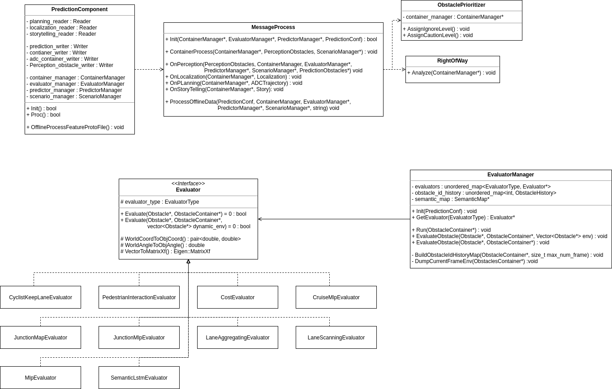

# Dig into Apollo(6.0) Prediction



## PredictionComponent

### Proc

This is a callback function for `PerceptionObstacle` Reader. If a new message is generated in channel, this function will execute.

```C++
if (FLAGS_use_lego) return ContainerSubmoduleProcess(perception_obstacles);
return PredictionEndToEndProc(perception_obstacles); 
```

### ContainerSubmoduleProcess

This is another prediction process which is the same as `PredictionEndToEnd`. This function is created for `Lego` architecture, whose communication system may have much difference with current `cyber`.

### PredictionEndToEnd

Almost all the work is doing in `MessageProcess` class.

- Transform all messages(perception/localization/planning/storytelling) to obstacle
- `message_process.OnPerception`
- Send the prediction message to channel

## MessageProcess

### Init

Initialize following classes with configures:

- ContainerManager
- EvaluatorManager
- PredictorManager
- PredictionMap

### OnPerception

Prediction module is driven by perception module, which means that once a frame of message is generated by perception, this function is called. The process is:

- use `ContainerProcess` function to process all messages
- insert all messages to a proto file for offline model training
- generate intension of obstacle with `evaluator` module
- generate trajectory of obstacle with `predictor` module

### ContainerProcess

This function :

- transforms messages from perception/localization/planning to abstract obstacles and
- prioritizes all obstacles to determine if the obstacle is need to consider and
- analyzes scenarios ego vehicle is in of:
    - Unknown
    - Cruise
    - Junction
- builds junction(conditional) and cruise features and
- sets `Caution` priority of obstacle and
- sets the weight of way in a distance to
    - -20, for left turn
    - -10, for right turn

## ObstaclePrioritizer

### AssignIgnoreLevel

This function set obstacle's priority of:

- `Ignore`, which means it's no need to consider
- `Normal`, which means it should be considered

And if an obstacle's priority is `Normal`, it is either:

- in `scan box`, which is a rectangular centered on ego vehicle
- on lane
- near lane with the type of `pedestrian`
- near junction

### AssignCautionLevel

Set the obstacle priority to be `Caution` if the obstacle is close to ego vehicle and

- in junction(under junction scenario)
- the first obstacle in front of ego vehicle(searched within lane sequence, may not be unique)
- its lane sequence is on ego vehicle's planning trajectory

And if enabled, this function will shrink the number of caution obstacles to a threshold according to distance.


## EvaluatorManager

`EvaluatorManager` class to manage all `Evaluator`s' lifecycle and 

### Init

This is a initialization function to initialize:

- semantic map
- all evaluators with configures
- default evaluator types by obstacle's:
    - type
    - priority(normal/caution)
    - status(onlane/offlane/junction)

### GetEvaluator

You can get the pointer to evaluator by inputing evaluator's type. It's better to use unordered_map(hash) other than map(balanced binary tree) to accumulate the looking up process.

### Run

This is the main process to `evaluate` an obstacle's intension(or trajectory) with multiple evaluators.
According to `Single Responsibility` principle, I don't think it's a good idea to do these stuffs in a `manager` class.

The function does:

- BuildObstacleIdHistoryMap
- DumpCurrentFrameEnv
- Evaluate obstacles with:
    - multiple thread according to `GroupObstaclesByObstacleIds` results
    - single thread

### BuildObstacleIdHistoryMap

Build a feature proto for each obstacle in current frame, every feature proto contains `max_num_frame`s with:

- id
- timestamp
- type
- position(x, y, z)
- theta(heading)
- length
- width
- is_trainable(bool, calculated with the function `IsTrainable`)

### IsTrainable

A helper function defined in `evaluator_manager.cc`'s unnamed namespace. Return `false` if the obstacle:

- is ego vehicle
- has the priority of `Ignore`
- is still
- is not vehicle

otherwise, return true;

### DumpCurrentFrameEnv

Another helper fucntion in unnamed namespace, the main purpose of this is to insert all obstacles' history information to `FrameEnv` class for output.

### GroupObstaclesByObstacleIds

This function assigns thread id for each obstacle according to its priority(caution or normal). Each thread has `obstacle_num / thread_num` obstacle ids(tasks).

#### CyclistKeepLaneEvaluator
The `CyclistKeepLaneEvaluator` is simple and has only two probability values:

- 1.0, if current lane id is equal to the lane id in lane sequence;
- 0.0, if current lane id is not equal to the lane id in lane sequence.

The lanes sequence is a list of lane id that covers the length:

$$
D_{lane} = v_{0} * t_{max} + 0.5 * a_{max} * t_{max}^2
$$

In equation,

- $D_{lane}$ is the distance the lane sequance covers;
- $v_{0}$ is current speed the obstacle has;
- $t_{max}$ is the predicted trajectory duration, it's 8.0 in program;
- $a_{max}$ is the maximum linear acceleration of vehicle, it's 4.0 in program;

### PedestrianInteractionEvaluator

This evaluator follows the paper[Social LSTM: Human Trajectory Prediction in Crowded Spaces](https://cvgl.stanford.edu/papers/CVPR16_Social_LSTM.pdf). I guess that this evaluator is not completed, because:

- the input trajectory size is only one
- the social part of work is not implemented, and without the social, lstm has little advance over constant velocity model.

### CostEvaluator
`CostEvaluator` calculates the probability based on the distance between obstacle and lane boundary.

$$
E_{l} = \frac{W_{lane}}{2} - W_{l}
$$

$$
P_{cost} = \frac{1}{1 + e^{-E_{l}}}
$$

In the equation:

- $E_{l}$ is the distance from lane boundary to obstacle's location;
- $W_{lane}$ is the width of lane;
- $W_{l}$ is the lateral distance from lane reference line to obstacle's location;
- $P_{cost}$ is the probability, calculated by a [Sigmoid function](https://en.wikipedia.org/wiki/Sigmoid_function).

### CruiseMLPEvaluator


The model has $23 + 5 * 9 + 8 + 20 * 4 = 146$ inputs, $23$ of which are obstacle features:

- $\theta_{filter}$, the average of the latest 5 heading values in an obstacle's history;
- $\theta_{mean}$, the average of all the heading values in an obstacle's history;
- $\theta_{filter} - \theta_{mean}$;
- $\theta_{diff} = \theta_{curr} - \theta_{prev}$, where $\theta_{curr}$ is the average of the latest $0 \to 4$ heading values in an obstacle's history, $\theta_{prev}$ is the average of the latest $5 \to 9$ heading values;
- $\theta_{diff}'$, $\theta'_{diff} = \frac{\theta_{diff}}{\Delta_t}$;
- $l_{filter}$, the average of the latest 5 lateral distance values in an obstacle's history;
- $l_{mean}$, the average of all the lateral distance values in an obstacle's history;
- $l_{filter} - l_{mean}$;
- $l_{diff} = l_{curr} - l_{prev}$, where $l_{curr}$ is the average of the latest $0 \to 4$ lateral distance values in an obstacle's history, $l_{prev}$ is the average of the latest $5 \to 9$ lateral distance values;
- $v$, the velocity of the obstacle;
- $a$, the acceleration of the obstacle;
- $j$, the jerk of the obstacle;
- $D_{lb}$, the distance from obstacle to left lane boundary;
- $D_{lb}' = \frac{D_{first} - D_{last}}{dt}$, where $D_{first}$ is the first $D_{lb}$ of the history, $D_{last}$ is the last $D_{lb}$ of the history, $dt$ is the duration of the history;
- $D_{lb diff}' = D_{lb curr} - D_{lb prev}$, where $D_{lb curr}$ is the average of the latest $0 \to 4$ $D_{lb}$ values in an obstacle's history, $D_{lb prev}$ is the average of the latest $5 \to 9$ $D_{lb}$ values;
- $D_{rb}$, the distance from obstacle to right lane boundary;
- $D_{rb}' = \frac{D_{first} - D_{last}}{dt}$, where $D_{first}$ is the first $D_{rb}$ of the history, $D_{last}$ is the last $D_{rb}$ of the history, $dt$ is the duration of the history;
- $D_{rb diff}' = D_{rb curr} - D_{rb prev}$, where $D_{rb curr}$ is the average of the latest $0 \to 4$ $D_{rb}$ values in an obstacle's history, $D_{rb prev}$ is the average of the latest $5 \to 9$ $D_{rb}$ values;
- `is_curr_lane_no_turn`, this value is $1$ if current lane is `NoTurn`, or it's $0$;
- `is_curr_lane_left_turn`, this value is $1$ if current lane is `LeftTurn`, or it's $0$;
- `is_curr_lane_right_turn`, this value is $1$ if current lane is `RightTurn`, or it's $0$;
- `is_curr_lane_uturn`, this value is $1$ if current lane is `UTurn`, or it's $0$.

And $5 * 9$ features are obstacle history features, we search $5$ frames of history, each frame has $9$ fearures:

- `is_curr_frame_has_hisotry`, the value is $1$ if current frame and previous frame all have position/velocity/acceleration/velocity_heading information, otherwise it's $0$;
- $x$, in local coordinate system;
- $y$, in local coordiante system;
- $x^{\prime}$;
- $y^{\prime}$;
- $x^{\prime\prime}$;
- $y^{\prime\prime}$;
- $\theta_{v}$, the heading of velocity;
- $\theta_{v}^{\prime}$.

$8$ features are for forward and backward obstacles:

- $s_{forward}$, the forward obstacle's distance;
- $l_{forward}$, the forward obstacle's lateral distance;
- $L_{forward}$, the forward obstacle's length;
- $v_{forward}$, the forward obstacle's velocity;
- $s_{backward}$, the backward obstacle's distance;
- $l_{backward}$, the backward obstacle's lateral distance;
- $L_{backward}$, the backward obstacle's length;
- $v_{backward}$, the backward obstacle's velocity;

And the other $20 * 4$ features are lane features, we choose $20$ points from the reference line, each of them has 4 features:

- $s_{point}$, the lane point's distance;
- $l_{point}$, the lane point's lateral distance;
- $\psi_{point}$: the heading of the lane point;
- $\kappa_{point}$: the curvature of the lane point.

The result of `CruiseMLPEvaluator` is:

- the probability of an obstacle on a lane;
- the time of an obstacle to travel to reference line.

### JunctionMLPEvaluator


This model has 3 obstacle features:

- $v$, the velocity of an obstacle;
- $a$, the acceleration of an obstacle;
- $S_{junction}$, the area of the junction.

The other $12 * 5$ features are junction features. We divide area aroud the vehicle to 12 regions and calculate the probability of each exit.

Each exit has 5 features:

- `is_exit_exist`, it's 1 if the exit of junction exists;
- $x_{diff} / S_{junction}$, $x_{diff}$ is the deviation between obstacle and exit in x direction;
- $y_{diff} / S_{junction}$, $y_{diff}$ is the deviation between obstacle and exit in y direction;
- $L_{diff} / S_{junction}$, $L_{diff}$ is the distance between obstacle and exit;
- $\theta_{diff}$, the heading difference between obstacle and exit.

And the output of the model is the probability of an obstacle to exit in 12 directions.
