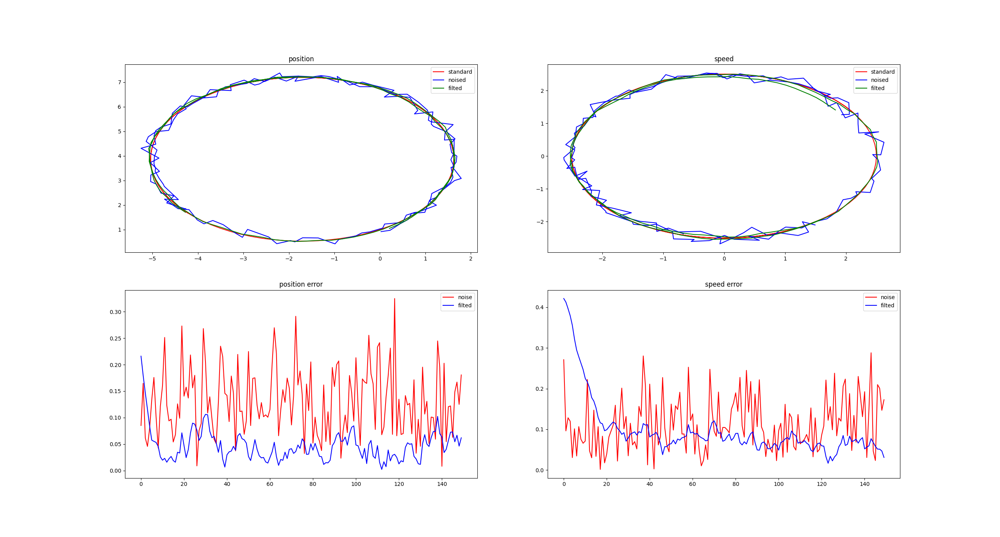
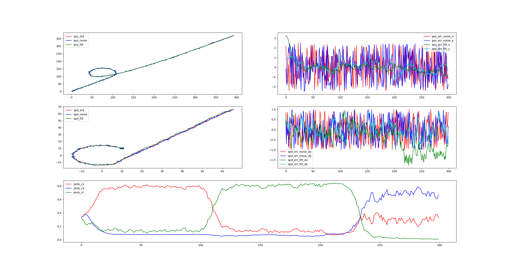
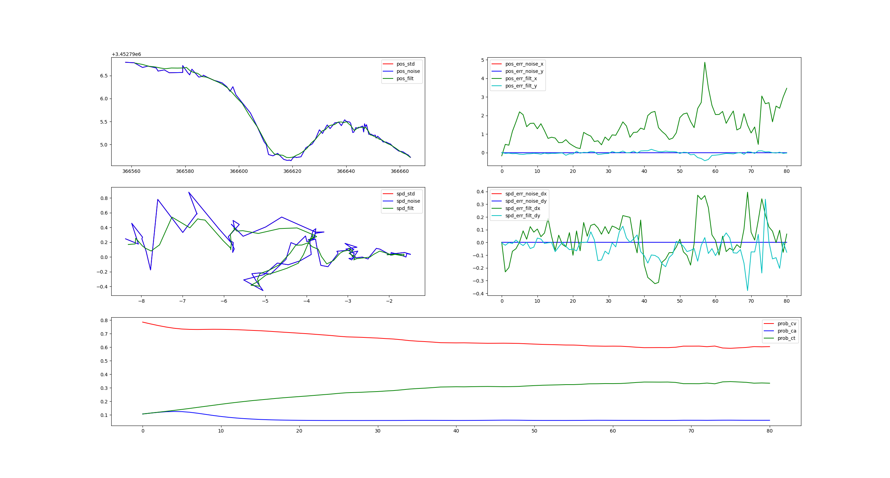
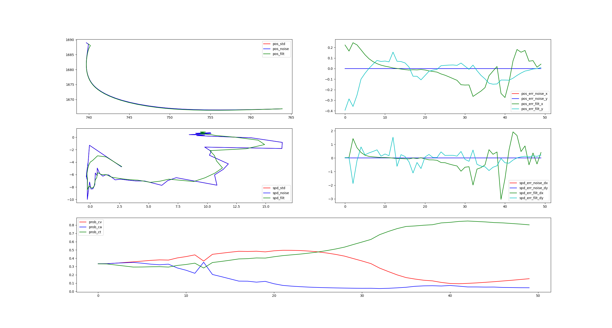

# Interacting Multiple Models(IMM) for Prediction

For self-driving vehicle, it's important to reliably predict the movement of traffic agents around ego car, such as vehicles, cyclists and pedestrians.

We have many neural networks to predict obstacle on lane, but for obstacles which are not on lane, we now have poor method to predict them.

## Current predictor for obstacles not on lane

If an obstacle(vehicle/bicycle/pedestrian) is not on lane, we use a `FreeMovePredictor` to predict its trajectory. `FreeMovePredictor` assumes that the obstacle always moves with constant acceleration, the state is:

$$
\begin{bmatrix}
x \\
y \\
x^\prime \\
y^\prime \\
x^{\prime\prime} \\
y^{\prime\prime}
\end{bmatrix}
$$

and the transition matrix is:

$$
\begin{bmatrix}
1 & 0 & t & 0 & 0.5 * t^2 & 0 \\
0 & 1 & 0 & t & 0 & 0.5 * t^2 \\
0 & 0 & 1 & 0 & t & 0 \\
0 & 0 & 0 & 1 & 0 & t \\
0 & 0 & 0 & 0 & 1 & 0 \\
0 & 0 & 0 & 0 & 0 & 1
\end{bmatrix}
$$

The disadvantages are:

1. We use the newest position and velocity from perception module, but the result is not so accurate.
2. It performs not so good especially for vehicles.

To solve these problems and imporve the prediction accuracy off lane, we use
- constant velocity kalman filter to predict pedestrian;
- interacting multiple model(IMM) of constant velocity(cv), constant acceleration(ca) and constant turn rate(ct) to predict vehicle and bicycle.

## Kalman filter
In 1960, R.E. Kalman published his famous paper describing a recursive solution to the discent-data linear filtering problem. Since that time, due in large part to advances in digital computing, the Kalman filter has been the subject of extensive research and application, particularly in the area of autonomous or assisted navigation.

The Kalman filter is a set of mathematical equations that provides an efficient computational (recursive) means to estimate the state of a process, in a way that minimizes the mean of the squared error. The filter is very powerful in several aspects: it supports estimations of past, present, and even future states, and it can do so even when the precise nature of the modeled system is unknown.

### The process to be estimated
The Kalman filter addresses the general problem of trying to estimate the state $x \in \Re^n$ of a discrete-time controlled process that is governed by the linear stochastic difference equation:

$$
x_k = Ax_{k-1} + Bu_{k-1} + w_{k-1} \tag1
$$

with a measurement $z \in \Re^m$ that is:

$$
z_k = Hx_k + v_k \tag2
$$

- The $n * n$ matrix $A$ is `transition matrix` which relates the state at the previous time step $k - 1$ to the state at the current step $k$, in the absence of either a driving function or process noise. Note that in practice A might change with each time step, but here we assume it is constant.
- The $n * l$ matrix $B$ is `control matrix` which relates the optional control input $u \in \Re^l$ to the state $x$.
- The $m * n$ matrix $H$ is `measurement matrix` which relates the state to the measurement $z_k$. In practice $H$ might change with each time step ore measurement, but we assume it is constant.

The random variable $w_k$ and $v_k$ represent the process and measurement noise. They are assumed to be independent(of each other), white and with normal probability distributions:

$$
p(w) \sim N(0, Q) \tag3
$$

$$
p(v) \sim N(0, R) \tag4
$$

where the $Q$ is `process noise covariance` and R is `measurement noise convariance`, they might change with each time step or measurement, but we assume that they are constant.

### The computational origin of the filter
We define $\hat{x}_k^- \in \Re^n$ to be our `priori state` estimate at step $k$ given knowledge of the process prior to step $k$ and $\hat{x}_k \in \Re^n$ to be our `posteriori state` estimate at step $k$ given measurement $z_k$. We can then define a `priori` and a `posteriori` estimate errors as:

$$
e_k^- \equiv x_k - \hat{x}_k^- \tag5
$$

$$
e_k \equiv x_k - \hat{x}_k \tag6
$$

The `priori` estimate error covariance is then:

$$
P_k^- = E[e_k^-(e_k^-)^T] \tag7
$$

and the `posteriori` estimate error covariance is:

$$
P_k = E[e_ke_k^T] \tag8
$$

In deriving the equation for the Kalman filter, we begin with the goal of finding an equation that compute an `posteriori` state estimate $\hat{x}_k$ as a linear combination of the `priori` estimate $\hat{x}_k^-$ and a weighted difference between an actual measurement $z_k$ and a measurement prediction $H\hat{x}_k^-$ as shown below:

$$
\hat{x}_k = \hat{x}_k^- + K(z_k - H\hat{x}_k^-) \tag9
$$

The difference $(z_k - H\hat{x}_k^-)$ is called the measurement `innovation` or `residual`. The residual reflects the discrepancy between the predicted measurement $H\hat{x}_k^-$ and the actual measurement $z_k$. A residual of zero means that the two are in complete agreement.

The $n*m$ matrix $K$ is chosen to be the `gain` or `blending factor` that minimizes the `posteriori` error covariance in (8). 

This minimization can be accomplished by 

1. substituting (9) into the (6) and substituting that into (8);
2. performing the indicated expectations;
3. taking the derivative of the trace of the result with respcet to $K$,
4. setting the result equal to $0$ and then solving for $K$.

One form of the resulting $K$ that minimizeds (8) is:

$$
\begin{align}
K_k &= P_k^-H^T(HP_k^-H^T + R)^{-1} \\\\
    &= \frac{P_k^-H^T}{HP_k^-HT + R}
\end{align} \tag{10}
$$

Looking at (10) we see that as the measurement error covariance $R \to 0$, the gain $K$ weights the residual more heavily. Specifically,

$$
\lim_{R_k \to 0}K_k = H^-1 \tag{11}
$$

On the other hand, as the `priori` estimate error convariance $P_k^- \to 0$, the gain $K$ weights the residual less heavily. Specially,

$$
\lim_{P_0^- \to 0} K_k = 0 \tag{12}
$$

Another way of thinking about the weighting by $K$ is that as the measurement error covariance $R \to 0$, the actual measurement $z_k$ is `trusted` more and more, while the predicted measurement $H\hat{x}_k^-$ is trusted less and less. On the other hand, as the `priori` estimate error covariance $P_k^- \to 0$ the actual measurement $z_k$ is trusted less and less, while the predicted measurement $H\hat{x}_k^-$ is trusted more and more.

### The discrete kalman filter algorithm

The Kalman filter estimate a process by using a form of feedback control: the filter estimates the process state at some time and then obtains feedback in the form of (noisy) measurement. As such, the equations for the Kalman filter falls into two groups:

- `time update`(predict) equations;
- `measurement update`(correct) equations.

The `time update` equations are responsible for projecting forward(in time) the current state and error covariance estimates to obtain the `priori` estimates for the next time step.

The `measurement update` equations are responsible for the feedback, incorporating a new measurement into the `priori` estimate to obtain an improved `posteriori` estimate.

The final estimation algorithm resembles that of a `predictor-corrector` algorithm for solving numerical problems:
```
           Time Update -----> Measurement Update
            (Predict)             (Correct)
                ^                     |
                |                     |
                -----------------------
```

The specific equations for the `time update` are:

$$
\hat{x}_k^- = A \hat{X}_{k-1} + B u_{k-1} \tag{13}
$$

$$
P_k^- = AP_{k-1}A^T + Q \tag{14}
$$

where:

- $\hat{X}_{k-1}$ is the `posteriori` state from time step $k-1$;
- $u_{k-1}$ is the control from time step $k-1$;
- $\hat{x}_k^-$ is the `priori` state from time step $k$;
- $P_{k-1}$ is the `posteriori` estimate error covariance from time step $k-1$;
- $P_k^-$ is the `priori` estimate error covariance from time step $k$.

The specific equations for the `measurement update` are:

$$
K_k = P_k^-H^T(HP_k^-H^T + R)^{-1} \tag{15}
$$

$$
\hat{x}_k = \hat{x}_k^- + K_k(z_k - H\hat{x}_k^-) \tag{16}
$$

$$
P_k = (I - K_kH)P_k^- \tag{17}
$$

where:

- $K_k$ is the `gain` from time step $k$;
- $z_k$ is the measurement variable from time step $k$;
- $\hat{x}_k$ is the `posteriori` state from time step $k$;
- $P_k$ is the `posteriori` estimate error covariance from time step $k$.

### Filter prameters and tunning

In the actual implementation of the filter, the measurement noise covariance $R$ is usually measured prior to operation of the filter. Measuring the measurement error covariance $R$ is generally practical (possible) because we need to be able to measure the process anyway (while operating the filter) so we should generally be able to take some off-line sample measurements in order to determine the variance of the measurement noise.

The determination of the process noise covariance $Q$ is generally more difficult as we typically do not have the ability to directly observe the process we are estimating. Sometimes a relatively simple (poor) process model can produce acceptable results if one “injects” enough uncertainty into the process via the selection of $Q$. Certainly in this case one would hope that the process measurements are reliable.

In either case, whether or not we have a rational basis for choosing the parameters, often times superior filter performance (statistically speaking) can be obtained by `tuning` the filter parameters $Q$ and $R$. The tuning is usually performed off-line, frequently with the help of another (distinct) Kalman filter in a process generally referred to as `system identification`.

## Dynamic model

The motion of a target object(pedestrian or vehicle) can be modeled as:

- Moving with constant speed(CV) in straight;
- Moving with constant acceleration(CA) in straight;
- Moving with constant turn(CT).

### CV model
For this model, the states under consideration are:

$$
X = \begin{bmatrix} x \\\\ \dot{x} \\\\ y \\\\ \dot{y} \end{bmatrix}
$$

where:

- $x$ is the position in longitudinal component;
- $y$ is the position in lateral component;
- $\dot{x}$ is the velocity in x-direction;
- $\dot{y}$ is the velocity in y-direction;

For this model, state transition matrix is:

$$
A_{CV} = 
\begin{bmatrix} 
1 & dt & 0 & 0 \\
0 & 1 & 0 & 0 \\
0 & 0 & 1 & dt \\
0 & 0 & 0 & 1
\end{bmatrix}
$$

### CA model
For this model, the states under consideration are:

$$
X = \begin{bmatrix} 
x \\
\dot{x} \\
\ddot{x} \\
y \\
\dot{y} \\
\ddot{y} 
\end{bmatrix}
$$

where:

- $x$ is the position in longitudinal component;
- $y$ is the position in lateral component;
- $\dot{x}$ is the velocity in x-direction;
- $\dot{y}$ is the velocity in y-direction;
- $\ddot{x}$ is the acceleration in x-direction;
- $\ddot{y}$ is the acceleration in y-direction;

For this model, state transition matrix is:

$$
A_{CA} = 
\begin{bmatrix} 
1 & dt & \frac{dt^2}{2} & 0 & 0 & 0 \\
0 & 1 & dt & 0 & 0 & 0 \\
0 & 0 & 1 & 0 & 0 & 0 \\
0 & 0 & 0 & 1 & dt & \frac{dt^2}{2} \\
0 & 0 & 0 & 0 & 1 & dt \\
0 & 0 & 0 & 0 & 0 & 1
\end{bmatrix}
$$

### CT model
For this model, the states under consideration are:

$$
X = \begin{bmatrix} 
x \\
\dot{x} \\
y \\
\dot{y} \\
\dot{\theta} \\
\end{bmatrix}
$$

where:

- $x$ is the position in longitudinal component;
- $y$ is the position in lateral component;
- $\dot{x}$ is the velocity in x-direction;
- $\dot{y}$ is the velocity in y-direction;
- $\dot{\theta}$ is the yawrate of obstacle;

For this model, state transition matrix is:

$$
A_{CT} = 
\begin{bmatrix} 
1 & \frac{sin(\dot{\theta} * dt)}{\dot{\theta}}& 0 & -\frac{1-cos(\dot{\theta} * dt)}{\dot{\theta}}& 0 \\
0 & cos(\dot{\theta} * dt)& 0 & -sin(\dot{\theta} * dt)& 0 \\
0 & \frac{1-cos(\dot{\theta} * dt)}{\dot{\theta}} & 1 & \frac{sin(\dot{\theta} * dt)}{\dot{\theta}}& 0 \\
0 & sin(\dot{\theta} * dt)& 0 & cos(\dot{\theta} * dt)& 0 \\
0 & 0 & 0 & 0 & 1
\end{bmatrix}
$$

### Simulation for kalman filter

To check if the algorithm is correct, we build the equation of kalman in python. For details, visit [imm](https://github.com/yongcongwang/interacting_multiple_model)

#### Kalman filter

```python
class kalman_filter:
    def __init__(self, A, B, H, Q, R):
        self.A = A
        self.B = B
        self.H = H
        self.Q = Q
        self.R = R

        self.U = np.zeros((B.shape[0], 1))
        self.X = np.zeros((A.shape[0], 1))
        self.X_pre = self.X
        self.P = np.zeros(A.shape)
        self.P_pre = self.P

    def filt(self, Z):
        self.__predict()
        self.__update(Z)
        return self.X

    def __predict(self):
        self.X_pre = np.dot(self.A, self.X) + np.dot(self.B, self.U)
        self.P_pre = np.dot(np.dot(self.A, self.P), self.A.T) + self.Q

    def __update(self, Z):
        K = np.dot(np.dot(self.P_pre, self.H.T),
                   np.linalg.inv(np.dot(np.dot(self.H, self.P_pre), self.H.T) +\
                                 self.R))
        self.X = self.X_pre + np.dot(K, Z - np.dot(self.H, self.X_pre))
        self.P = self.P_pre - np.dot(np.dot(K, self.H), self.P_pre)
```

#### Constant velocity model

```python
def kf_cv():
    A = np.array([
            [1., dt, 0., 0.],
            [0., 1., 0., 0.],
            [0., 0., 1., dt],
            [0., 0., 0., 1.]
            ])
    B = np.eye(A.shape[0])
    H = np.array([
        [1., 0., 0., 0.],
        [0., 1., 0., 0.],
        [0., 0., 1., 0.],
        [0., 0., 0., 1.]
        ])
    Q = np.eye(A.shape[0])
    R = np.eye(4) * 10. ** 2

    kf = kalman_filter(A, B, H, Q, R)
    return kf
```
The simulation result:


#### Constant acceleration model

```python
def kf_ca():
    A = np.array([
            [1., dt, 0.5 * dt**2, 0., 0., 0.],
            [0., 1., dt, 0., 0., 0.],
            [0., 0., 1., 0., 0., 0.],
            [0., 0., 0., 1., dt, 0.5 * dt**2],
            [0., 0., 0., 0., 1., dt],
            [0., 0., 1., 0., 0., 1.]
            ])
    B = np.eye(A.shape[0])
    H = np.array([
        [1., 0., 0., 0., 0., 0.],
        [0., 1., 0., 0., 0., 0.],
        [0., 0., 0., 1., 0., 0.],
        [0., 0., 0., 0., 1., 0.]
        ])
    Q = np.eye(A.shape[0])
    R = np.eye(4) * 150

    kf = kalman_filter(A, B, H, Q, R)
    return kf
```
The simulation result:


#### Constant turn rate model
```python
def kf_ct():
    dtheta = math.pi / 180 * 15
    theta = dtheta * dt
    A = np.array([
         [1., math.sin(theta)/dtheta, 0., -(1 - math.cos(theta))/dtheta, 0.],
         [0., math.cos(theta), 0., -math.sin(theta), 0.],
         [0., (1 - math.cos(theta)) / dtheta, 1., math.sin(theta)/dtheta, 0.],
         [0., math.sin(theta), 0., math.cos(theta), 0.],
         [0., 0., 0., 0., 1.],
         ])
    B = np.eye(A.shape[0])
    H = np.array([
        [1., 0., 0., 0., 0.],
        [0., 1., 0., 0., 0.],
        [0., 0., 1., 0., 0.],
        [0., 0., 0., 1., 0.]
        ])
    Q = np.eye(A.shape[0])
    R = np.eye(4) * 150
    return kalman_filter(A, B, H, Q, R)
```

The simulation result:


## Interacting multiple model
The IMM estimator was originally proposed by Bloom in [An efficient filter for abruptly changing systems](https://ieeexplore.ieee.org/document/4047965). It is one of the most cost-effective class of estimators for a single maneuvering target. The IMM has been receiving special attention in the last few years, due to its capability of being combined with other algorithms to resolve the multiple target tracking problem.

The main idea of imm is the identification and transition between different models: at every tracking moment, by setting weight-coefficient and probability for each filter, and finally weighting calculation, we obtain the current optimal estimation state.


Assume that we have $r$ models, each model's state equation:

$$
X_{k+1} = A^jX_{k} + w^j_{k}
$$

where

- $j \in [1, r]$, $X$ is state vector,
- $A_j$ is transition matrix,
- $w$ is noise with the variance of $Q$.

The measurement equation is:

$$
Z_{k} = H^jX_{k} + v^j_k
$$

where 

- $Z$ is measurement vector,
- $H$ is measurement matrix,
- $v$ is the noise with the variance of $R$.

The transition matrix between models can be:

$$
P = 
\begin{bmatrix} 
p_{11} & \cdots & p_{1r} \\
\vdots & \ddots & \vdots \\
p_{r1} & \cdots & p_{rr}
\end{bmatrix}
$$

and probability vector of each model is:

$$
U = \begin{bmatrix} u_1 & \cdots & u_{r} \end{bmatrix}
$$

### Step1: Input mix

$$
X^{0j}_{k-1|k-1} = \sum_{i=1}^{r}{X^j_{k-1|k-1}\mu^{ij}_{k-1|k-1}}
$$

$$
P^{0j}_{k-1|k-1} = \sum_{i=1}^{r}{\mu^{ij}_{k-1|k-1}[P^j_{k-1|k-1} + (X^j_{k-1|k-1}) - X^{0j}_{k-1|k-1}][P^j_{k-1|k-1} + (X^j_{k-1|k-1}) - X^{0j}_{k-1|k-1}]^T}
$$

where

- $X^j_{k-1|k-1}$ is the optimal state estimate,
- $P^j_{k-1|k-1}$ is the optimal state estimate;

$$
\mu^{ij}_{k-1|k-1} = \frac{p_{ij}U^j_{k-1}}{C^j}
$$ 

and

$$
C^j = \sum_{i=1}^r{p_{ij}U^j_{k-1}}
$$

where

- $i,j = 1, \cdots, r$;
- $\mu_{k-1}^j$ is the probabiltiy of model $j$ at time $k-1$;
- $p_{ij}$ is the probability of a transition from model $i$ to $j$.

### Step2: Model estimate
It's the same as normal kalman filter.

### Step3: Probability update
With the use of the latest measurement $z_k$, the likelihood function value of the model $j$ at time $k$ is given by:

$$
\Lambda_k^j = N(z_k;z_{k|k-1}^j,v_k^j) = \begin{vmatrix} 2\pi S_k^j\end{vmatrix}^{-\frac{n_z}{2}} \cdot e^{-\frac{1}{2}(z_k - z_{k|k-1}^j)^T S_k^j (z_k-z_{k|k-1}^j)}
$$

where:

- $v_k^j = z_k-z_{k|k-1}^j$ denotes the filter residual;
- $S_k^j$ denotes the innovation convariance;
- $n_z$ denotes the dimension of measurement vector.

The model probability $\mu_{k|k}^j$ at time $k$ is computed by the following equation:

$$
\mu_{k|k}^j = \frac{\Lambda_k^j C_j}{C}
$$

where:

$$
C = \sum_{i=1}^r{\Lambda_k^jCi}
$$

### Step4: Output Integration
Finally, the state estimate $\hat{x}_{k|k}$ and corresponding covariance $P_{k|k}$ are obtained by the model-conditional estimates and covariances of different models:

$$
\hat{x}_{k|k} = \sum_{j=1}^r{\mu_{k|k}^j\hat{x}_{k|k}^j}
$$

$$
P_{k|k} = \sum_{j=1}^r{\mu_{k|k}^j}(P_{k|k}^j + (\hat{x}_{k|k}^j-\hat{x}_{k|k})(\hat{x}_{k|k}^j-\hat{x}_{k|k})^T)
$$

### Simulation for imm
To volidate the performance of the proposed algorithm, a simulation in python is operated.

#### Imm algorithm

```python
class Imm:
    def __init__(self, models, model_trans, P_trans, U_prob):
        self.models = models
        self.P_trans = P_trans
        self.U_prob = U_prob
        self.model_trans = model_trans

        self.mode_cnt = len(models)
        self.dim = models[0].A.shape[0]

    def filt(self, Z):
        # setp1: input mix
        u = np.dot(self.P_trans.T, self.U_prob)
        mu = np.zeros(self.P_trans.shape)
        for i in range(self.mode_cnt):
            for j in range(self.mode_cnt):
                mu[i, j] = self.P_trans[i, j] * self.U_prob[i, 0] / u[j, 0];

        X_mix = [np.zeros(model.X.shape) for model in self.models]

        for j in range(self.mode_cnt):
            for i in range(self.mode_cnt):
                X_mix[j] += np.dot(self.model_trans[j][i],
                                   self.models[i].X) * mu[i, j]

        P_mix = [np.zeros(model.P.shape) for model in self.models]
        for j in range(self.mode_cnt):
            for i in range(self.mode_cnt):
                P = self.models[i].P + np.dot((self.models[i].X - X_mix[i]),
                                              (self.models[i].X - X_mix[i]).T)
                P_mix[j] += mu[i, j] * np.dot(np.dot(self.model_trans[j][i], P),
                                              self.model_trans[j][i].T)
        ## step2: filt
        for j in range(self.mode_cnt):
            self.models[j].X = X_mix[j]
            self.models[j].P = P_mix[j]
            self.models[j].filt(Z)

        ### step3: update probability
        for j in range(self.mode_cnt):
            mode = self.models[j]
            D = Z - np.dot(mode.H, mode.X_pre)
            S = np.dot(np.dot(mode.H, mode.P_pre), mode.H.T) + mode.R

            Lambda = (np.linalg.det(2 * math.pi * S)) ** (-0.5) * \
                     np.exp(-0.5 * np.dot(np.dot(D.T, np.linalg.inv(S)), D))
            self.U_prob[j, 0] = Lambda * u[j, 0]
        self.U_prob = self.U_prob / np.sum(self.U_prob)

        return self.U_prob
```
#### Input
To test the algorithm performance, following curves are used:

- generated constant velocity curve + constant turn rate curve + constant acceleration;
- vehicle pose data from real autonomous car;
- vehicle pose data from [argoverse](https://www.argoverse.org/) dataset.

$cv + ct + ca$ curve is generated with:

```python
def cv_z(x0, dx, y0, dy, dt, cnt):
    Z = [np.array([
            [x0],
            [dx],
            [y0],
            [dy]
        ])]
    for i in np.arange(1, cnt):
        Z.append(np.array([
            [Z[i-1][0, 0] + dx * dt],
            [dx],
            [Z[i-1][2, 0] + dy * dt],
            [dy]
            ]))

    return Z

def ca_z(x0, dx, ddx, y0, dy, ddy, dt, cnt):
    Z = [np.array([
            [x0],
            [dx],
            [y0],
            [dy]
        ])]
    for i in np.arange(1, cnt):
        Z.append(np.array([
            [Z[i-1][0,0] + Z[i-1][1,0] * dt + 0.5 * ddx * dt**2],
            [Z[i-1][1,0]+ ddx * dt],
            [Z[i-1][2,0] + Z[i-1][3,0] * dt + 0.5 * ddy * dt**2],
            [Z[i-1][3,0]+ ddy * dt]
            ]))

    return Z

def ct_z(x0, dx, y0, dy, dtheta, dt, cnt):
    Z = [np.array([
            [x0],
            [dx],
            [y0],
            [dy]
        ])]
    theta = math.atan2(dy, dx)
    v = math.hypot(dx, dy)
    for i in np.arange(1, cnt):
        theta += dtheta * dt
        Z.append(np.array([
            [Z[i-1][0, 0] + v * dt * math.cos(theta)],
            [v * math.cos(theta)],
            [Z[i-1][2, 0] + v * dt * math.sin(theta)],
            [v * math.sin(theta)]
            ]))

    return Z
```

#### Simulation result
##### CV + CT + CA


From the figure we can see:

- the algorithm can figure out three models correctly;
- it's more difficult to figure out the $CA$ model, because the acceleration information is not in the observation vector;
- it's not easy to distinguish $CV$ and $CA$ model.

##### Real vehicle data


The result is not so good, because its characteristics do not fit any model.

##### Argoverse data

I choose a turning vehicle's path and add it's velocity information, we can say:

- it takes 2.5s to predict the right model;
- after test, I found that if we set the inital probability a more precise number, it can predict the right model more quickly(within 0.5s).

## Generate prediction trajectory
With the right model probabilities, we can predict the obstacle's trajectory in longer time.
We use the probabilities and three models to generate trajectory:


The red line is the real trajectory of a vehicle, and the green line is predicted trajectory every time.

We can see that:

- At the beginning it can not figure out the right model, so it mixes them up to generate trajectory;
- After figure out the CT model, the trajectory is getting closer to the real trajectory.
 
## Cpp class diagram
After testing the correctness of the algorithm, we designed the class diagram of the code:


### LRT class
We should create a filter(kalman filter or imm) for every obstacle, it's important to construct and deconstruct the filters dynamiclly.

We already have a `LRU`(Latest Recently Used) class, which will destroy the oldest node when it's capacity is to reach maximum. But it has the following problems:

- If the capacity is too big and the the number of filters we used is small, `LRU` will waste much memory space;
- If the capacity is too small and the the number of filters we used is big, `LRU` will destroy some filters in use, which hurts the prediction module.

So we add the time limit to `LRU` structure and names it `LRT`. If a node is not used for a given time, it will be destroyed.

### KalmanFilter
To fit with different filter parameters, we use a template to generate instance.

```C++
//!
//! \class KalmanFilter
//! \brief Implement a discrete-time Kalman Filter
//!        https://www.cs.unc.edu/~welch/media/pdf/kalman_intro.pdf
//! 
//! \param T DataType(double/float/int, etc.)
//! \param Xn dimension of state
//! \param Zn dimension of observations
//! \param Un dimension of controls
//!
template <typename T, unsigned int Xn, unsigned int Zn, unsigned int Un>
class KalmanFilter {
 public:
```

### ImmKf
To fit with different kalman filters, we use a parameter pack to input all filters.

```C++
//!
//! \class ImmKf
//! \brief Implement a discrete-time Imm with kalman filter
//!        https://sci-hub.do/10.1109/cdc.1984.272089#
//! 
//! \param T DataType(double/float/int, etc.)
//! \param Kf Kalman filters
//! \param Zn dimension of observations
//!
[[deprecated]]
template<typename T, std::size_t Zn, typename... Kf>
class ImmKf {
  using TupleType = typename std::tuple<Kf...>;
  using Mat1xN = Eigen::Matrix<T, 1, std::tuple_size<TupleType>::value>;
  using MatNxN = Eigen::Matrix<T, std::tuple_size<TupleType>::value,
                               std::tuple_size<TupleType>::value>;
  using MatZx1 = Eigen::Matrix<T, Zn, 1>;
 public:
```
