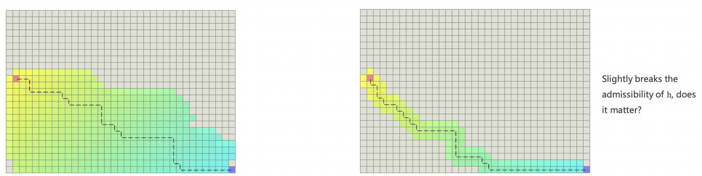
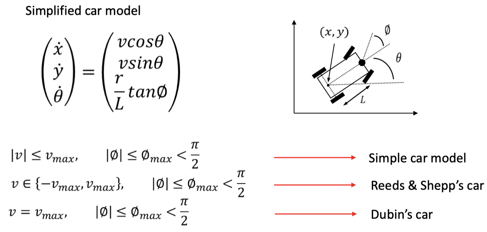

Path-planning is an important primitive for autonomous mobile robots that lets robots find the shortest(or otherwise optimal) path between two points. Otherwise optimal paths could be paths that minimize the amount of turning, the amount of braking or whatever a specific application requires. Algorithms to find a shortest path are important not only in robotics, but also in network routing, video games and gene sequencing.

# Behavior Planning
The goal of `behavior planning` is to find a movable path in configuration space for `motion planning` to generate a smoother and cost lower trajectory.

Before planning process, we generally transform obstacles from workspace to configuration space which makes the planning task less complicated. In workspace, robot has shape and size which is a hard task for motion planning. After tranfomation, the robot becomes a point while obstacles are expended:

## Based on graph searching
A typical workflow of graph searching is:
- Maintain a `container` to store all the nodes `to be visited`
- The container is initialized with the start state
- Loop:
 - `Remove`: remove a node from the container according to some pre-defined cost function
 - `Expand`: obtain all `neighbors` of the node
 - `Push`: put all the neihbors into the container
- End loop

Two frequently used methods to search the graph are:
- `Breadth First Search(BFS)`, which use a `queue` to store the nodes to be discoved;
- `Depth First Search(DFS)`, which use a `stack` to store the nodes to be discovered.

### Greedy best first search
`BFS` and `DFS` pick the next node off the frontiers based on which was `last-in`, while the Greedy best first search picks the `best` node according to some rule, called `heuristic`. 
> A `heuristic` is a guess of how close you are to the target.

There are two commonly used distance to `guess` the distance to the target:
- Euclidean Distance, which assumes that you can move in any direction;
- Diagonal Distance, which assumes that you can move in eight directors;
- Manhattan Distance, which assumes that you can only move in four direction: up/down/left/right.

The greedy best first search works fine with an empty map, but in a more complated map it may find the path which is not the global optimal.

### Dijkstra
Dijkstra expands the node with the `cheapest accumulated cost g(n)`. `g(n)` is the current best estimates of the accumulated cost from the start state to node `n`. And a node expanded is guaranteed to have the smallest cost from the start state.

The process of the algorithm is as:
- Maintain a `priority queue` to store all the nodes to be expanded
- The priority queue is initialized with the start state $X_s$
- Assign $g(X_s) = 0$ and $g(n) = infinite$ for all other nodes in graph
- Loop:
 - If the queue is empty, return `False`, break;
 - Remove the node n with the lowest $g(n)$ from the priority queue
 - Mark node n as expanded
 - If the node n is the goal state, return `True`, break
 - For all unexpanded neighbors "m" of "n":
   - If $g(m) == infinite$
    - $g(m)=g(n) + C_{nm}$
    - Push node "m" into the queue
   - If $g(m) > g(n) + C_{nm}$
    - $g(m) = g(n) + C_{nm}$
- End Loop

#### Pros
- Complete and optimal

#### Cons
- Can only see the cost accumulated so far, thus exploring next state in all directions
- No information about goal location

### `A*`
The `A*` algorithm is a dijkstra with heuristic. The cost of `A*` is estimated with:
$$
f(n) = g(n) + h(n)
$$
where:
- $g(n)$ is the accumulated cost which represents current best estimates of the accumulated cost from the start state to node "n"
- $h(n)$ is the heuristic cost which represents the estimated least cost from node n to goal state.

While expanding the node, `A*` expands the node with the cheapest $f(n)$.

The only difference comparing to Dijkstra's algorithm is that `A*` removes the node "n" with lowest $f(n)$ from the priority queue.

#### Optimality
`A*` has optimality only if:
$$
h(n) <= h^{\*}(n)
$$
where $h^\*(n)$ is the true least cost to goal from node "n".
- if $h(n) << h^\*(n)$, then the solution is optimal, but the searching speed will be slow;
- if $h(n) > h^\*(n)$, the solution is not optimal, which means that the path found by `A*` may not be the shortest path;
- if $h(n) == h^\*(n)$, the solution is optimal and the speed is the fastest.

#### Speed up `A*`

##### The best heuristic
Even if we have an optimal heuristic cost, there is still something to optimize. For example, if we use the $f(n) == g(n)$ as cost function, we can surely find the shortest path, but the speed is slow. The closer our heuristic cost is to the actual distance from node to goal, the less steps we go through to reach the goal.

##### Tie breaker
In a 2D path without any obstacles, many paths have the same $f(n)$ value. There is no differences among them which makes them explored by `A*` equally.

We can change the $f(n)$ value slightly to break the tie:
- Interfere $h$ slightly: $h = h * (1.0 + p)$, where p is a very small value;
- when $f$ is the same, compares $h$;
- add deterministic random numbers to the heuristic or edge costs(A hash of the coordinates);
- prefer paths that are along the straight line from the starting point to the goal;
- other more...

### JPS(Jump Point Search)
Jump point search is a systematic approach to solve the tie problem of `A*`. The core idea of JPS is to find the symmetry and break them.

JPS explores intelligently, becasue it always looks ahead and jump.

#### Look ahead rule

- Neighbor pruning:
 - gray node: inferior neighbors, when going to them, the path without x is cheaper, Discard.
 - white node: nutural neighbors.
 - we only need to consider natural neighbors when expand the search.
- Forced neighbors
 - There is obstacle adjacent to x.
 - Red nodes are forced neighbors.
 - A cheaper path from x's parent to them is blocked by obstacle.

#### Jumping rule

- Recursively apply straight pruning rule and identify y as a jump point successor of x. This node is interesting because it has a neighbor z that can not reached optimally except by a path that visit x then y.
- Recursively apply the diagonal pruning rulea and identify y as a jump point successor of x.
- Before each diagonal step we first recurse straight. Only if both straight recursions fail to identify a jmp point do we step diagonally again.
- Node w, a forced neighbor of x, is expanded as normal.

#### Conclusion
- Most time, especially in complex environments, JPS is better, but far away from alway. For example, a large map with not many obstacles, JPS may be slower than `A*`.
- JPS reduces the number of nodes in `open list`, but increase the number of status query.
- JPS' limitation: only applicable to uniform grid map.

## Based on sampling
Planners based on sampling don't attempt to explicitly construct the C-space and its boundariess, they simply need to know if a single robot configuration is in collision. Exploits simple tests for collision with full knowledge of the space.
There are three completenesses in planning:
- Complete planner: always answers a path planning query correctly in bounded time;
- Probabilitic complete planner: if a solution exists, planner will eventually find it, using random sampling;
- Resolution complete planner: same as probabilitic complete planner but based on a deterministic sampling(e.g. samplingg on a fixed grid).

### Probabilitic Road Map(PRM)
A PRM is:
- a graph structure,
- it divides planning into two phases:
 - learning phase
 - query phase
- and checks sampled configurations and connections between samples for collision efficiently,
- a relatively small number of milestones and local paths are sufficient to capture the connectivity of the free space.

#### Learning phase
- Sample N points in C-space
- Delete points that are not collision-free
- Connect to nearest points and get collision-free segments
- Delete segments that are not collision free

#### Query phase
- Search on the road map to find a path from the start to the goal(using Dijkstra or A star algortihm)
- Road map is now similar with the grid map(or a simplified grid map)

#### Pros
- probabilitically complete

#### Cons
- Required to solve 2 point boundary value problem
- Build graph over state space but no particular focus on generating a path
- Not efficiet

#### Lazy collision-checking
- Collision-checking process is time-consuming, especially in complex or high-dimensional environments
- Sample points and generate segments without considering the collision(lazy)
- Find a path on the road map generated without collision checking
- Delete the corresponding edgess and nodes if the path is not collision free
- Restart path-finding

### Rapidly-exploring Random Tree(RRT)
RRT builds up a tree through generating `next states` in the tree by executing random controls.
The algorithm process is:

- get a random point from C-space $x_{rand}$
- check the nearest point $x_{near}$ from rrt-tree 
- move from $x_{near}$ to $x_{rand}$ by a distance $step_size$ to get a new point $x_{new}$
- if $x_{new}$ is collision-free, add it to the rrt-tree

#### Pros
- Aims to find a path from the start to the goal
- More target-oriented than PRM

#### Cons
- Not optimal solution
- Not efficient(leave room for improvement)
- Sample in the whole space

### Optimal sampling-based path planning methods

#### RRT\*

The difference between RRT and RRT star is:
> after adding a new node to rrt tree, rrt star check all nodes around the new added node. If surrounding points can get to start point with lower cost through the new node, they change their parents to the new node. That's the rewire step.

#### Kinodynamic-RRT\*

Kinodynamic-RRT\* change the steer step of RRT\* to fit with motion or other constraints in robot navigation.

#### Anytime RRT\*
Keep optimizing the leaf RRT Tree when the robot executes the current trajectory Anytime Fashion.

### Advanced path planning methods

#### Informed RRT\*

Informed RRT\* makes the rrt tree to grow only in an ellipse, start point and end point are ellipse's two focal points, and the distance from curve to focal points is the length of path. If a new path shorter is found, the distance will decrease. 

#### Cross-entropy motion planning

#### Other variants
- Lower Bound Tree RRT
- Sparse Stable RRT
- Transition-based RRT
- Vector Field RRT
- Parallel RRT

## Based on kinodynamic model

### Introduction
The `kinodynamic` planning problem is to synthesize a robot subject to simultaneous 
- `kinematic` constraints, such as `avoiding obstacles`
- `dynamic` constraints, such as modulus `bounds on velocity, acceleration, and force`
A kinodynamic solution is a mapping from time to generalized forces or accelerations.

We choose kinodynamic planning because:
- Straight-line connections between pairs of states are typically not valid trajectories due to the system's differential constraints.
- The smoother the path we found, the easier we optimize it.

The typical models we used are:
- Unicycle model:

- Bicycle model:

### State Lattice Planning

### Kinodynamic RRT\*

### Hybrid A\*

# Motion Planning

## Minimum snap trajectory generation

## Soft and hard constrained trajectory optimization

# MDP & MPC

# Reference
- [Motion Planning for Mobile Robots](https://www.shenlanxueyuan.com/course/268)

